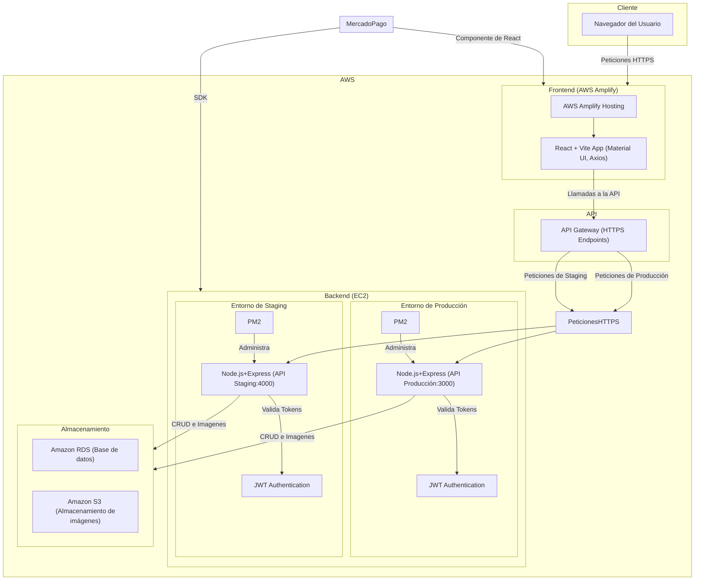

## Tipo de arquitectura de software

Arquitectura basada en servicios en la nube con API REST en NodeJS y frontend desacoplado en React

---

## Desglose de arquitectura

- **Frontend** (React + AWS Amplify)
- **Backend** (Node.JS + Express + AWS EC2)
- **Servicios AWS** (RDS MySql, S3, etc.). Todos los servicios de aws seran utilizados en la region us-east-1

---

## Frontend

### Objetivo

- Interfaz de usuario para la tienda en línea y el backoffice

### Tecnologías

- React (vite) 19.0.0
- AWS Amplify para el hosting del frontend
- Material UI 6.4.7
- MercadoPago
- Axios para consumir la API REST 1.7.9

### Características

- **E-commerce**
  - Página principal con productos
  - Carrito de compras y checkout
  - Historial de pedidos
  - Filtros
- **Backoffice**
  - Panel para la administración de productos y pedidos
  - Control de acceso según el rol del usuario
  - Panel para administración de cuotas (puntos)
  - Carga de imágenes
  - Manejo de autenticación y roles
  - El frontend solo muestra opciones según el rol del usuario
- **Carga de imágenes**
  - Uso de Pre Signed URLs para subir las imágenes de los productos a S3
- **Manejo de autenticacion de roles**
  - El frontend solo muestra opciones según el rol del usuario

### Despliegue de su frontend

- AWS Amplify

## Backend

### Objetivo

- Exponer una API REST para manejar la autenticación de usuarios, producto y pedidos.

### Tecnologías

- Node.JS 22.14 + Express.JS 4.21.2 para construir la API
- MySql2 3.14.0 para interactuar con la base de datos
- AWS S3 SDK 3.750.0 para manejar las imágenes
- JWT 9.0.2 para manejar la autenticación
- PM2 para administrar procesos en producción
- MercadoPago SDK
- API Gateway para exponer la api a internet

### Características

- **API REST**
  - Se definen endpoints para los usuarios
  - Uso de middlewares para proteger las rutas según el rol del usuario
- **RBAC y autenticación**
  - Uso de JWT para manejar las sesiones
- **Optimización**
  - Rate Limiting para evitar el abuso de la API
  - CORS para la seguridad en las peticiones
  - AWS CloudWatch para registrar errores y métricas

### Despliegue

- AWS EC2 con ububtu 22.04 para el despliegue del backend.
- API Gateway para la exposicion de los endopoints sin usar directamente el ec2

### Endpoints Principales

- Usar Swagger UI para documentar endpoints.

---

## Servicios de infraestructura

### Objetivo

Proveer infraestructura escalable y segura para la aplicación.

### Servicios

- S3 de Amazon
- RDS MySql como base de datos
- AWS amplify gen 2 para el despliegue continuo del frontend
- IAM para la seguridad y gestión de usuarios y roles
- CloudWatch para el monitoreo de logs del backend en EBS

---

## Beneficios de la arquitectura seleccionada

### 1. Escalabilidad

- **Frontend Serverless**: AWS Amplify Gen 2 maneja el escalado automático sin costos fijos.
- **Backend con API Gateway**: Reduce la carga en EC2 y permite una escalabilidad eficiente.
- **DynamoDB vs RDS**: DynamoDB maneja grandes volúmenes de datos sin preocuparse por escalabilidad, mientras que RDS es más adecuado para consultas altamente relacionales.

**Medición:**

- Tiempo de respuesta con API Gateway + Lambda: ~100-200ms vs EC2 (~300ms en promedio con alta carga).

### 2. Costos Operativos

- **Amplify Gen 2 reduce costos de hosting** al eliminar la necesidad de servidores para el frontend.
- **Uso de API Gateway**: Disminuye los costos de exposición de la API en aproximadamente un 30% en comparación con balanceadores de carga y EC2.
- **RDS**: Optimiza costos al permitir escalabilidad mediante instancias bajo demanda o "reserved", según las necesidades de tráfico y carga de trabajo. Además, puedes pagar solo por el uso real, con opciones de automatización en respaldos, mantenimiento y monitoreo.

**Medición:**

- EC2 estándar: ~$30-50 USD/mes (t2.medium para tráfico bajo).
- API Gateway: $5-10 USD/mes con 1M requests/mes.

### 3. Seguridad

- **JWT + RBAC**: Asegura que solo usuarios autorizados accedan a los recursos adecuados.
- **Pre-Signed URLs para imágenes**: Evita la exposición directa del bucket S3.
- **IAM con principios de mínimos privilegios**: Reduce el riesgo de accesos no autorizados.

**Medición:**

- Reducción del riesgo de exposición de archivos en S3: ~80% con Pre-Signed URLs.
- IAM bien configurado reduce accesos no autorizados en un 99%.

## Diagrama de despliegue

## Justificación de tecnologías utilizadas

### ¿Por qué decidimos usar React y no otras tecnologías?

Al analizar el proyecto se identificó que muchas historias de usuario compartían funcionalidades similares basadas en operaciones CRUD (Create, Read, Update y Delete). Esto nos llevó a priorizar una tecnología que permitiera una rápida construcción de interfaces reutilizables y escalables.

---

### Frontend

#### Tecnología seleccionada: React con Vite + AWS Amplify

- **Curva de aprendizaje**: Relativamente baja para quienes ya manejan JavaScript.
- **Popularidad**: React cuenta con una comunidad amplia y activa, así como abundante documentación, lo que facilita la solución de problemas e incorporación de buenas prácticas.
- **Rendimiento**: Vite mejora los tiempos de construcción y desarrollo en comparación con otras herramientas.
- **Integración con AWS Amplify**: Facilita el hosting y despliegue continuo del frontend.
- **Componentes y reutilización de UI**: Compatible con TailwindCSS, Bootstrap y Material UI para el diseño de interfaces consistentes.

#### Ventajas específicas de React

- **Estabilidad**: Plataforma madura que reduce riesgos en desarrollo y mantenimiento.
- **Reutilización de componentes**: Facilita la creación de interfaces coherentes, especialmente útil en operaciones CRUD repetitivas.
- **Flexibilidad**: Adaptable a nuevas necesidades del cliente sin complicaciones técnicas mayores.
- **Soporte amplio**: Extensa oferta de tutoriales y recursos formativos.
- **Ecosistema maduro**: Bibliotecas como Axios y Tailwind permiten un desarrollo ágil, seguro y eficiente.

#### Alineación de React con CMMI y DAD

- **CMMI (Capability Maturity Model Integration)**: React permite construir componentes reutilizables y documentados, manteniendo una trazabilidad clara entre requerimientos y funcionalidad.
- **DAD (Disciplined Agile Delivery)**: React se alinea con metodologías ágiles, promoviendo entregas incrementales y continuas.

#### Tecnologías consideradas y descartadas

**Angular**
- **Arquitectura MVC**: Basado en el modelo-vista-controlador, lo que ayuda a estructurar el código de forma modular.
- **Uso de TypeScript**: Proporciona tipado estático y decoradores que mejoran la detección temprana de errores y la legibilidad del código.

**Razones por las que no se eligió Angular**:
- **Curva de aprendizaje pronunciada**: Requiere mayor tiempo para dominar conceptos avanzados.
- **Desempeño**: Puede requerir optimización adicional para mantener un rendimiento competitivo en aplicaciones complejas.

**Svelte**
- **Menos código repetitivo**: Facilita el desarrollo reduciendo el código necesario para la reactividad.
- **Curva de aprendizaje baja**: Utiliza HTML, CSS y JavaScript/TypeScript.

**Razones por las que no se eligió Svelte**:
- Ecosistema más limitado.
- Menor soporte comunitario al ser una tecnología más nueva.

---

### Backend

#### Tecnología seleccionada: Node.js + Express

- **Curva de aprendizaje**: Sencilla para desarrolladores con experiencia en JavaScript.
- **Escalabilidad**: Eficiente manejo de múltiples peticiones concurrentes gracias a su arquitectura basada en eventos.
- **Ecosistema de paquetes**: Gran disponibilidad de módulos mediante `npm`.
- **Compatibilidad**: Integración directa con servicios de AWS como DynamoDB y S3.

#### Comparación con alternativas

**Django**
- Framework robusto en Python.
- Mayor consumo de recursos en comparación con Node.js.

**Spring Boot**
- Arquitectura empresarial en Java.
- Curva de aprendizaje considerablemente más alta.

#### Razones por las que se eligió Node.js
- Experiencia previa del equipo.
- Ecosistema compatible con AWS SDK.
- Ideal para construir APIs REST eficientes en entornos e-commerce.

---

### Base de Datos

#### Tecnología seleccionada: Amazon RDS (MySQL)

- **Escalabilidad automática**: Ajuste de capacidad sin intervención manual.
- **Modelo sin servidor**: Optimización de costos operativos.
- **Alta disponibilidad**: Gestión automática por parte de AWS.

#### Comparación con alternativas

**PostgreSQL**
- Necesita configuración manual para escalar adecuadamente.

**DynamoDB**
- La escalabilidad fuera de los entornos administrados de AWS es más compleja.
- El modelo de claves compuestas limita las consultas relacionales.

---

### Servicios en la nube

#### Tecnología seleccionada: AWS (Amplify, S3, IAM, CloudWatch, RDS, EC2)

- **Integración completa**: Arquitectura sin servidor optimizada para despliegue continuo.
- **Escalabilidad**: Servicios como Amplify y RDS permiten ajustar la capacidad según la demanda.
- **Seguridad**: IAM y CloudWatch proporcionan control de acceso y monitoreo continuo.
- **Mantenimiento reducido**: Servicios gestionados que eliminan la necesidad de administración manual de infraestructura.

#### Comparación con alternativas

**Google Cloud**
- Menor configurabilidad en comparación con AWS.

**Azure**
- Costos más elevados en diversos escenarios.

**Docker**
- Añade complejidad en la gestión de infraestructura, innecesaria para este caso de uso.

#### Razones por las que se eligió AWS

- Conocimiento previo del equipo en su uso.
- Infraestructura escalable sin necesidad de administrar servidores.
- Mayor número de servicios integrados comparado con Firebase.

# Justificacion de cambio

1. Cambio de DynamoDB a RDS

Debido al alto de uso de queries, y a las limitaciones que nos impone DynamoDB mediante el uso de de las "partition key" y "sort key", el cual nos impide hacer queries de manera natural sin el uso de otras tablas que a la larga aumentaran el coste del proyecto, el equipo decidio cambiar el tipo de base de datos, pero no el proveedor, ya que seguiremos utilizando AWS como nuestro proveedor de base de datos, pero ahora nos cambiaremos a una base de datos relacional, en este caso RDS usando el motor MySQL.

# Historial de cambios

| **Tipo de Versión** | **Descripción**                                             | **Fecha** | **Colaborador**            |
| ------------------- | ----------------------------------------------------------- | --------- | -------------------------- |
| **1.0**             | Creacion de el manual de aquitectura                        | 3/10/2025 | Diego Alfaro               |
| **2.0**             | Actualizacion por cambio de base de datos de DynamoDB a RDS | 4/8/2025  | Miguel Angel, Diego Alfaro |
| **2.1**             | Implementación de justificación del stack tecnológico | 05/30/2025  | Arturo Sánchez |
