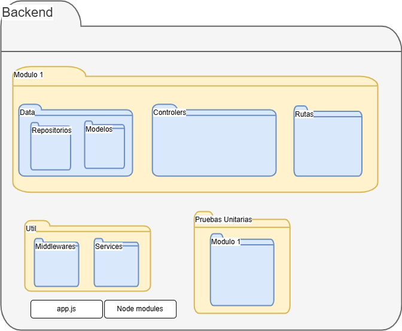

# Manual Técnico ALTERTEX

## Índice

1. [Introducción](#1-introducción)
2. [Requisitos Previos](#2-requisitos-previos)
3. [Preparación del Proyecto](#3-preparación-del-proyecto)
4. [Estructura de Carpetas](#4-estructura-de-carpetas)
5. [Configuración del Entorno](#5-configuración-del-entorno)
6. [Ejecución del Proyecto](#6-ejecución-del-proyecto)
7. [Pruebas del Sistema](#7-pruebas-del-sistema)
8. [CI/CD y Despliegue](#8-cicd-y-despliegue)
9. [Documentación Visual](#9-documentación-visual)
10. [Referencias Cruzadas](#10-referencias-cruzadas)
11. [Historial de Cambios](#12-historial-de-cambios)

---

## 1. Introducción

Este manual técnico describe paso a paso cómo preparar, ejecutar, probar y mantener el sistema ALTERTEX. Está diseñado para que cualquier desarrollador pueda replicar la instalación y el despliegue del sistema desde cero, sin requerir conocimientos previos del proyecto.

---

## 2. Requisitos Previos

### 2.1 Herramientas necesarias

Instala las siguientes herramientas en tu equipo local:

1. [Node.js (v18 o superior)](https://nodejs.org/)
2. [Git](https://git-scm.com/)
3. [MySQL Workbench](https://dev.mysql.com/downloads/workbench/)
4. [Visual Studio Code](https://code.visualstudio.com/)
5. [Postman](https://www.postman.com/) para pruebas de API REST

### 2.2 Crear y Configurar una Cuenta en AWS

Para poder utilizar los servicios necesarios del sistema ALTERTEX, debes tener una cuenta activa en AWS.

#### Paso a paso para crear la cuenta:

1. Ve a [https://aws.amazon.com](https://aws.amazon.com) y haz clic en **"Crear una cuenta gratuita"**.
2. Ingresa un correo electrónico válido y una contraseña segura.
3. Completa los datos de contacto y método de pago (aunque hay un plan gratuito, AWS requiere una tarjeta de crédito para verificación).
4. Verifica tu identidad vía SMS o llamada.
5. Elige el plan **"Basic"** cuando se te solicite.

#### Activación de servicios requeridos

Una vez creada la cuenta y accediendo a la consola de AWS:

* **EC2**: Busca "EC2" en la barra superior de búsqueda. Sirve para alojar el backend en una máquina virtual.
* **RDS**: Escribe "RDS". Sirve para crear una base de datos relacional MySQL.
* **S3**: Escribe "S3". Sirve para almacenar imágenes u otros archivos del sistema.
* **Amplify**: Escribe "Amplify". Sirve para desplegar el frontend de manera continua desde GitHub.

Verifica que puedes acceder sin errores a cada uno de estos servicios desde la consola.

**Importante:** Si es la primera vez que usas AWS, algunos servicios como RDS pueden tardar unos minutos en estar completamente habilitados tras el registro inicial.

### 2.3 Instalaciones globales necesarias

Instala PM2 en tu equipo local y en la instancia EC2:

```bash
npm install -g pm2
```

### 2.4 Configuración de Servicios en AWS 

#### EC2 (backend)

1. Ir a la consola de AWS > EC2 > "Launch Instance"
2. Configurar:

   * Nombre: `backend-altertex`
   * IAM: Ubuntu Server 22.04 LTS
   * Tipo: t2.micro
   * Crear un par de claves (Key Pair) y descargar `.pem`
   * Configurar grupo de seguridad:

     * Puerto 22 (SSH)
     * Puerto 4000 (para backend)
3. Lanzar la instancia
4. Conectarse por SSH:

```bash
chmod 400 tu-clave.pem
ssh -i "tu-clave.pem" ubuntu@<ip-publica-ec2>
```

5. Instalar Node y PM2:

```bash
curl -fsSL https://deb.nodesource.com/setup_18.x | sudo -E bash -
sudo apt-get install -y nodejs
sudo npm install -g pm2
```

#### RDS (MySQL)

1. Ir a RDS > Crear Base de Datos
2. Elegir MySQL (versión 8.0), tipo Free Tier
3. Usuario: root, contraseña segura
4. Crear base: altertex
5. Habilitar acceso público y agregar tu IP en grupo de seguridad

#### S3

1. Ir a S3 > Crear Bucket
2. Nombre único: `altertex-imgs-nombre`
3. Región: us-east-1
4. Desactivar bloqueo de acceso público si se requiere acceso a imágenes

#### Amplify (frontend)

1. Ir a Amplify > Nuevo Proyecto
2. Conectar repositorio GitHub
3. Seleccionar rama (`main`, `staging`)
4. Configurar variables del entorno (VITE\_API\_URL, VITE\_API\_KEY)

#### Links de referencia
1. [MySQL RDS - EC2](https://drive.google.com/file/d/1B9Ei6tlGTNb0JBR01YV85kIeRpS21gMs/view?usp=sharing)
2. [MySQL Capacitación](https://drive.google.com/file/d/1E9aODKokxhfOoEVqCS5lIcIZUki946ts/view?usp=drive_link)

---

## 3. Preparación del Proyecto

### 3.1 Clonar los Repositorios

Abre tu terminal y ejecuta:

```bash
# Backend
cd ~
git clone https://github.com/CodeAnd-Co/Backend-textiles.git
cd Backend-textiles
npm install
cp .env.example .env
```

```bash
# Frontend
cd ~
git clone https://github.com/CodeAnd-Co/Frontend-Text-Lines.git
cd Frontend-Text-Lines
npm install
cp .env.example .env
```

### 3.2 Crear base de datos ALTERTEX

**Usando MySQL Workbench:**

1. Abre MySQL Workbench
2. Conéctate con los datos de RDS
3. Crea la base:

```sql
CREATE DATABASE altertex;
```

4. Archivo > Open SQL Script > Selecciona `ALTERTEX.sql`
5. Ejecuta sobre la base `altertex`

**Desde consola:**

```bash
mysql -h <host-rds> -P 3306 -u root -p
mysql> CREATE DATABASE altertex;
mysql> EXIT;
mysql -h <host-rds> -P 3306 -u root -p altertex < ALTERTEX.sql
```

---

## 4. Estructura de Carpetas




---

## 5. Configuración del Entorno

### 5.1 Variables del Backend

1. Abre `.env` con un editor de texto.
2. Completa los campos:

```env
PORT=4000
NODE_ENV=staging
DB_HOST=<endpoint-RDS>
DB_PORT=3306
DB_USER=root
DB_PASSWORD=tu_clave
DB_NAME=altertex
JWT_SECRET=secreto123
API_KEY=clave-api-secreta
AWS_REGION=us-east-1
AWS_BUCKET_NAME=nombre-bucket
AWS_ACCESS_KEY_ID=...
AWS_SECRET_ACCESS_KEY=...
LOCAL_URL=http://localhost:4000
DEPLOYED_URL=https://api.ejemplo.com/
API_GATEWAY_URL=https://api.ejemplo.com/
```

### 5.2 Variables del Frontend

```env
VITE_API_URL=http://localhost:4000
VITE_API_KEY=clave-api-secreta
```

---

## 6. Ejecución del Proyecto

### 6.1 Ejecutar Backend Local

```bash
cd Backend-textiles
npm run dev
```

Esperar mensaje:

```
Servidor corriendo en puerto: 4000
```

### 6.2 Ejecutar Frontend Local

```bash
cd Frontend-Text-Lines
npm run dev
```

Abrir navegador:

```
http://localhost:5173
```

### 6.3 Backend en EC2

1. Conectarse por SSH a EC2
2. Clonar el repositorio y cambiar a rama correspondiente:

```bash
git clone https://github.com/CodeAnd-Co/Backend-textiles.git staging
cd staging
git checkout staging
npm install
cp .env.staging .env
pm2 start ecosystem-staging.config.js
pm2 logs
```

---

## 7. Pruebas del Sistema

### 7.1 Pruebas Manuales

Usuarios de prueba:

* **SuperAdmin:** [maria.gonzalez@example.com](mailto:maria.gonzalez@example.com) / hola
* **Empleado:** [gabriela.mendoza@example.com](mailto:gabriela.mendoza@example.com) / hola


---

## 8. CI/CD y Despliegue


### 8.1 Despliegue del Backend en EC2 usando PM2

Una vez que el backend esté configurado y las variables `.env` estén listas en la instancia EC2, puedes usar PM2 para ejecutarlo como un proceso permanente.

#### Pasos:

1. Asegúrate de estar en la carpeta del entorno correspondiente:

```bash
cd ~/staging  # o ~/production según el entorno
```

2. Inicia el backend con PM2 usando el archivo de configuración:

```bash
pm2 start ecosystem-staging.config.js
```

> Este archivo ejecuta `app.js` en modo cluster, usando múltiples núcleos del servidor.

3. Verifica que el backend esté corriendo:

```bash
pm2 logs
```

Deberías ver una salida como:

```
Server corriendo en puerto: 4000 en ambiente de staging
```

4. Para ver todos los procesos activos:

```bash
pm2 ls
```

5. Para reiniciar el backend en caso de actualizaciones:

```bash
pm2 restart app-staging
```

---

### 8.2 Despliegue del Frontend con AWS Amplify

AWS Amplify permite desplegar el frontend directamente desde GitHub, sin necesidad de configuración adicional en servidores.

#### Pasos:

1. Ingresa a [AWS Amplify Console](https://console.aws.amazon.com/amplify/).
2. Haz clic en **“New app”** y selecciona **“Host web app”**.
3. Conecta tu repositorio GitHub y selecciona el proyecto `Frontend-Text-Lines`.
4. Elige la rama que deseas desplegar (`main` o `staging`).
5. Configura las variables del entorno necesarias en la sección “Build settings”:

```env
VITE_API_URL=https://api.ejemplo.com/
VITE_API_KEY=clave-api-secreta
```

6. Amplify detectará automáticamente que es un proyecto Vite y construirá la aplicación.

#### Verificación:

* Revisa el progreso del build en la consola de Amplify.
* Si hay errores, entra a “Build logs” para identificar el problema.
* Una vez desplegado exitosamente, se mostrará la URL pública del frontend.


---

## 9. Documentación Visual

### Storybook (Frontend)

```bash
npm run storybook
```

Abre:

```
http://localhost:6006
```

### Swagger (Backend)

Accede a:

```
http://localhost:4000/api-docs
```

---

## 10. Referencias

* [Manual de Despliegue](manual-despliegue-textiles.md)
* [Estrategia Técnica](estrategia-tecnica-textiles.md)
* [Manual de Prueba de Arquitectura](prueba-de-arquitectura.md)
* [Plan de Pruebas](plan-stp.md)
* [MER y Diccionario](diagrama-mer.md)
* [Endpoints del Sistema](endpoints-prueba-arquitectura.md)

---


## 11. Historial de Cambios

| Versión | Descripción                            | Fecha      | Colaborador    |
| ------- | -------------------------------------- | ---------- | -------------- |
| 1.0     | Implementación de Manual Técnico       | 15/05/2025 | Arturo Sánchez |
| 1.0     | Fix de seguimiento del manual con el usuario       | 16/05/2025 | Arturo Sánchez |

