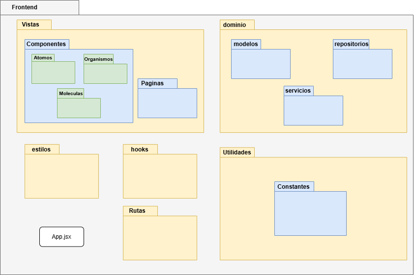

# Manual Técnico ALTERTEX

## Índice

1. [Introducción](#1-introducción)
2. [Requisitos Previos](#2-requisitos-previos)
3. [Preparación del Proyecto](#3-preparación-del-proyecto)
4. [Estructura de Carpetas](#4-estructura-de-carpetas)
5. [Configuración del Entorno](#5-configuración-del-entorno)
6. [Ejecución del Proyecto](#6-ejecución-del-proyecto)
7. [Pruebas del Sistema](#7-pruebas-del-sistema)
8. [CI/CD y Despliegue](#8-cicd-y-despliegue)
9. [Documentación Visual](#9-documentación-visual)
10. [Referencias](#10-referencias)
11. [Historial de Cambios](#11-historial-de-cambios)

---

## 1. Introducción

Este manual técnico describe paso a paso cómo preparar, ejecutar, probar y mantener el sistema ALTERTEX. Está diseñado para que cualquier desarrollador o auditor técnico pueda replicar la instalación desde cero, sin requerir conocimientos previos del proyecto.

### 1.1 ¿Qué es ALTERTEX?

ALTERTEX es un sistema de gestión administrativa B2B2C desarrollado para la empresa Altertex. Permite administrar clientes, productos, cuotas, roles, empleados y más desde una plataforma en la nube. Su arquitectura está compuesta por:

* Un **frontend** desarrollado en React y desplegado en AWS Amplify.
* Un **backend** basado en Node.js alojado en una instancia EC2.
* Una **base de datos MySQL** en RDS.
* Un bucket de **almacenamiento de imágenes** en S3.

---

## 2. Requisitos Previos

### 2.1 Herramientas necesarias

Instala las siguientes herramientas en tu equipo local:

1. **Node.js:** Ejecuta el backend del sistema ALTERTEX. [Descargar](https://nodejs.org/)
2. **Git:** Permite clonar el código fuente desde GitHub. [Descargar](https://git-scm.com/)
3. **MySQL Workbench:** Interfaz visual para administrar la base de datos. [Descargar](https://dev.mysql.com/downloads/workbench/)
4. **Postman:** Herramienta para probar las APIs del backend. [Descargar](https://www.postman.com/)

### 2.2 Crear y Configurar una Cuenta en AWS

#### Paso a paso para crear la cuenta:

1. Ve a [https://aws.amazon.com](https://aws.amazon.com) y haz clic en **"Crear una cuenta gratuita"**.
2. Ingresa un correo electrónico válido y una contraseña segura.
3. Completa los datos de contacto y método de pago.
4. Verifica tu identidad vía SMS o llamada.
5. Elige el plan **"Basic"**.

#### Activación de servicios requeridos

* **EC2:** Ejecuta el backend.
* **RDS:** Almacena la base de datos MySQL.
* **S3:** Almacena las imágenes cargadas por los usuarios.
* **Amplify:** Despliega automáticamente el frontend desde GitHub.

**Importante:** Algunos servicios como RDS pueden tardar varios minutos en habilitarse tras la creación de cuenta.

### 2.3 Configuración de Servicios en AWS

#### EC2 (backend)

1. Ir a AWS > EC2 > Launch Instance
2. Configuración:

   * Nombre: `altertex`
   * Imagen: Ubuntu Server 22.04 LTS
   * Tipo: t2.micro (gratis)
   * Par de claves: crear y descargar (`.pem`)
   * Grupo de seguridad:

     * Puerto 22 (SSH)
     * Puerto 80 (HTTP)
     * Puerto 3000 (opcional frontend)
     * Puerto 4000 (backend)
     * Puerto 3306 (RDS)
3. Conectarse por SSH:

```bash
chmod 400 tu-clave.pem
ssh -i "tu-clave.pem" ubuntu@<ip-publica-ec2>
```

4. Instalar Node.js y PM2:

```bash
curl -fsSL https://deb.nodesource.com/setup_18.x | sudo -E bash -
sudo apt-get install -y nodejs
sudo npm install -g pm2
```

#### RDS (MySQL)

1. Ir a RDS > Crear base de datos
2. Tipo: Free Tier
3. Motor: MySQL 8.0
4. Usuario: root / Contraseña segura
5. Nombre de la base: `altertex`
6. Activar acceso público + autorizar IP en grupo de seguridad

#### S3

1. S3 > Crear Bucket
2. Nombre: `altertex-bucket` 
3. Región: us-east-1
4. Configurar accesos según uso del frontend

#### Amplify (frontend)

Consulta el [Manual de Despliegue](manual-despliegue-textiles.md) para conectar GitHub y configurar el entorno correctamente.

#### Links de referencia

1. [MySQL RDS - EC2](https://drive.google.com/file/d/1B9Ei6tlGTNb0JBR01YV85kIeRpS21gMs/view?usp=sharing)
2. [ALTERTEX.SQL](https://drive.google.com/file/d/1phzB82eeAGwSd0o88BYTSBlc2VJlualM/view?usp=drive_link)


---

## 3. Preparación del Proyecto

Después de configurar los servicios en AWS, clonaremos los repositorios y prepararemos el entorno de desarrollo local.

### 3.1 Clonar los Repositorios

```bash
# Backend
cd ~
git clone https://github.com/CodeAnd-Co/Backend-textiles.git
cd Backend-textiles
npm install
cp .env.example .env
```

```bash
# Frontend
cd ~
git clone https://github.com/CodeAnd-Co/Frontend-Text-Lines.git
cd Frontend-Text-Lines
npm install
cp .env.example .env
```

### 3.2 Crear base de datos ALTERTEX

**MySQL Workbench:**

1. Abrir Workbench
2. Conectarse con credenciales de RDS
3. Crear base:

```sql
CREATE DATABASE altertex;
```

4. Cargar y ejecutar el script `ALTERTEX.sql`

**Desde consola:**

```bash
mysql -h <host-rds> -P 3306 -u root -p
mysql> CREATE DATABASE altertex;
mysql> EXIT;
mysql -h <host-rds> -P 3306 -u root -p altertex < ALTERTEX.sql
```

**Capacitación**
1. [MySQL Capacitación](https://drive.google.com/file/d/1E9aODKokxhfOoEVqCS5lIcIZUki946ts/view?usp=drive_link)

---

## 4. Estructura de Carpetas

Una vez clonado el código fuente, es importante conocer su estructura para facilitar navegación, desarrollo y pruebas.




---

## 5. Configuración del Entorno

A continuación, se configuran los archivos `.env` necesarios para que tanto backend como frontend funcionen correctamente.

### 5.1 Variables del Backend

```env
AWS_REGION=...
AWS_BUCKET_NAME=...
AWS_ACCESS_KEY_ID=...
AWS_SECRET_ACCESS_KEY=...

LOCAL_URL=...
LOCAL_URL_BACKEND=...
DEPLOYED_URL=...
API_GATEWAY_URL=...

NODE_ENV=staging
JWT_SECRET=...
API_KEY=...
PORT=4000

DB_HOST=...
DB_PORT=...
DB_USER=...
DB_PASSWORD=...
DB_NAME=...
```

> Estas variables permiten conectar con la base de datos, autenticar usuarios, acceder a servicios de AWS y configurar entornos de desarrollo o producción.

### 5.2 Variables del Frontend

```env
VITE_URL_API=http://localhost:4000
VITE_CLAVE_API=clave-api-secreta
```

> Estas variables permiten que el frontend haga peticiones autenticadas al backend.

---

## 6. Ejecución del Proyecto

Con el entorno ya configurado y los repositorios listos, ejecutamos ambos servidores localmente.

### 6.1 Ejecutar Backend Local

```bash
cd Backend-textiles
npm run dev
```

Esto inicia el servidor backend en `http://localhost:4000`.

### 6.2 Ejecutar Frontend Local

```bash
cd Frontend-Text-Lines
npm run dev
```

Esto abre la interfaz en el navegador en `http://localhost:5173`, donde puedes iniciar sesión.

### 6.3 Backend en EC2

Consulta el [Manual de Despliegue](manual-despliegue-textiles.md) para conocer el proceso completo usando PM2.

---

## 7. Pruebas del Sistema

Una vez que backend y frontend estén en ejecución, inicia sesión con los siguientes usuarios de prueba:

### 7.1 Pruebas Manuales

* **SuperAdmin:** [maria.gonzalez@example.com](mailto:maria.gonzalez@example.com) / hola
* **Empleado:** [gabriela.mendoza@example.com](mailto:gabriela.mendoza@example.com) / hola

> Una vez dentro, verifica que puedas acceder al dashboard y navegar por los módulos.

---

## 8. CI/CD y Despliegue

Para los detalles completos de despliegue del backend (EC2 con PM2) y frontend (Amplify), consulta el [Manual de Despliegue](manual-despliegue-textiles.md).

---

## 9. Documentación Visual

### Storybook (Frontend)

```bash
npm run storybook
```

Abre en:

```
http://localhost:6006
```

### Swagger (Backend)

```
http://localhost:4000/api-docs
```

---

## 10. Referencias

* [Manual de Despliegue](manual-despliegue-textiles.md)
* [Estrategia Técnica](estrategia-tecnica-textiles.md)
* [Manual de Prueba de Arquitectura](prueba-de-arquitectura.md)
* [Plan de Pruebas](plan-stp.md)
* [MER y Diccionario](diagrama-mer.md)
* [Endpoints del Sistema](endpoints-prueba-arquitectura.md)

---

## 11. Historial de Cambios

| Versión | Descripción                                   | Fecha      | Colaborador    |
| ------- | --------------------------------------------- | ---------- | -------------- |
| 1.0     | Implementación inicial del Manual Técnico     | 15/05/2025 | Arturo Sánchez |
| 1.1     | Correcciones continuidad y seguimiento paso a paso     | 16/05/2025 | Arturo Sánchez |
