# Manual paso a paso de prueba de arquitectura

## Creación de proyectos del frontend y backend

### Requisitos Previos

Antes de comenzar, hay que instalar la versión de node especificada en el manual de arquitectura

#### Creación del proyecto

Abrir la terminal y moverse al directorio donde se desea crear la aplicación, una vez allí, ejecutar el comando.

```
npm create vite@latest <nombre-del-proyecto>
```

Seguir los pasos que aparecen una vez se corre el comando

Moverse al directorio que se creó

```
cd <nombre-del-proyecto>
```

Instala las dependencias.

```
npm install
```

Una vez que se instalaron las dependencias, ya podemos correr el servidor localmente.

```
npm run dev
```

Ahora ya tienes una aplicación de React corriendo en tu servidor local.

### Backend

Primero, muévete al directorio donde queramos iniciar nuestro proyecto

Una vez en el directorio, hay que correr el comando

```
npm init
```

Y seguir los pasos que aparecerán en la terminal

Una vez se termine, se generará el archivo **package.json**

Después de esto, hay que instalar la librería de Express, que es el framework que se usará para la creación de nuestra API

```
npm install express
```

Una vez instalado express, pasamos a crear nuestro archivo app.js, y agregar el código inicial para crear una aplicación básica

```js
const express = require("express");
const app = express();
const PORT = process.env.PORT || 3000;

app.use(express.json());
app.use(express.urlencoded({ extended: true }));
app.use(express.static("public"));

app.get("/", (req, res) => {
  res.send("Hola, mundo desde Express!");
});

app.listen(PORT, () => {
  console.log(`Servidor corriendo en http://localhost:${PORT}`);
});
```

Para ejecutar nuestra aplicación, debemos correr el comando

```
node app.js
```

Una vez creados nuestros proyectos, podemos empezar a programar nuestra aplicación

:::warning Aviso
Es importante leer el archivo de [Estrategia tecnica](/docs/proyectos/textiles/documentacion/estrategia-tecnica-textiles) para conocer la forma en la que se desarrollará el proyecto, y otros aspectos como el diagrama de paquetes y el manejo de ramas
:::

## Creación del Backend del proyecto

:::tip Aviso

En este apartado se mostrara como se crearon los endpoints, si se necesitan más detalles, revisar el documento [Endpoints prueba de arquitectura](/docs/proyectos/textiles/documentacion/estrategia-tecnica-textiles) o el repositorios del [backend](https://github.com/DiegoAlfaro1/prueba-arquitectura-backend-textiles)
:::

Para empezar a crear los endpoints, empezaremos a crear la seguridad para estos mismos, por lo que empezaremos por los middlewares de autenticacion y revision de API key

### Función para autentacion del token JWT

Primero tenemos que instalar las dependencias necesarias

```
npm install jsonwebtoken cookie-parser dotenv
```

Ahora tenemos que configurar la libreria de `cookie-parser` en el archivo `app.js`

```js
const cookieParser = require("cookie-parser");

app.use(cookieParser());
```

Ahora creamos el archivo del middleware en la carpeta `middlewares` donde crearemos nuestra función usando este código

```js
/**
 * Middleware para autorizar a un usuario utilizando un token JWT almacenado en las cookies.
 *
 * @param {Object} req - Objeto de solicitud de Express.
 * @param {Object} res - Objeto de respuesta de Express.
 * @param {Function} next - Función para pasar al siguiente middleware.
 * @returns {void} - Devuelve una respuesta JSON en caso de error, o continua con `next()` si el token es válido.
 */
const jwt = require("jsonwebtoken");

module.exports = async (req, res, next) => {
  const token = req.cookies.token; // Obtener el token de las cookies

  console.log(req.cookies);
  console.log(token);

  if (!token) {
    return res.status(403).json({ message: "Acceso denegado" });
  }

  try {
    // Verificar el token JWT
    const verified = jwt.verify(token, process.env.JWT_SECRET);
    req.user = verified; // Agregar información del usuario verificado a la solicitud
    console.log("Verificado");
    next();
  } catch (err) {
    console.log("No Verificado");
    res.status(401).json({ message: "Token inválido", error: err });
  }
};
```

Este código verifica el token guardado en las cookies, y revisarlo utilizando las funciones que nos proporciona JWT, para validar el token recibido.

Una vez creado, podemos utilizar este middleware para proteger las rutas a las que no deberia acceder un usuario no autenticado

```js
router.get("/perfil", autorizarToken, (req, res) => {
  res.json({ message: "Bienvenido a tu perfil", usuario: req.user });
});
```

De esta manera, cuando se haga una llamada a esa ruta, antes de hacer la logica de la función, se llamará a la función y si falla no permitirá completar la solicitud

:::warning Aviso
Esta función solo se usó para la prueba de arquitectura, ya que es necesario revisar los roles y permisos que tienen los usuarios

También se explicará más adelante como se genera el token que se busca validar
:::

También tenemos que configurar nuestro secreto en nuestro `.env`

```js
JWT_SECRET=una clave super secreta
```

### Función para autenticar la API key

Primero tenemos que crear nuestro archivo `revisarApiKey.js`

En este archivo usaremos la siguiente función

```js
/**
 * Middleware para verificar la existencia de un encabezado específico en la solicitud.
 *
 * @param {string} headerName - Nombre del encabezado a verificar.
 * @param {string} [errorMessage="Api key invalida"] - Mensaje de error personalizado en caso de que el encabezado no exista.
 * @returns {Function} - Middleware de Express que verifica la presencia del encabezado.
 */
module.exports = (headerName, errorMessage = "Api key invalida") => {
  return (req, res, next) => {
    const headerValue = req.get(headerName); // Obtener el valor del encabezado

    if (!headerValue) {
      return res.status(400).json({ message: errorMessage }); // Responder con error si no existe
    }

    next(); // Pasar al siguiente middleware si el encabezado existe
  };
};
```

Esta función revisa los `headers` de la petición enviada, y revisará que si se ha enviado el header del API key

Al igual que con el middleware del JWT, lo usaremos en una ruta para añadir una capa adicional de protección.

```js
router.get(
  "/perfil",
  autorizarToken,
  revisarHeader("x-api-key"),
  (req, res) => {
    res.json({ message: "Bienvenido a tu perfil", usuario: req.user });
  }
);
```

Esto hará que a pesar de que el token sea válido, si no se envia el API key, no se completara la petición, esto añade una capa adicional de seguridad a las rutas.

Una vez que tenemos nuestras 2 capas de seguridad, podemos pasar a construir los diferentes módulos de la aplicación

:::warning Aviso
En este manual solo se hablará de las integraciones con servicios externos, si se quiere obtener más información del resto de la aplicación, consultar el repositorio [backend](https://github.com/DiegoAlfaro1/prueba-arquitectura-backend-textiles)
:::

### Integración con AWS RDS

#### Envio de datos

Primero tenemos que instalar las librerias necesarias para utilizar RDS

```
npm install mysql2
```

También tenemos que asegurarnos de haber creado la tabla que se usará para crear el usuario. En este caso, la tabla se llama `Users` con los atributos de name, email, y password

Ahora vamos a crear el archivo de conexion con rds, el cual es una base de datos relacional, que usa MySQL como motor

Primero crearemos nuestro archivo `db.js`

```js
// db.js

const mysql = require("mysql2");

// Configure MySQL connection using environment variables
const connection = mysql.createConnection({
  host: process.env.DB_HOST,
  user: process.env.DB_USER,
  password: process.env.DB_PASSWORD,
  database: process.env.DB_NAME,
});

connection.connect((err) => {
  if (err) {
    console.error("Error connecting to MySQL:", err.stack);
    return;
  }
  console.log("Connected to MySQL as id " + connection.threadId);
});

// Export the connection to use in other files
module.exports = connection;
```

Este archivo nos ayudara a conectarnos a la base de datos que se encuentra en el EC2

Para esto vamos a seguir con nuestra pequeña aplicación. Para poder integrar la envio de datos a RDS, vamos a crear un servicio en nuestro backend para enviar datos.

Primero creamos un nuevo archivo en la carpeta de servicios, y utilizamos el siguiente codigo

```js
// insertItem.js
const connection = require("./db"); // Import the connection from db.js

module.exports = async (nombreTabla, modelo) => {
  // Prepare the query for inserting a record into the MySQL table
  const columns = Object.keys(modelo).join(", ");
  const values = Object.values(modelo)
    .map((value) => `'${value}'`)
    .join(", ");

  const query = `INSERT INTO ${nombreTabla} (${columns}) VALUES (${values})`;

  // Execute the query
  return new Promise((resolve, reject) => {
    connection.query(query, (err, results) => {
      if (err) {
        reject(err);
      } else {
        resolve(results);
      }
    });
  });
};
```

Esta función usa la conexion a la base de datos, hace una preparacion de los datos que utilizara para la query, y crea una query normal de sql para insertar datos en la tabla especificada

Esta función nos ayudará a no tener que crear múltiples bloques de código iguales y poder reutilizar este mismo cada que se quiera subir algo a RDS

Una vez creada esta funcion, podemos pasará a crear nuestra ruta, la cual se encargará de recibir la petición para crear un nuevo usuario.

La ruta se verá de esta manera

```js
router.post(
  "/register",
  checkHeader("x-api-key", "Api key invalida"),
  registerController.register
);
```

Ahora hay que crear el controlador para esta ruta

```js
exports.register = async (req, res) => {
  const { email, password, name } = req.body;

  if (!email || !password) {
    return res.status(401).json({ message: "Se ocupa el mail y contra" });
  }

  try {
    // Crear una nueva instancia de usuario
    const user = new User(name, email, password);

    // Hashear la contraseña antes de guardarla
    await user.hashPassword();

    // Guardar el usuario en la base de datos
    await userRepository.createUser(user);

    res.status(201).json({ message: "Registrado exitosamente" });
  } catch (error) {
    res.status(500).json({ message: error.message });
  }
};
```

Este controlador será el que maneje la lógica necesaria para crear el usuario, aquí es donde entra en acción el diagrama de paquetes, como podemos ver, aun no se llama a la función que creamos primero, en el controlador podemos ver que se crea una clase `User`, el cual es un modelo que nos ayudará a asegurarnos que se envíen los datos correctos

```js
const bcrypt = require("bcryptjs");

class User {
  constructor(name, email, password) {
    this.name = name;
    this.email = email;
    this.password = password;
  }

  async hashPassword() {
    this.password = await bcrypt.hash(this.password, 10);
    return this;
  }
}

module.exports = User;
```

Este modelo User, incluye una función para cifrar la contraseña.

Ahora que creamos el usuario y hasheamos la contraseña, tenemos que crear la función `createUser` en nuestro repositorio

```js
exports.createUser = async (user) => {
  return await enviarDatos("Users", user);
};
```

Como podemos ver, es una función muy pequeña que llama a la función que creamos al principio

Y de esta manera es como podemos crear nuestra ruta para crear un usuario en la base de datos

#### Recibo de datos

Para poder recibir datos de AWS, primero creamos una función similar a la de enviar datos, seguimos el mismo proceso, pero ahora la función será un poco diferente

```js
const connection = require("./db");

module.exports = async (nombreTabla, llaves) => {
  const conditions = Object.keys(llaves)
    .map((key) => `${key} = '${llaves[key]}'`)
    .join(" AND ");

  const query = `SELECT * FROM ${nombreTabla} WHERE ${conditions}`;

  return new Promise((resolve, reject) => {
    connection.query(query, (err, results) => {
      if (err) {
        reject(err);
      } else {
        resolve(results.length > 0 ? results[0] : null);
      }
    });
  });
};
```

Con esta funcion, podremos recibir datos de RDS, en este caso, recibiremos la informacion de un usuario, y haremos el login al sistema

Primero vamos a crear nuestra ruta

```js
router.post(
  "/login",
  checkHeader("x-api-key", "Api key invalida"),
  loginController.login
);
```

Ahora vamos a crear el controlador

```js
/**
 * @file Controlador para la autenticación de usuarios utilizando bcrypt y JWT.
 * @module AuthController
 */

const bcrypt = require("bcryptjs");
const jwt = require("jsonwebtoken");
const userRepository = require("../Data/userRepository");

/**
 * Maneja el inicio de sesión del usuario verificando credenciales y generando un token JWT.
 *
 * @async
 * @function login
 * @param {Object} req - Objeto de solicitud de Express.
 * @param {Object} req.body - Cuerpo de la solicitud con los datos de inicio de sesión.
 * @param {string} req.body.email - Correo electrónico del usuario.
 * @param {string} req.body.password - Contraseña del usuario.
 * @param {string} [req.body.name] - Nombre del usuario (opcional).
 * @param {Object} res - Objeto de respuesta de Express.
 * @returns {Object} Respuesta JSON con un mensaje de éxito o error.
 *
 * @example
 * POST /api/login
 * Body: {
 *   "email": "usuario@ejemplo.com",
 *   "password": "contraseña_segura",
 *   "name": "Juan Pérez"
 * }
 */
exports.login = async (req, res) => {
  const { email, password, name } = req.body;

  if (!email || !password) {
    return res.status(400).json({ message: "Se necesita email y contraseña" });
  }

  try {
    // Buscar al usuario en la base de datos utilizando el repositorio de usuarios
    const user = await userRepository.getUserByEmail(email, name);

    if (!user) {
      return res.status(401).json({ message: "Usuario no encontrado" });
    }

    // Comparar la contraseña proporcionada con la contraseña almacenada (hash)
    const isMatch = await bcrypt.compare(password, user.password);
    if (!isMatch) {
      return res.status(401).json({ message: "Contraseña incorrecta" });
    }

    // Generar un token JWT válido por 1 hora
    const token = jwt.sign({ email: user.email }, process.env.JWT_SECRET, {
      expiresIn: "1h",
    });

    // Configurar el token como una cookie HTTP-only para mayor seguridad
    res.cookie("token", token, {
      httpOnly: true,
      secure: true,
      sameSite: "None",
    });

    res.json({ message: "Inicio de sesión exitoso" });
  } catch (error) {
    res.status(500).json({ message: "Error al iniciar sesión", error });
  }
};
```

Aunque esta función es más extensa, el flujo es parecido a la función para registrar un usuario, solo con la diferencia de que esta hace más verificaciones antes de llamar a la base de datos

Ahora vamos a crear la función del repositorio para obtener los datos

```js
exports.getUserByEmail = async (email, name) => {
  return await recibirDatos("Users", { email, name });
};
```

Al igual que con el registro, esta función solo llama al servicio que obtiene los datos de RDS

Una vez que la función se asegura que las credenciales son correctas, se crea el JWT, y se asigna a una cookie, la misma cookie que se lee en la función de más arriba para autorizar al usuario

Ahora ya tenemos creado tanto el registro de usuarios como el login de usuarios, pero más importante, tenemos implementado el recibir y enviar datos a RDS.

### Integración con AWS S3

#### Subida de archivos a S3

Para poder crear la integración con AWS S3, primero tenemos que instalar las librerias

```
npm install @aws-sdk/client-s3 @aws-sdk/s3-request-presigner
```

Ahora vamos a empezar por crear el flujo de subir una imagen a S3

Primero creamos la ruta

```js
const express = require("express");
const multer = require("multer");

const router = express.Router();
const uploadController = require("../Controllers/upload.controller");
const getUrl = require("../Controllers/getUrl.controller");

const storage = multer.memoryStorage();
const upload = multer({ storage });
router.post("/upload", upload.single("file"), uploadController.upload);
```

Esta ruta, como podemos ver, es diferente, ya que utilizamos un middleware para poder recibir un archivo

Ahora creamos el controlador que utilizara esta ruta

```js
/**
 * Maneja la carga de un archivo a S3.
 *
 * Esta función verifica si hay un archivo en la solicitud y lo sube a un bucket de S3.
 * Luego, responde con un mensaje de éxito o un error en caso de fallo.
 *
 * @function
 * @async
 * @param {Object} req - El objeto de la solicitud HTTP.
 * @param {Object} req.file - El archivo cargado en la solicitud.
 * @param {Buffer} req.file.buffer - El contenido del archivo cargado en forma de buffer.
 * @param {string} req.file.originalname - El nombre original del archivo cargado.
 * @param {string} req.file.mimetype - El tipo MIME del archivo cargado.
 * @param {Object} res - El objeto de la respuesta HTTP.
 * @returns {Object} Respuesta JSON que contiene:
 *   - message: Mensaje de éxito en caso de que la carga se realice correctamente.
 *   - url: URL donde se encuentra el archivo en S3.
 * @throws {Error} Si ocurre un error al subir el archivo a S3.
 *
 * @example
 * // Ejemplo de solicitud con un archivo llamado "image.png"
 * // POST /api/upload
 *
 * // Respuesta esperada:
 * {
 *   "message": "Subido exitosamente",
 *   "url": "https://example-bucket.s3.amazonaws.com/uploads/1234567890abcdef-image.png"
 * }
 */
exports.upload = async (req, res) => {
  // Verifica que se haya recibido un archivo en la solicitud
  if (!req.file) {
    console.log("No hay archivo");
    return res.status(400).json({ error: "No file uploaded" });
  }

  // Genera un nombre único para el archivo
  const fileName = generarNombreUnico(req.file.originalname);

  // Parámetros para subir un objeto a S3
  const params = {
    Bucket: process.env.AWS_BUCKET_NAME,
    Key: `uploads/${fileName}`,
    Body: req.file.buffer,
    ContentType: req.file.mimetype || "application/octet-stream",
  };

  try {
    // Intenta subir el archivo a S3 y obtener la URL prefirmada
    const urlArchivo = await enviarS3(params, fileName);
    res.json({ message: "Subido exitosamente", url: urlArchivo });
  } catch (error) {
    console.error("Error al subir archivo:", error);
    // Responde con un error si falla la carga
    res
      .status(500)
      .json({ message: "Error al subir archivo", error: error.message });
  }
};
```

En este controlador se utiliza una función llamada `generarNombreUnico`, la cual genera un nombre único para los archivos que se suben

```js
/**
 * Función para generar un nombre de archivo único basado en la fecha y un valor aleatorio.
 *
 * @param {string} originalName - El nombre original del archivo, utilizado para obtener la extensión del archivo.
 * @returns {string} - Un nombre único para el archivo, basado en la fecha actual y un valor aleatorio.
 */
const crypto = require("crypto");
const path = require("path");

module.exports = (originalName) => {
  const randomBytes = crypto.randomBytes(16).toString("hex");
  return `${Date.now()}-${randomBytes}${path.extname(originalName)}`;
};
```

Al igual que se hizo con RDS, aqui también utilizaremos un servicio para subir objetos a S3

```js
/**
 * Función para subir un archivo a un bucket de S3.
 *
 * @param {Object} params - Parámetros necesarios para subir el archivo, que incluyen el nombre del archivo, el contenido y otras configuraciones de S3.
 * @param {string} params.Bucket - El nombre del bucket de S3.
 * @param {string} params.Key - El nombre del archivo a subir.
 * @param {Buffer|Stream|Uint8Array} params.Body - El contenido del archivo que se subirá.
 * @returns {Promise<string>} - URL pública del archivo subido en S3.
 * @throws {Error} - Lanza un error si no se puede completar la carga.
 */
const { S3Client, PutObjectCommand } = require("@aws-sdk/client-s3");

const s3 = new S3Client({
  region: "us-east-1",
});

module.exports = async (params) => {
  try {
    await s3.send(new PutObjectCommand(params));
    const fileName = params.Key;
    return `https://${process.env.AWS_BUCKET_NAME}.s3.${process.env.AWS_REGION}.amazonaws.com/uploads/${fileName}`;
  } catch (error) {
    console.error("Error uploading to S3:", error);
    throw new Error("Failed to upload file to S3");
  }
};
```

Con estos bloques de codigo, podemos crear nuestro flujo para subir un archivo a S3

#### Recibo de archivos de S3

Para recibir los archivos que subimos previamente, es un poco diferente que recibir datos de RDS, ya que tenemos que utilizar algo llamado `Pre-signed URL`, lo que nos permitira visualizar el contenido de los archivos

Primero creamos nuestro servicio para generar estos url prefirmados

```js
/**
 * @module generarUrlPrefirmado
 */

const {
  S3Client,
  GetObjectCommand,
  ListObjectsV2Command,
} = require("@aws-sdk/client-s3");
const { getSignedUrl } = require("@aws-sdk/s3-request-presigner");

// Cliente de S3 configurado para la región especificada
const s3Client = new S3Client({
  region: "us-east-1",
});

// Nombre del bucket y tiempo de expiración predeterminado de la URL
const BUCKET_NAME = process.env.AWS_BUCKET_NAME;
const URL_EXPIRATION = 3600;

/**
 * Genera una URL prefirmada para acceder a un objeto almacenado en S3.
 *
 * Esta función genera una URL que permite acceder a un objeto almacenado en S3 sin necesidad de credenciales,
 * válida por un tiempo determinado. La URL prefirmada es útil para la descarga de archivos sin exponer el
 * acceso directo al bucket S3.
 *
 * @function
 * @async
 * @param {string} llaveObjeto - La clave (key) del objeto en el bucket S3.
 * @param {number} [expiresIn=3600] - El tiempo en segundos que la URL prefirmada será válida. Por defecto es 3600 segundos (1 hora).
 * @returns {string} La URL prefirmada generada que permite acceder al objeto.
 * @throws {Error} Si ocurre un error al generar la URL prefirmada.
 *
 * @example
 * // Generar una URL prefirmada para un archivo llamado "image.png"
 * const url = await generarUrlPrefirmado("uploads/image.png");
 * console.log(url); // URL que puede ser usada para acceder al archivo
 */
module.exports = async (llaveObjeto, expiresIn = URL_EXPIRATION) => {
  const command = new GetObjectCommand({
    Bucket: BUCKET_NAME,
    Key: llaveObjeto,
  });

  return getSignedUrl(s3Client, command, { expiresIn });
};
```

Este código nos retorna los urls prefirmados que usaremos

Ahora podemos crear todo el flujo

Primero como siempre creamos la ruta

```js
router.get("/images/:filename", getUrl.getUrl);
```

Ahora creamos el controlador para la ruta

```js
/**
 * @module getUrl
 */

const generarUrlPrefirmado = require("../../util/generarUrlPresigned");

const FOLDER_NAME = "uploads"; // Nombre de la carpeta donde se guardan los archivos
const URL_EXPIRATION = 3600; // Tiempo de expiración de la URL prefirmada en segundos

/**
 * Obtiene una URL prefirmada para acceder a un archivo en S3.
 *
 * @function
 * @async
 * @param {Object} req - El objeto de la solicitud HTTP.
 * @param {Object} req.params - Parámetros de la solicitud, que contiene el nombre del archivo.
 * @param {string} req.params.filename - El nombre del archivo para el cual se generará la URL prefirmada.
 * @param {Object} res - El objeto de la respuesta HTTP.
 * @returns {Object} Respuesta JSON que contiene:
 *   - success: Booleano que indica si la operación fue exitosa.
 *   - url: La URL prefirmada generada para acceder al archivo.
 *   - expiresIn: El tiempo en segundos hasta que la URL expire.
 * @throws {Error} Si ocurre un error al generar la URL prefirmada.
 *
 * @example
 * // Ejemplo de solicitud con un archivo llamado "file.txt"
 * // GET /api/file/file.txt
 *
 * // Respuesta esperada:
 * {
 *   "success": true,
 *   "url": "https://example-bucket.s3.amazonaws.com/uploads/file.txt?...",
 *   "expiresIn": 3600
 * }
 */
exports.getUrl = async (req, res) => {
  try {
    const filename = req.params.filename;
    const objectKey = `${FOLDER_NAME}/${filename}`;

    // Generar URL prefirmada
    const presignedUrl = await generarUrlPrefirmado(objectKey);

    // Responder con la URL prefirmada y la expiración
    res.json({
      success: true,
      url: presignedUrl,
      expiresIn: URL_EXPIRATION,
    });
  } catch (error) {
    console.error("Error generating presigned URL:", error);
    // Manejo de errores
    res.status(500).json({
      success: false,
      message: "Failed to generate presigned URL",
      error: error.message,
    });
  }
};
```

Este seria nuestro controlador que nos regresa un ur json con los mensajes de si la petición fue un exito, el URL que permite visualizar la imagen, y la expiracion del url

Esto permite subir y visualizar archivos desde S3.

# Creación del frontend del proyecto

## Componente para el formulario de login

Primero tenemos que instalar una libreria muy importante que se usara en todo el proyecto

```
npm install axios
```

Esta libreria nos ayuda a hacer peticiones https, como las peticiones post y get

También tenemos que instalar las librerias para los componentes estilizados de material ui

```
npm install @mui/styled-engine-sc @mui/material @emotion/styled @emotion/react
```

Estas son las librerias necesarias para poder utilizar los componentes de MUI

Ahora creamos nuestro component llamado `LoginForm` adentro del archivo `LoginForm.jsx`

```js

<Box
      display='flex'
      justifyContent='center'
      alignItems='center'
      minHeight='90vh'
      bgcolor='#fffff'
    >
      <Card sx={{ width: 400, padding: 3, boxShadow: 3 }}>
        <CardHeader
          title='Welcome Back'
          subheader='Enter your details to sign in'
          sx={{ textAlign: "center" }}
        />
        <CardContent>
          <form onSubmit={handleSubmit}>
            <TextField
              fullWidth
              label='Name'
              variant='outlined'
              margin='normal'
              value={name}
              onChange={(event) => setName(event.target.value)}
              required
            />
            <TextField
              fullWidth
              label='Email'
              type='email'
              variant='outlined'
              margin='normal'
              value={email}
              onChange={(event) => setEmail(event.target.value)}
              required
            />
            <TextField
              fullWidth
              label='Password'
              type='password'
              variant='outlined'
              margin='normal'
              value={password}
              onChange={(event) => setPassword(event.target.value)}
              required
            />
            {message && (
              <Typography
                color={message.includes("successful") ? "green" : "red"}
                textAlign='center'
                mt={1}
              >
                {message}
              </Typography>
            )}
            <CardActions>
              <Button
                type='submit'
                variant='contained'
                fullWidth
                sx={{ mt: 2 }}
              >
                Sign In
              </Button>
            </CardActions>
          </form>
          {/* Register Button */}
          <Stack
            direction='row'
            justifyContent='center'
            alignItems='center'
            mt={2}
          >
            <Typography variant='body2'>Don't have an account?</Typography>
            <Button
              onClick={() => navigate("/register")}
              variant='text'
              sx={{ ml: 1 }}
            >
              Register
            </Button>
          </Stack>
        </CardContent>
      </Card>
    </Box>
  );
```

En este componente necesitamos la función encargada de hacer la logica una vez que se presiona el boton

```js
const handleSubmit = async (event) => {
  event.preventDefault();
  const data = { email, password, name };

  try {
    await axios.post(`${API_URL}/api/login`, data, {
      withCredentials: true,
      headers: { "x-api-key": "api-key" }, // Ensures cookies are sent/received
    });

    // Send request with credentials enabled
    const response = await axios.get(`${API_URL}/api/auth/me`, {
      withCredentials: true,
      headers: { "x-api-key": "api-key" },
    });

    setUser(response.data.user);

    setMessage("Login successful");

    // Redirect after successful login
    setTimeout(() => navigate("/home"), 1000); // Redirect after 1 second
  } catch (error) {
    console.error("Error:", error);
    setMessage("An error occurred");
  }
};
```

También tenemos que definir las variables de estado

```js
const [email, setEmail] = useState("");
const [password, setPassword] = useState("");
const [name, setName] = useState("");
const [message, setMessage] = useState("");
const navigate = useNavigate();
const { setUser } = useAuth();
```

A diferencia de el backend donde se usaba la linea `process.env.Variable`, en react se utiliza de esta manera

```js
const API_URL = import.meta.env.VITE_API_URL;
```

Así obtenemos la URL de nuestra API

Con esto, el componente de login está listo.

## Componente para el formulario de registro

Crear el componente de registro es similar al componente de login, sigue la misma logica, solo que en lugar de mandar una petición a la ruta de login, se hace a la ruta de registrar

```js
import { useState } from "react";
import { useNavigate } from "react-router-dom";
import axios from "axios";
import {
  TextField,
  Button,
  Card,
  CardContent,
  CardHeader,
  CardActions,
  Typography,
  Box,
  FormControlLabel,
  Checkbox,
} from "@mui/material";

const API_URL = import.meta.env.VITE_API_URL;

export default function RegisterForm() {
  const [email, setEmail] = useState("");
  const [password, setPassword] = useState("");
  const [name, setName] = useState("");
  const [message, setMessage] = useState("");
  const [termsAccepted, setTermsAccepted] = useState(false); // New state for checkbox
  const navigate = useNavigate(); // Initialize the navigate function

  const handelSubmit = async (event) => {
    event.preventDefault();

    if (!termsAccepted) {
      setMessage("You must accept the terms and conditions.");
      return;
    }

    const data = { email, password, name };

    try {
      const response = await axios.post(`${API_URL}/api/register`, data, {
        withCredentials: true,
        headers: { "x-api-key": "api-key" },
      });
      setMessage(response.data.message);

      // Redirect to login page after successful registration
      setTimeout(() => navigate("/login"), 1000); // Redirect to login after 1 second
    } catch (error) {
      console.log("Error:", error);
      setMessage("An error occurred during registration.");
    }
  };

  return (
    <Box
      display='flex'
      justifyContent='center'
      alignItems='center'
      minHeight='90vh'
      bgcolor='#fffff'
    >
      <Card sx={{ width: 400, padding: 3, boxShadow: 3 }}>
        <CardHeader
          title='Create an Account'
          subheader='Enter your details to sign up'
          sx={{ textAlign: "center" }}
        />
        <CardContent>
          <form onSubmit={handelSubmit}>
            <TextField
              fullWidth
              label='Name'
              variant='outlined'
              margin='normal'
              value={name}
              onChange={(event) => setName(event.target.value)}
              required
            />
            <TextField
              fullWidth
              label='Email'
              type='email'
              variant='outlined'
              margin='normal'
              value={email}
              onChange={(event) => setEmail(event.target.value)}
              required
            />
            <TextField
              fullWidth
              label='Password'
              type='password'
              variant='outlined'
              margin='normal'
              value={password}
              onChange={(event) => setPassword(event.target.value)}
              required
            />
            <FormControlLabel
              control={
                <Checkbox
                  checked={termsAccepted}
                  onChange={(event) => setTermsAccepted(event.target.checked)}
                  color='primary'
                  sx={{ "& .MuiSvgIcon-root": { fontSize: 18 } }} // Smaller checkbox
                />
              }
              label={
                <Typography variant='body2' sx={{ fontSize: "0.75rem" }}>
                  I agree to the{" "}
                  <a
                    href='/terms-of-service'
                    target='_blank'
                    rel='noopener noreferrer'
                    style={{ fontSize: "0.75rem" }}
                  >
                    Terms of Service
                  </a>{" "}
                  and{" "}
                  <a
                    href='/privacy-policy'
                    target='_blank'
                    rel='noopener noreferrer'
                    style={{ fontSize: "0.75rem" }}
                  >
                    Privacy Policy
                  </a>
                </Typography>
              }
            />
            {message && (
              <Typography
                color={message.includes("successful") ? "green" : "red"}
                textAlign='center'
                mt={2}
              >
                {message}
              </Typography>
            )}
            <CardActions>
              <Button
                type='submit'
                variant='contained'
                fullWidth
                sx={{ mt: 2 }}
              >
                Create Account
              </Button>
            </CardActions>
          </form>
        </CardContent>
        <div style={{ textAlign: "center", marginBottom: "16px" }}>
          <Typography
            variant='body2'
            color='textSecondary'
            sx={{ fontSize: "0.75rem" }}
          >
            Already have an account?{" "}
            <Button
              onClick={() => navigate("/login")}
              variant='text'
              sx={{ fontSize: "0.75rem" }}
            >
              Sign In
            </Button>
          </Typography>
        </div>
      </Card>
    </Box>
  );
}
```

Con el componente de registro creado, ahora podemos acceder de manera normal sistema, porque ahora podemos iniciar sesión con nuestras credenciales

## Otros componentes

### Componente de home

Este es el componente al que se redirige una vez se hace login

```js
import { Link, useNavigate } from "react-router-dom";
import { useAuth } from "./AuthProvider";
import axios from "axios";
import Button from "@mui/material/Button";
import { useState } from "react";

const API_URL = import.meta.env.VITE_API_URL;

function Home() {
  const { user, logout } = useAuth();
  const [imageUrl, setImageUrl] = useState(null);
  const navigate = useNavigate();

  const handleLogout = async () => {
    await axios.post(
      `${API_URL}/api/logout`,
      {},
      { withCredentials: true, headers: { "x-api-key": "api-key" } }
    );
    logout();
    navigate("/login");
  };

  const handleGetImage = async () => {
    try {
      const response = await axios.get(
        `${API_URL}/s3/images/1740439302693-f210cf52db93505f5be2c4e5f477504e.jpg`,
        {},
        { withCredentials: true, headers: { "x-api-key": "api-key" } }
      );

      const url = response.data.url;
      setImageUrl(url);
    } catch (error) {
      console.log(error);
    }
  };

  return (
    <div>
      <h1>Welcome to My React App</h1>
      <nav>
        <Button variant='contained'>
          <Link to='/upload'>Upload</Link>
        </Button>
      </nav>

      <Button variant='contained' onClick={handleGetImage}>
        Obtener imagen de S3
      </Button>

      {imageUrl && (
        <div className='image-container'>
          
        </div>
      )}
      <br></br>
      <br></br>
      <br></br>
      <br></br>

      <button onClick={handleLogout}>Logout</button>
    </div>
  );
}

export default Home;
```

Este componente es muy sencillo, ya que solamente tenemos 4 botones, uno que nos redirige a la página para subir un archivo, un boton que obtiene una imagen de s3 y la despliega, y un boton para hacer logout.

### Componente de upload

Para nuestra página que nos deja subir un archivo utilizaremos este componente

```js
import axios from "axios";
import { useState } from "react";
import Cookies from "js-cookie";

const API_URL = import.meta.env.VITE_API_URL;

export default function Upload() {
  const [file, setFile] = useState(null);

  const handleFileChange = (event) => {
    setFile(event.target.files[0]); // Store the selected file
  };

  const handleUpload = async () => {
    if (!file) {
      alert("Please select a file first.");
      return;
    }

    const formData = new FormData();
    formData.append("file", file); // Key should match backend expectation

    try {
      const response = await axios.post(`${API_URL}/s3/upload`, formData, {
        headers: {
          "Content-Type": "multipart/form-data",
          "x-api-key": "api-key",
        },
        withCredentials: true,
      });

      alert("File uploaded successfully!");
      console.log(response.data);
    } catch (error) {
      console.error("Error uploading file:", error);
    }
  };

  return (
    <div>
      <input type='file' onChange={handleFileChange} />
      <button onClick={handleUpload}>Upload File</button>
    </div>
  );
}
```

Como podemos ver simplemente nos pide escoger un archivo local, y lo envia al endpoint que creamos para poder subir ese archivo

### AuthProvider

Este componente es muy importante, es el componente responsable de proteger nuestras rutas y que se tenga que hacer login antes de utilizar las páginas.

Este componente se divide en tres partes

#### Custom hook useAuth

```js
import { createContext, useContext, useEffect, useState } from "react";
import { useLocation } from "react-router-dom";
import axios from "axios";

const API_URL = import.meta.env.VITE_API_URL;
const AuthContext = createContext(null);

export const AuthProvider = ({ children }) => {
  const [user, setUser] = useState(null);
  const [loading, setLoading] = useState(true);
  const location = useLocation(); // Get the current URL

  useEffect(() => {
    // Avoid fetching user data if already logged in or on login/register pages
    if (
      !user &&
      location.pathname !== "/login" &&
      location.pathname !== "/register"
    ) {
      axios
        .get(`${API_URL}/api/auth/me`, {
          withCredentials: true,
          headers: { "x-api-key": "api-key" },
        })
        .then((res) => setUser(res.data.user))
        .catch((error) => {
          if (error.response) {
            console.log(error);
            console.warn("Acceso denegado");
            setUser(null);
          }
        })
        .finally(() => setLoading(false));
    } else {
      setLoading(false); // Set loading to false if on login or register
    }
  }, [user, location.pathname]); // Re-run on user change or URL change

  const logout = async () => {
    await axios.post(
      `${API_URL}/api/logout`,
      {},
      { withCredentials: true, headers: { "x-api-key": "api-key" } }
    );
    setUser(null);
  };

  return (
    <AuthContext.Provider value={{ user, setUser, loading, logout }}>
      {children}
    </AuthContext.Provider>
  );
};

export const useAuth = () => useContext(AuthContext);
```

Este componente es el que hace la petición al api para poder autorizar nuestro token JWT

#### Componente de ruta protegida

```js
import { useAuth } from "./AuthProvider";
import { Navigate } from "react-router-dom";

const ProtectedRoute = ({ children }) => {
  const { user, loading } = useAuth();

  if (loading) return <p>Loading...</p>;
  return user ? children : <Navigate to='/login' />;
};

export default ProtectedRoute;
```

Este componente utiliza el custom hook personalizado anterior, para redirigir a la ruta de inicio de sesión en caso de que no se autentifique el token

Estos dos componentes anteriores se utilizan de esta manera

```js
import { BrowserRouter as Router, Routes, Route, Link } from "react-router-dom";
import Home from "./Home";
import "./App.css";
import RegisterForm from "./RegisterForm";
import LoginForm from "./LoginForm";
import Upload from "./Upload";
import ProtectedRoute from "./ProtectedRoute";
import { AuthProvider } from "./AuthProvider";

function App() {
  return (
    <Router>
      <AuthProvider>
        <Routes>
          <Route path='/login/' element={<LoginForm />} />
          <Route path='/register/' element={<RegisterForm />} />
          <Route
            path='/home/'
            element={
              <ProtectedRoute>
                <Home />
              </ProtectedRoute>
            }
          />
          <Route
            path='upload'
            element={
              <ProtectedRoute>
                <Upload />
              </ProtectedRoute>
            }
          />
          <Route
            path='/'
            element={
              <ProtectedRoute>
                <Home />
              </ProtectedRoute>
            }
          />
        </Routes>
      </AuthProvider>
    </Router>
  );
}

export default App;
```

Se debe colocar el AuthProvider dentro del routeador para que todas las rutas puedan utilizarlo

También hay que wrappear el componente que se va a rendeerizar en la ruta en el componente de ruta protegida, de esta manera la ruta va a redirigir al login en caso de que no se este autenticado

# Despliegue de la aplicación

## Despliegue del backend

### Servidor

#### Instalaciones iniciales

Para hacer el despliegue del backend utilizamos un servidor de AWS EC2 de tipo `t2.micro`, usando la imagen de `Ubuntu` 22.04

Primero hay que lanzar nuestra instancia de ec2, si no se sabe cómo lanzar una instancia de ec2, consultar este corto [video](https://www.youtube.com/watch?v=86Tuwtn3zp0)

Luego de tener nuestra instancia, vamos a acceder a ella por medio de SSH, en el caso para la prueba de arquitectura usamos este comando

```
ssh -i "PruebaArquitectura.pem" ubuntu@ec2-18-206-253-81.compute-1.amazonaws.com
```

donde `"PruebaArquitectura.pem"` es la llave privada que creamos, en caso de no tenerla en el mismo directorio a donde se encuentra la terminal, también se puede agregar la ruta del archivo `.pem`

Una vez se haya ingresado a la terminal del servidor, vamos a hacer varios pasos

Primero tenemos que instalar node en nuestro servidor usando estos comandos

```
sudo apt update && sudo apt upgrade -y
```

```
curl -fsSL https://deb.nodesource.com/setup_current.x | sudo -E bash -
```

```
sudo apt install -y nodejs
```

y por ultimo verificamos la instalacion

```
node -v
npm -v
```

Una vez tenemos instalado node, instala pm2 globalmente

```
npm install -g pm2
```

Una vez instalado pm2 podemos comenzar a subir nuestra aplicación

#### Configurar git

Ahora para poder subir nuestra aplicación utilizaremos github, asi que clonaremos nuestro repositorio, pero no de la manera usual por http, si no que lo haremos por medio de SSH, estoserá útil más adelante.

Primero tenemos que crear un par de llaves para poder agregar a github

```
ssh-keygen -t rsa -b 4096 -C "tu-email@example.com"
```

Seguir los pasos para poder crear nuestras llaves

Una vez creadas las llaves, tenemos que copiar el contenido de la llave publica y agregarla al siguente apartado en guthub


Ahora en el servidor podemos correr este comando

```
ssh -T git@github.com
```

Y si todo se hizo correctamente deberia aparecer un mensaje como este

```
Hi DiegoAlfaro1! You've successfully authenticated, but GitHub does not provide shell access.
```

Ahora podemos pasar a clonar nuestro repositorio

Esto se hace de manera similar a como normalmente se clona un repositorio, solo que en lugar de copiar el mismo comando desde github, se tiene que seleccionar SSH, y de esa manera le dará el comando necesario, una vez con ese comando, clonaremos el repositorio en el servidor.

```
git clone git@github.com:DiegoAlfaro1/prueba-arquitectura-backend-textiles.git
```

Ahora nos moveremos a la carpeta que se creó con nuestro repositorio, e instalaremos las dependencias

Una vez tenemos las dependencias instaladas, podemos crear nuestros procesos que son los que mantienen la aplicación corriendo

Primero iniciaremos el proceso de producción, antes de iniciar el proceso, tenemos que asegurarnos que estemos en el directorio que tiene toda nuestra aplicación, y que hayamos agregado los .env necesarios

Ahora sí podemos correr nuestro comando para crear el proceso de producción

```
pm2 start ecosystem.config.js --only app-production
```

Esto hace que se ejecute el archivo `ecosystem.config.js`, el cual nos ayudará a iniciar nuestra app en diferentes puertos dependiendo del nombre de la aplicación

Ahora también podemos empezar nuestro proceso de staging, el cual es el mismo comando solo cambiando el nombre de la aplicación

```
pm2 start ecosystem.config.js --only app-staging
```

Ahora ya tenemos nuestras aplicaciones corriendo y podemos consultarlas en los puertos 3000 y 4000 de nuestro servidor

#### API gateway

Para poder utilizar petciones cifradas por medio de https sin tener que configurar un ceritifcado en nuestro de servidor, se utilizo API gateway

Para poder configurar API gateway se uso este video, el cual también explica como desplegar una aplicación en ec2 [video](https://www.youtube.com/watch?v=1238WUz0_fk)

#### CI/CD

Para el despliegue continuo se utilizo un script de github actions el cual se encuentra en la carpeta .github/workflows, el cual permite automatizar la actualización de los archivos manualmente y no tener que recargar nuestro proceso, para ver más a fondo el script consultar la [guia de github actions](../../../guias/github/github-actions.md)

## Despliegue del frontend

El despliegue del frontend se hizo con AWS Amplify

Primero hay que ingresar al apartado de AWS amplify, y crear nuestra app, esto nos lleva a una serie de configuraciones donde se debe otorgar acceso al repositorio de github, y automaticamente detectara los comandos necesarios para desplegar la aplicacion, como se puede ver, Amplify automáticamente despliega la rama main, esto es muy importante ya que nos ayudará a poder desplegar nuestra rama staging de la misma manera

Luego de desplegar la rama, simplemente hay que agregar nuestras variables de entorno a este apartado


Y con esto ya tendriamos desplegado el frontend, al igual que el backend de nuestra prueba de arquitectura

## Integración con Mercado Pago utilizando Checkout Pro

### Objetivo

Integrar el sistema de pagos **Checkout Pro** de Mercado Pago en una aplicación web, desde cero. Aprenderás desde la creación de cuenta hasta el despliegue de un botón de pago funcional.

---

### Requisitos previos

- Tener una cuenta de Mercado Pago (se puede crear una gratuita).
- Tener un backend con Node.js funcionando.
- Tener un frontend hecho en React.
- Tener Postman o herramienta para probar endpoints.
- Conocimientos básicos de JavaScript y HTTP.

---

### 1. Crear cuenta en Mercado Pago

1. Ir a [https://www.mercadopago.com.mx/](https://www.mercadopago.com.mx/)
2. Haz clic en **"Crear cuenta"**
3. Selecciona una cuenta de **tipo empresa/negocio** (esto es importante para habilitar funciones de pagos).
4. Completa los datos de registro como nombre del negocio, correo electrónico, etc.
5. Verifica tu cuenta mediante correo electrónico o SMS.

---

### 2. Obtener credenciales (Access Token)

1. Ingresa a [https://www.mercadopago.com.mx/developers/panel](https://www.mercadopago.com.mx/developers/panel)
2. En el menú izquierdo, ve a **"Credenciales"**
3. Verás dos ambientes:
   - **Producción** (para ventas reales)
4. Copia el **Access Token** del ambiente de **test**.
5. Crea un archivo `.env` en tu backend y agrega la variable:

```env
MERCADO_PAGO_ACCESS_TOKEN=TEST-XXXXXXXXXXXXXXXXXXXXXXXXXXXXXXX
```

Este token será tu llave secreta para autenticar las peticiones al SDK de Mercado Pago.

---

## 3. Configuración del Backend

### 3.1 Instalar SDK

```bash
npm install mercadopago
```

Esto instala el cliente oficial de Mercado Pago lo cual nos permitirá usar todas las funciones que Mercado Pago ofrece.

---

### 3.2 configMercadoPago.js

```js
const { MercadoPagoConfig } = require("mercadopago");

const mercadopago = new MercadoPagoConfig({
  accessToken: process.env.MERCADO_PAGO_ACCESS_TOKEN,
});

module.exports = mercadopago;
```

**¿Qué hace esto?**
Ahora creamos un archivo llamado `configMercadoPago.js` en el backend. Este archivo se encargará de iniciañizar Mercado Pago con el Access Token. Lo que hará es importa la clase `MercadoPagoConfig` desde el SDK, crea una instancia con el token y se exporta para que pueda ser utilizada en todo el backend,

---

### 3.3 configPreference.js

```js
const mercadopago = require("./configMercadoPago");
const { Preference } = require("mercadopago");

const createPreference = async (products) => {
  const items = products.map((product) => ({
    title: product.title,
    quantity: product.quantity,
    unit_price: product.unit_price,
    currency_id: "MXN",
  }));

  const preference = {
    items,
    back_urls: {
      success: "http://localhost:4000/exito",
      failure: "http://localhost:4000/fallo",
      pending: "http://localhost:4000/pendiente",
    },
    auto_return: "approved",
  };

  const preferenceClient = new Preference(mercadopago);
  const response = await preferenceClient.create({ body: preference });

  return response;
};

module.exports = createPreference;
```

**¿Qué hace este archivo?**
Ahora creamos una función que nos permite generar una `preferencia de pago`. Una preferencia es como una orden que le dice a Mercado Pago qué producto se va a pagar, el costo y a donde va a redirigir al usuario según el estado del pago, por lo cual tenemos que crear un archivo llamado `configPreference.js` para recibir una lista de producto.

---

### 3.4 mercadoPago.controller.js

```js
const createPreference = require("../../util/createPreference");

const createPreferenceHandler = async (req, res) => {
  try {
    const products = req.body.products;

    if (!products || !Array.isArray(products) || products.length === 0) {
      return res.status(400).json({ error: "Productos inválidos" });
    }

    const preference = await createPreference(products);
    res.status(200).json({
      id: preference.id,
      init_point: preference.init_point,
    });
  } catch (error) {
    console.error("Error al crear preferencia:", error);
    res.status(500).json({ error: "Error interno al generar la preferencia" });
  }
};

module.exports = { createPreferenceHandler };
```

**¿Qué hace este controlador?**
Ocupamos una función que reciba las peticiones desde el frontend y utilice la función `createPreference` para responder con el link de pago, para eso creamos un archivo de controlador llamado `mercadoPago.controller.js` donde definimos la función de `createPreferenceHandler` la cual se encarga de verificar los productos recibidos y genera la preferencia.

---

### 3.5 mercadoPago.routes.js

```js
const express = require("express");
const router = express.Router();
const {
  createPreferenceHandler,
} = require("../Controllers/mercadoPago.controller");

router.post("/create_preference", createPreferenceHandler);

module.exports = router;
```

**¿Qué hace esta ruta?**
Una vez que el controlador está listo, debemos definir una ruta que lo llame. Para eso crearemos un archivo llamado `mercadoPago.routes.js` donde creamos una ruta POST que se encarga de que reciba las solicitudes del frontend.

---

### 4. Probar endpoint con Postman

1. Método: `POST`
2. URL: `http://localhost:3000/api/mercadoPago/create_preference`
3. Headers:
   - `Content-Type: application/json`
   - `x-api-key: TU_API_KEY` (si usas middleware de autenticación)
4. Body (raw JSON):

```json
{
  "products": [
    {
      "title": "Producto de prueba",
      "quantity": 1,
      "unit_price": 1000
    }
  ]
}
```

**¿Qué hacemos aqui?**
Antes de pasar al frontend, vamos a probar si el endpoint está funcionando correctamente, utilizando Postman y creamos una petición de tipo `POST`, siguiendo los pasos anteriores.

```json
{
  "id": "123456789",
  "init_point": "https://www.mercadopago.com/checkout/start?pref_id=...."
}
```

---

## 5. Frontend

### 5.1 Instalar SDK React

Ahora en el frontend abrimos la terminal en la carpeta del frontend y ejecutamos:

```bash
npm install @mercadopago/sdk-react
```

---

### 5.2 Crear BotonPago.jsx

```jsx
import { useState } from "react";
import { Wallet } from "@mercadopago/sdk-react";
import Button from "@mui/material/Button";

function BotonPago() {
  const [preferenceId, setPreferenceId] = useState(null);

  const crearPreferencia = async () => {
    try {
      const res = await fetch(
        `${import.meta.env.VITE_API_URL}/api/mercadoPago/create_preference`,
        {
          method: "POST",
          headers: {
            "Content-Type": "application/json",
            "x-api-key": import.meta.env.VITE_API_KEY,
          },
          body: JSON.stringify({
            products: [
              {
                title: "Producto de prueba",
                quantity: 1,
                unit_price: 1000,
              },
            ],
          }),
        }
      );

      if (!res.ok) {
        const error = await res.json();
        console.error("Error en respuesta:", error);
        alert("Ocurrió un error al crear la preferencia");
        return;
      }

      const data = await res.json();
      setPreferenceId(data.id);
    } catch (error) {
      console.error("Error al conectar con el backend:", error);
      alert("Error de conexión con el backend");
    }
  };

  return (
    <div>
      <Button variant='contained' color='primary' onClick={crearPreferencia}>
        Pagar con Mercado Pago
      </Button>
      {preferenceId && (
        <div style={{ marginTop: "20px" }}>
          <Wallet initialization={{ preferenceId }} />
        </div>
      )}
    </div>
  );
}

export default BotonPago;
```

**¿Qué hace este componente?**
Crea un componente nuevo en el frontend llamado `BotonPago.jsx`. Este componente tendrá un botón que al hacer clic nos enviará la solicitud al backend para generar la preferencia, recibiendo el `preferenceId` podemos mostrar el botón de MercadoPago utilizando el componente `Wallet` del SDK.

---

### 5.3 Documentación visual de componentes con Storybook

**1. ¿Qué es Storybook?**

Storybook es una herramienta de desarrollo para construir, probar y documentar componentes de interfaz gráfica de usuario de forma aislada y visual.

**2. ¿Por qué usar Storybook?**

- **Aislamiento**: Permite enfocarte en un solo componente a la vez, sin depender de las rutas o el estado global de tu app.
- **Catálogo visual**: Todos los componentes están organizados y son navegables desde una interfaz.
- **Documentación**: Las stories sirven como documentación interactiva de tu UI.
- **Pruebas**:
  - Puedes simular props, estados y eventos fácilmente.
  - Compatible con pruebas visuales y de accesibilidad.

**3. Instalar Storybook**

```bash
npx sb init
npm install @storybook/addon-a11y --save-dev
```

Esto agregará una carpeta llamada _.storybook_ con la configuración central de Storybook que incluye los archivos main.js, preview.js y vitest.js.

- **main.js** define la configuración general de Storybook, incluyendo los addons instalados, las rutas donde se encuentran las historias y el framework que se utilizará (en este caso, React con Vite). Como estaremos utilizando _@storybook/addon-a11y_, debemos asegurarnos de agregarlo dentro del arreglo addons, de la siguiente forma:

```javascript
"addons": [
    "@storybook/addon-essentials",
    "@storybook/addon-onboarding",
    "@chromatic-com/storybook",
    "@storybook/experimental-addon-test",
    "@storybook/addon-a11y"
  ]
```

- **preview.js** define cómo se visualizan tus componentes dentro de Storybook. Aquí puedes configurar decoradores globales, temas personalizados y parámetros que afectan a todas las historias, como controles automáticos para props de tipo color o fecha.
- **vitest.js** y **vitest.workspace.js** conectan Storybook con Vitest, permitiendo ejecutar pruebas automatizadas directamente sobre los componentes definidos en tus historias. Utilizan la configuración de **preview.js** para asegurar coherencia entre el entorno de pruebas y la visualización en Storybook.

**4. Refactorización: src/stories**

Al instalar Storybook, por defecto se incluye una carpeta src/stories con componentes y ejemplos. Vamos a eliminar su contenido y reorganizar el proyecto con una estructura más limpia, modular y escalable.

```bash
src/
├── componentes/
│   └── Button.jsx            # Componente funcional (usando MUI)
├── estilos/
│   └── button.css            # Estilos personalizados del componente (si aplica)
├── stories/
│   └── Button.stories.js     # Historias del componente para Storybook
```

**5. Crear un componente: src/components/Button.jsx:**

```javascript
// Importa React, necesario para definir componentes funcionales
import React from "react";

// Importa PropTypes para validar las props que recibe el componente
import PropTypes from "prop-types";

// Importa el componente Button de la librería Material UI
import MUIButton from "@mui/material/Button";

/** Botón personalizado usando Material UI */
export const Button = ({
  primary = false, // Si es true, usará el color 'primary'; si no, 'secondary'
  backgroundColor = null, // Permite definir un color de fondo personalizado
  size = "medium", // Tamaño del botón: 'small', 'medium' o 'large'
  label, // Texto que aparecerá dentro del botón
  variant = "contained", // Tipo de botón: 'contained', 'outlined', 'text'
  ...props // Cualquier otra prop adicional (por ejemplo: onClick)
}) => {
  // Determina si el botón usará el color 'primary' o 'secondary'
  const color = primary ? "primary" : "secondary";

  // Devuelve el botón de MUI con las props aplicadas
  return (
    <MUIButton
      variant={variant}
      color={color}
      size={size}
      sx={backgroundColor ? { backgroundColor } : {}}
      {...props}
    >
      {label}
    </MUIButton>
  );
};

// Definición de los tipos de props esperadas y sus validaciones
Button.propTypes = {
  /** ¿Es la acción principal en la página? */
  primary: PropTypes.bool,
  /** Color de fondo opcional */
  backgroundColor: PropTypes.string,
  /** Tamaño del botón */
  size: PropTypes.oneOf(["small", "medium", "large"]),
  /** Texto del botón */
  label: PropTypes.string.isRequired,
  /** Variante del botón */
  variant: PropTypes.oneOf(["contained", "outlined", "text"]),
  /** Manejador de clics */
  onClick: PropTypes.func,
};
```

**6. Crear estilo del componente: src/estilos/button.css:**

```css
.storybook-button {
  display: inline-block;
  cursor: pointer;
  border: 0;
  border-radius: 3em;
  font-weight: 700;
  line-height: 1;
  font-family: "Nunito Sans", "Helvetica Neue", Helvetica, Arial, sans-serif;
}
.storybook-button--primary {
  background-color: #555ab9;
  color: white;
}
.storybook-button--secondary {
  box-shadow: rgba(0, 0, 0, 0.15) 0px 0px 0px 1px inset;
  background-color: transparent;
  color: #333;
}
.storybook-button--small {
  padding: 10px 16px;
  font-size: 12px;
}
.storybook-button--medium {
  padding: 11px 20px;
  font-size: 14px;
}
.storybook-button--large {
  padding: 12px 24px;
  font-size: 16px;
}
```

**7. Crear historia del componente: src/stories/Button.stories.js:**

```javascript
// Importa la función `action` de Storybook para mostrar clics en el panel de acciones
import { action } from "@storybook/addon-actions";

// Importa el componente Button que quieres documentar y mostrar en Storybook
import { Button } from "../components/Button";

// Exporta la configuración principal del Storybook para este componente
export default {
  title: "Example/Button",
  component: Button,
  parameters: {
    layout: "centered",
  },
  tags: ["autodocs"],

  // Define qué props pueden ser controladas desde la UI de Storybook
  argTypes: {
    backgroundColor: { control: "color" },
    variant: {
      control: "radio",
      options: ["contained", "outlined", "text"],
    },
    size: {
      control: "radio",
      options: ["small", "medium", "large"],
    },
    primary: { control: "boolean" },
  },

  // Valores por defecto para todas las historias (como un template base)
  args: {
    onClick: action("clicked"),
  },
};

// Define historias específicas (variantes del botón) con diferentes props

export const Primary = {
  args: {
    primary: true,
    label: "Primary Button",
    variant: "contained",
  },
};

export const Secondary = {
  args: {
    primary: false,
    label: "Secondary Button",
    variant: "contained",
  },
};

export const Outlined = {
  args: {
    primary: true,
    label: "Button",
    variant: "outlined",
  },
};

export const Text = {
  args: {
    primary: true,
    label: "Button",
    variant: "text",
  },
};

export const Large = {
  args: {
    size: "large",
    label: "Button",
  },
};

export const Small = {
  args: {
    size: "small",
    label: "Button",
  },
};

export const CustomColor = {
  args: {
    label: "Button",
    backgroundColor: "#FF5722",
    primary: true,
    variant: "contained",
  },
};
```

- **title** : Define cómo se agrupará y mostrará el componente en la interfaz de Storybook. En este caso, 'Example/Button' indica que el componente Button se encontrará dentro del grupo o carpeta virtual llamada Example.
- **component** : Especifica el componente que se está documentando.
- **tags**: Al incluir _autodocs_, se habilita la generación automática de documentación.
- **parameters.docs.description.component**: Proporciona una descripción del componente que aparecerá en la documentación.
- **argTypes** : Define qué props pueden ser controladas desde la UI de Storybook.
- Se define una plantilla (**Template**) para reutilizar la estructura del componente con diferentes argumentos (**args**).
- Se crean historias como **Primary** y **Secondary**, cada una con diferentes argumentos que representan variantes del botón.

**7. Iniciar Storybook**

```bash
npm run storybook
```

**8. Pruebas visuales manuales**

- Simulación de props y eventos
  - Permiten visualizar el componente en diferentes estados cambiando sus props (como color, variante, etc.) desde la interfaz de Storybook.
  - Puedes simular eventos como onClick y verlos reflejados en el panel Actions.

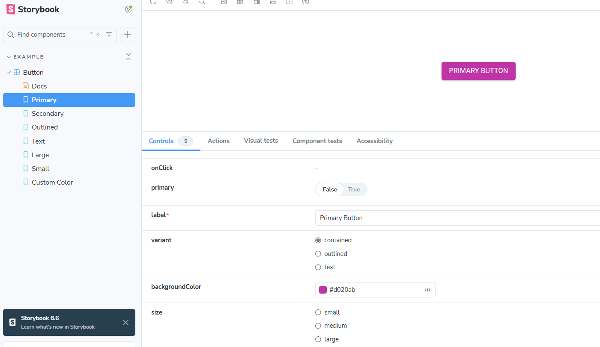

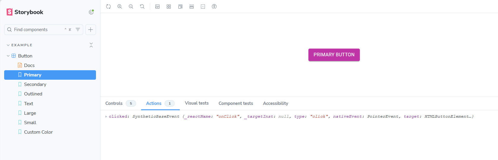

**9. Pruebas de accesibilidad**

- Al instalar @storybook/addon-a11y, se habilita la pestaña A11y en la interfaz de Storybook.
- Esta analiza automáticamente los componentes e identifica posibles problemas de accesibilidad, como:
  - Contraste insuficiente entre texto y fondo.
  - Ausencia de atributos aria-\*.
  - Elementos interactivos sin roles definidos.
  - Estructuras incorrectas como encabezados mal jerarquizados.

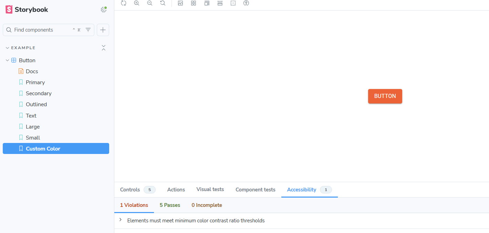

(Coleman & Nguyen, n.d.)

# Pruebas

## Prueba de rendimiento

### Objetivo

Ejecutar una prueba de rendimiento sobre el endpoint de **registro de usuarios** del sistema. El objetivo es simular múltiples registros consecutivos para evaluar el comportamiento de la arquitectura bajo carga y validar la capacidad del sistema para manejar múltiples registros de usuarios consecutivos, sin errores.

### Herramientas necesarias

- [Postman](https://www.postman.com/)
- Acceso a la colección de pruebas o endpoints del sistema

---

### Paso 1: Obtener CSRF Token

1. Abre Postman y crea una nueva solicitud con la siguiente URL: https://nr8nw243lb.execute-api.us-east-1.amazonaws.com/csrf-token
2. Cambia el método a `GET`.
3. Haz clic en **Send**.
4. Copia el valor del campo `"csrfToken"` de la respuesta.

### Paso 2: Ejecutar el script de carga en el endpoint de registro

1. Crea una nueva solicitud en Postman con la siguiente URL: https://nr8nw243lb.execute-api.us-east-1.amazonaws.com/api/register
2. Cambia el método a `POST`.
3. Ve a la pestaña **"Headers"** y añade una key llamada "x-api-key" e introduce un valor como "APIKey".
4. Ve a la pestaña **"Body"** indicando el tipo de body como raw, JSON.

```javascript
  {
    "email": "user@example.com",
    "password": "Test1234!",
    "name": "user"
  }
```

5. Ve a la pestaña **"Pre-request Script"** y pega el siguiente script, reemplazando el csrfToken donde se indica:

```javascript
const totalRequests = 1000;
const delayBetweenRequests = 0; // Ejecutar inmediatamente sin pausas

const url =
  "https://nr8nw243lb.execute-api.us-east-1.amazonaws.com/api/register";
const method = "POST";
const apiKey = "apikey"; // Reemplazar con tu API key real
const csrfToken = "HpaBZMv9-HNzDqmYsppZ211Le3QuYYYY-X50"; // Reemplazar con el token obtenido en el paso 1

let completedRequests = 0;

function makeRequest() {
  completedRequests++;
  console.log(`Sending request ${completedRequests}/${totalRequests}`);

  const requestBody = {
    email: `user${completedRequests}@example.com`,
    password: "Test1234!",
    name: `user${completedRequests}`,
  };

  pm.sendRequest(
    {
      url: url,
      method: method,
      header: {
        "Content-Type": "application/json",
        "x-api-key": apiKey,
        "X-CSRF-Token": csrfToken,
      },
      body: JSON.stringify(requestBody),
    },
    function (err, res) {
      if (err) {
        console.error(`Error on request ${completedRequests}:`, err);
      } else {
        console.log(`Request ${completedRequests} Status: ${res.status}`);
        console.log(`Response: ${res.json ? res.json() : res.text()}`);
      }

      if (completedRequests < totalRequests) {
        makeRequest(); // Ejecutar inmediatamente la siguiente solicitud
      } else {
        console.log("All requests completed.");
      }
    }
  );
}

makeRequest();
```

### Paso 3: Ejecutar el script

1. Haz clic en "Send" en la solicitud que contiene el script anterior.
2. Abre la consola de Postman para ver los resultados en tiempo real.

### Resultados esperados

- Para solicitudes exitosas, deberías ver algo como:
  - Request 7 Status: Created
  - Request 8 Status: Created
- Si alguna solicitud falla, verás un mensaje como:
  - Error on request 14: ...
- Al completar todas las solicitudes, la consola mostrará:
  - All requests completed.

# Prueba de Requerimiento - Carga masiva de archivos a S3

El sistema debe permitir la subida eficiente y estable de una gran cantidad de archivos (hasta 3,000) sin fallos o cuellos de botella críticos.

## Objetivo de la prueba

Validar que el endpoint de subida de archivos (`/s3/upload`) puede recibir múltiples archivos consecutivos (3,000) sin errores de red, pérdida de datos o sobrescritura.

## Herramientas utilizadas

- Node.js (v18+)
- axios – cliente HTTP
- form-data – para enviar archivos como `multipart/form-data`
- Archivo de prueba: `cabra.jpeg`
- Entorno de prueba: local, con conexión a endpoint productivo en AWS API Gateway

## Pasos para realizar la prueba

1. Crear una carpeta de trabajo en el entorno local y colocar el archivo `cabra.jpeg` que se usará para las 3,000 subidas.
2. Inicializar un proyecto Node.js en la carpeta mediante `npm init -y`.
3. Instalar las dependencias necesarias con el comando:  
   `npm install axios form-data`
4. Crear un archivo llamado `upload.js` con el siguiente contenido:

```javascript
const axios = require("axios");
const fs = require("fs");
const FormData = require("form-data");

const ENDPOINT =
  "https://nr8nw243lb.execute-api.us-east-1.amazonaws.com/s3/upload";
const FILE_PATH = "./cabra.jpeg";
const TOTAL_UPLOADS = 3000;
const DELAY_MS = 200;

function delay(ms) {
  return new Promise((resolve) => setTimeout(resolve, ms));
}

async function uploadFile(iteration) {
  const form = new FormData();
  form.append(
    "file",
    fs.createReadStream(FILE_PATH),
    `cabra-${iteration}.jpeg`
  );

  try {
    const response = await axios.post(ENDPOINT, form, {
      headers: form.getHeaders(),
    });
    console.log(`✅ [${iteration}] Subida exitosa - cabra-${iteration}.jpeg`);
  } catch (error) {
    console.error(
      `❌ [${iteration}] Error:`,
      error.response?.status || error.message
    );
  }
}

async function startUpload() {
  for (let i = 1; i <= TOTAL_UPLOADS; i++) {
    await uploadFile(i);
    await delay(DELAY_MS);
  }
  console.log("Subida masiva completada.");
}

startUpload();
```

5. Ejecutar el script con el comando:  
   `node upload.js`
6. Verificar en consola que cada archivo fue subido exitosamente.
7. Comprobar en el bucket de S3 que todos los archivos estén disponibles y nombrados como `cabra-1.jpeg`, `cabra-2.jpeg`, ..., `cabra-3000.jpeg`.

## Resultados esperados

- El sistema debe aceptar 3,000 peticiones consecutivas sin errores de conexión ni pérdida de archivos.
- El endpoint debe retornar una respuesta HTTP 200 para cada archivo subido.
- Ningún archivo debe sobrescribirse: cada uno debe tener un nombre único.
- El tiempo entre peticiones (200ms) debe evitar saturación del endpoint o errores por límite de tasa.
- Todos los archivos deben estar disponibles en el bucket de S3 al finalizar el proceso.

### Inicio de la prueba:

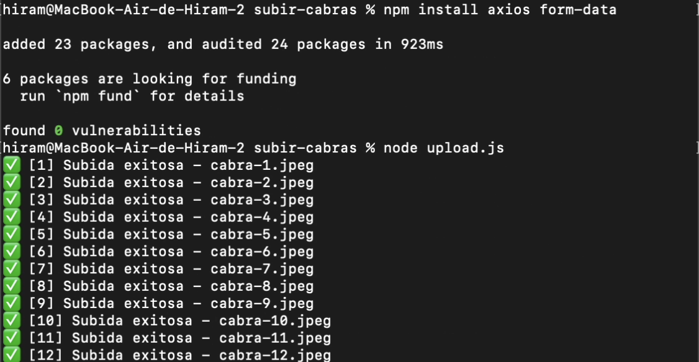

### Final de la prueba:

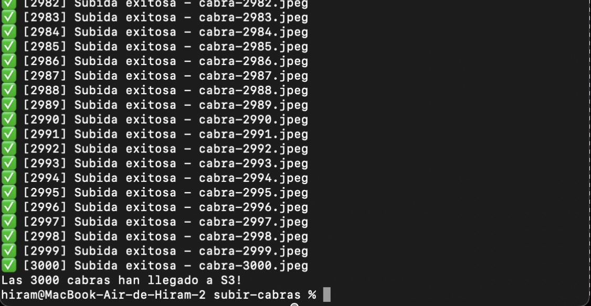

## Prueba de seguridad

### Comprendiendo la Inyección SQL en RDS

Cuando el sistema no valida adecuadamente la información que escribe el usuario, esa entrada puede alterar el comportamiento de la aplicación. En bases de datos SQL como MySQL (usado en Amazon RDS), este tipo de vulnerabilidad ocurre cuando los datos del usuario se utilizan directamente en consultas SQL sin la debida validación o saneamiento. Las consecuencias pueden incluir:

- Manipular parámetros en consultas SQL.
- Modificar condiciones de filtro o cláusulas `WHERE`.
- Inyectar valores maliciosos en consultas `INSERT`, `UPDATE` o `DELETE`.
- Evadir validaciones del lado del servidor, como controles de autenticación o autorización.
- Acceder a datos no autorizados mediante consultas modificadas.

Estas acciones suelen aprovechar las vulnerabilidades en las consultas SQL que no están correctamente parametrizadas. Por ello, es fundamental revisar y proteger los siguientes componentes de las operaciones en bases de datos SQL:

- **Consultas `SELECT`**: Si no se validan adecuadamente los parámetros de entrada, un atacante puede manipular las consultas y obtener datos no autorizados.
- **Consultas `INSERT`, `UPDATE`, `DELETE`**: Al no parametrizar correctamente los valores proporcionados por el usuario, un atacante puede modificar o eliminar datos sensibles.
- **Procedimientos almacenados**: Aunque son más seguros que las consultas dinámicas, si no se controlan adecuadamente, también pueden ser vulnerables a inyecciones SQL.
- **Validación de datos en formularios**: Asegúrese de validar y sanitizar todos los datos de entrada del usuario antes de usarlos en las consultas SQL.

### Prevención

La forma más efectiva de prevenir la inyección SQL en RDS es utilizar **consultas parametrizadas** o **procedimientos almacenados**, que aseguran que los datos proporcionados por el usuario se traten de forma segura. Además, es fundamental implementar un sistema adecuado de validación de entradas y controles de acceso.

### ¿Cómo probar inyecciones SQL?

**1. Preparativos:**

Ántes de comenzar a probar, es necesario instalar las dependencias de _jest_ y _supertest_, para lo que usaremos el siguiente comando:

```
npm install --save-dev jest supertest
```

_jest_ es un framework que nos permite ejecutar pruebas en JavaScript.

_supertest_ permite realizar solicitudes HTTP para probar rutas con Express.

**2. Modificar el archivo app.js:**

Dentro de nuestro **app.js**, agregamos el siguiente código:

```
app.use("/api", rutasLogin);
// Solo escucha si este archivo es ejecutado directamente (no durante tests).
if (require.main === module) {
  app.listen(port, () =>
    console.log(`Server running on port ${port} in ${process.env.NODE_ENV} mode.`)
  );
}

module.exports = app;
```

**3. Crear archivos de prueba:**
Creamos una carpeta llamada "Pruebas" en la raíz del directorio y, a continuación, harémos dos archivos dentro de esta nueva carpeta:

- **register.test.js**
- **login.test.js**

Al final, así se debería ver la ruta:

Pruebas/register.test.js

Pruebas/login.test.js

**4. Archivo de prueba: Pruebas/register.test.js**

```javascript
const request = require("supertest");
const app = require("../app");

const apiKey = "apikey";

// Entradas válidas
const safePayload = {
  email: "hola@hotmail.com",
  password: "hola",
  name: "hola",
};

const maliciousInputs = [
  // 1. Manipula lógica booleana
  "' OR 1=1 --",

  // 2. Busca acceso con rol de admin
  "' OR role = 'admin' --",

  // 3. Condición siempre verdadera
  "' OR 1=1",

  // 4. Afecta lógica con existencia/ausencia de atributos
  "' OR EXISTS(SELECT * FROM users WHERE email = 'admin') --",

  // 5. Evalúa tamaño para generar condiciones verdaderas
  "' OR LENGTH(email) > 0 --",

  // 6. Simula cierre de expresión + operador lógico
  "' OR 1=1) --",

  // 7. Inserta condición válida para saltar seguridad
  "' OR email = 'hola@hotmail.com' --",

  // 8. Lógica invertida y maliciosa
  "' AND email != 'hola@hotmail.com' --",

  // 9. Condición redundante que puede romper lógica
  "' OR email = email --",

  // 10. Intento de manipular expresión con uso de funciones válidas
  "' UNION SELECT username, password FROM users --",

  // 11. Intenta inyectar un DROP TABLE dentro de una expresión de actualización
  "'; DROP TABLE users --",

  // 12. Manipula valores dinámicos al nivel de parámetros
  "' OR 1=1 --",

  // 13. Intenta cerrar una expresión SQL y ejecutar código malicioso
  "'; SELECT * FROM users; --",
];

describe("/api/register - Pruebas campo por campo contra inyecciones SQL", () => {
  for (const field of Object.keys(safePayload)) {
    for (const attack of maliciousInputs) {
      const payload = { ...safePayload, [field]: attack };

      test(`debería rechazar valor malicioso en el campo "${field}" con valor ${attack}`, async () => {
        const res = await request(app)
          .post("/api/register")
          .set("x-api-key", apiKey)
          .send(payload);

        expect(res.statusCode).toBeGreaterThanOrEqual(400);
        expect(res.body).toHaveProperty("message");
      });
    }
  }
});
```

**5. Archivo de prueba: Pruebas/login.test.js**

```javascript
const request = require("supertest");
const app = require("../app");

const apiKey = "apikey";

// Credenciales válidas
const safePayload = {
  email: "hola@hotmail.com",
  password: "hola",
  name: "hola",
};

const maliciousInputs = [
  // 1. Manipula lógica booleana
  "' OR 1=1 --",

  // 2. Busca acceso con rol de admin
  "' OR role = 'admin' --",

  // 3. Condición siempre verdadera
  "' OR 1=1",

  // 4. Afecta lógica con existencia/ausencia de atributos
  "' OR EXISTS(SELECT * FROM users WHERE email = 'admin') --",

  // 5. Evalúa tamaño para generar condiciones verdaderas
  "' OR LENGTH(email) > 0 --",

  // 6. Simula cierre de expresión + operador lógico
  "' OR 1=1) --",

  // 7. Inserta condición válida para saltar seguridad
  "' OR email = 'hola@hotmail.com' --",

  // 8. Lógica invertida y maliciosa
  "' AND email != 'hola@hotmail.com' --",

  // 9. Condición redundante que puede romper lógica
  "' OR email = email --",

  // 10. Intento de manipular expresión con uso de funciones válidas
  "' UNION SELECT username, password FROM users --",

  // 11. Intenta inyectar un DROP TABLE dentro de una expresión de actualización
  "'; DROP TABLE users --",

  // 12. Manipula valores dinámicos al nivel de parámetros
  "' OR 1=1 --",

  // 13. Intenta cerrar una expresión SQL y ejecutar código malicioso
  "'; SELECT * FROM users; --",
];

describe("api/login - Pruebas campo por campo contra inyecciones SQL", () => {
  for (const field of Object.keys(safePayload)) {
    for (const attack of maliciousInputs) {
      const payload = { ...safePayload, [field]: attack };

      test(`debería rechazar valor malicioso en el campo "${field}" con valor ${attack}`, async () => {
        const res = await request(app)
          .post("/api/login")
          .set("x-api-key", apiKey)
          .send(payload);

        expect(res.statusCode).toBeGreaterThanOrEqual(400);
        expect(res.body).toHaveProperty("message");
      });
    }
  }
});
```

**6. Rutas: login/Routes/loginModule.routes.js**

Aquí se definen los casos de prueba que validan que los endpoints /register y /login rechacen entradas maliciosas. Las pruebas reemplazan uno a uno los campos del payload con valores maliciosos y verifican que la API los rechace correctamente.

```javascript
const validateNoSQLInjection = require("../../util/validateNoSQLInjection");

router.post(
  "/register",
  validateNoSQLInjection,
  checkHeader("x-api-key", "Api key invalida"),
  registerController.register
);

router.post(
  "/login",
  validateNoSQLInjection,
  checkHeader("x-api-key", "Api key invalida"),
  loginController.login
);
```

Aquí se aplica el middleware que valida y limpia los datos antes de llegar al controlador.

**7. Middleware de validación: util/validateNoSQLInjection.js**

```javascript
// middlewares/validateAndSanitize.js

const forbiddenPattern = /['";`]|(--)/; // caracteres típicos en inyecciones

function validateAndSanitize(req, res, next) {
  const { body } = req;

  // Verifica que el cuerpo sea un objeto plano
  if (typeof body !== "object" || Array.isArray(body)) {
    return res.status(400).json({ message: "Formato del cuerpo inválido." });
  }

  for (const [key, value] of Object.entries(body)) {
    // Solo aceptamos strings, números o booleanos simples
    if (
      typeof value !== "string" &&
      typeof value !== "number" &&
      typeof value !== "boolean"
    ) {
      return res
        .status(400)
        .json({ message: `Valor inválido para el campo "${key}".` });
    }

    if (typeof value === "string") {
      if (forbiddenPattern.test(value)) {
        return res
          .status(400)
          .json({ message: `Entrada sospechosa en el campo "${key}".` });
      }

      // Limpieza básica: quitar espacios al inicio/final
      req.body[key] = value.trim();
    }
  }

  next();
}

module.exports = validateAndSanitize;
```

Este middleware actúa como una primera barrera para evitar inyecciones. Valida que cada valor en el cuerpo del request sea del tipo esperado y que no contengan patrones sospechosos (como ', ;, --, etc.).

### Referencias

PortSwigger. (n.d.). NoSQL injection | Web Security Academy. https://portswigger.net/web-security/nosql-injection

Coleman, T., & Nguyen, D. (n.d.). Intro to storybook. Storybook Tutorials. https://storybook.js.org/tutorials/intro-to-storybook/

---

## Ataques CSRF

Un ataque CSRF o Cross-Site Request Forgery, on en español una falsificación de petición en sitios cruzados, es un tipo de ataque en el que el atacante engaña a un usuario autenticado para que realice una acción no deseada en una aplicación web en la que ese usuario ya está autenticado.

Imagina que estás logueado en tu banco desde tu navegador, y sin cerrar la sesión visitas una página maliciosa. Esa página maliciosa **envía una petición al sitio del banco en tu nombre**, aprovechando que tu sesión aún está activa (por ejemplo, usando tus cookies de sesión.

```

```

## ¿Cómo se previene?

- Tokens CSRF: Generar un token único en cada formulario y validarlo en el backend.
- Cabeceras personalizadas: Verificar cabeceras como Origin o Referer.
- SameSite Cookies: Configurar las cookies como SameSite=Strict o SameSite=Lax para evitar que se envíen en contextos cruzados.
- Autenticación adicional: Pedir una segunda autenticación para acciones críticas.

## Instalar Burp Suite

Burp Suite es una herramienta utilizada por hackers éticos, testers de seguridad y desarrolladores para analizar, interceptar y probar la seguridad de aplicaciones web. Es muy útil para detectar vulnerabilidades como:

- CSRF (Cross-Site Request Forgery)
- SQL Injection
- XSS (Cross-Site Scripting)
- Inseguridades en APIs
- Fallas en autenticación y autorización

Burp Suite tiene dos versiones principales:

- Burp Suite Community **(Gratis)**: Incluye herramientas básicas como el interceptor de tráfico HTTP y el escáner manual.
- Burp Suite Professional **(De pago)**: Incluye herramientas avanzadas como el escáner automático de vulnerabilidades

Ve a la página oficial de PortSwigger y descarga la versión que prefieras:
(https://portswigger.net/burp/communitydownload)[Link de descarga]
Elige la versión para tu sistema operativo:

- Windows (.exe)
- MacOS (.dmg)
- Linux (.sh)

## Configuración de Burp Suite

Para interceptar tráfico, necesitas configurar Burp Suite como proxy en tu navegador.

### Configurar Proxy en Burp Suite

- Abre Burp Suite y ve a la pestaña Proxy → Options.
- Asegúrate de que el proxy esté en 127.0.0.1:8080.

### Configurar el navegador

Debes configurar tu navegador para que use el proxy de Burp Suite:

#### En Firefox:

1. Ve a Configuración → General → Configuración de Red.
2. Selecciona Configuración Manual del Proxy.
3. Pon en HTTP Proxy: 127.0.0.1 y Puerto: 8080.
4. Marca Usar este proxy para todos los protocolos.

#### En Chrome

1. Usa la extensión FoxyProxy o configura el proxy manualmente en la configuración de red.

Ahora, dentro de Burp Suite, dirígete a la pestaña de proxy y selecciona la opción de “Open Browser” o “Abrir Navegador”

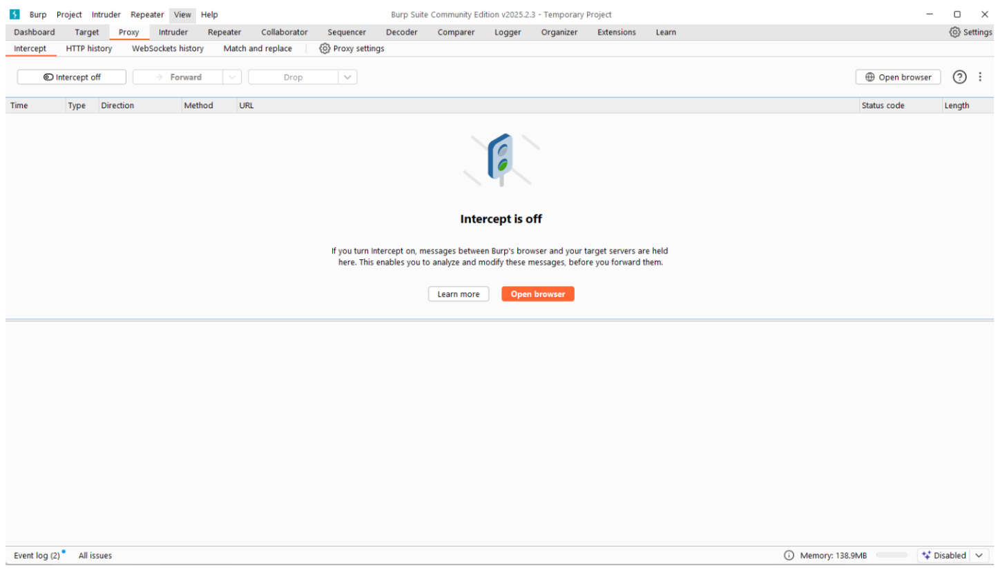

Después, dentro del navegador, pega la URL de la página para realizar las pruebas. En este caso, utilizaremos la dirección http://localhost:5173/login solo que cambiaríamos localhost por [::1] para evitar errores de que no cargue la página dentro de Burp: http://[::1]:5173/login

Al abrir la dirección URL dentro de Burp, podemos observar que se abre una pestaña dentro del navegador:

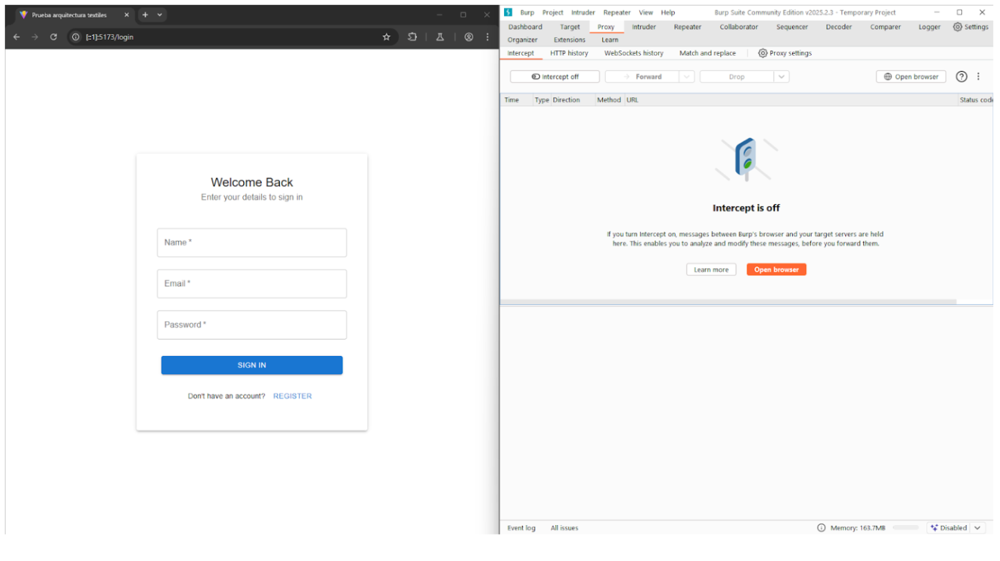

Si nos movemos a HTTP history observamos que cuando realizamos una petición dentro del navegador, se registra dentro del historial.

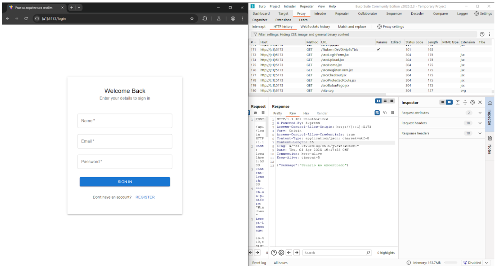

Dentro del request se pueden ver los datos que se están enviando mediante el formulario.

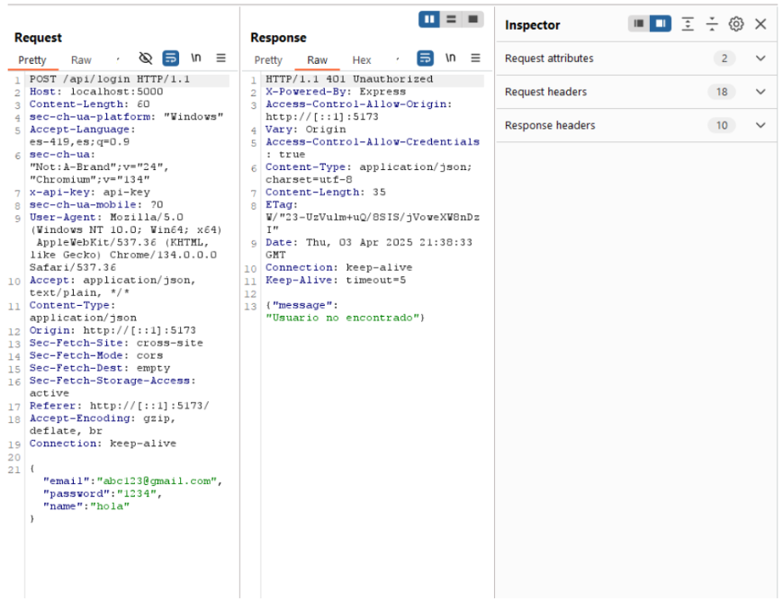

Haz clic derecho dentro de la petición o request, después selecciona send to repeater.

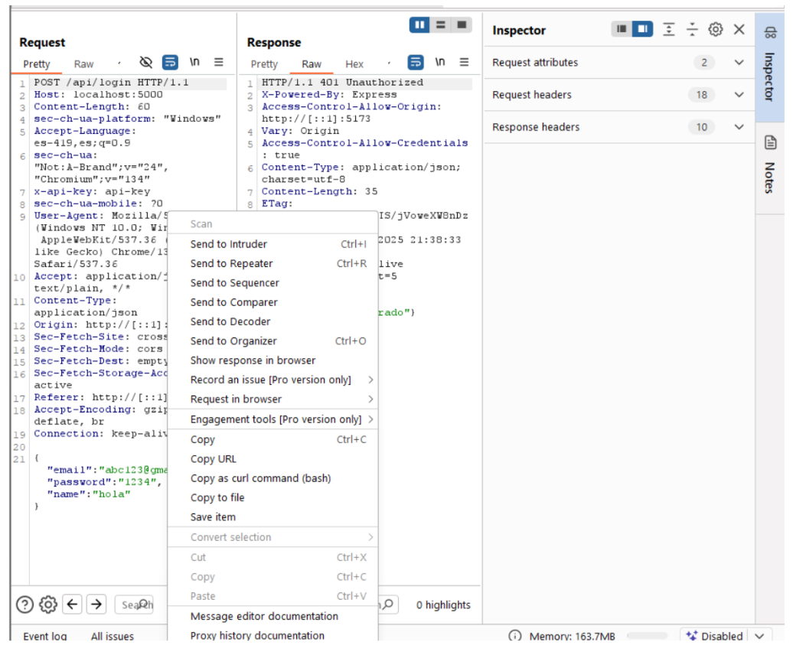

Ahora, abre la pestaña del repeater. Si haces clic en el botón de send o enviar y se realiza la petición de forma exitosa, quiere decir que la aplicación no está protegida contra CSFRF porque no se está generando un token del formulario para validarlo en el backend.

1. No hay ningún token CSRF en la solicitud que el backend valide.
2. La solicitud en Repeater funcionó sin ninguna modificación, lo que implica que no hay protección activa contra CSRF.

Si un atacante crea un sitio malicioso con un formulario oculto y logra que un usuario autenticado lo visite, la API aceptará la solicitud como válida, porque el navegador enviará la cookie de sesión automáticamente.

Al implementar la librería de CSURF nos permite proteger las consultas de ataque maliciosos, por lo que al realizar un POST sin un token CSRF, no nos permite realizar una petición hacia nuestra API.

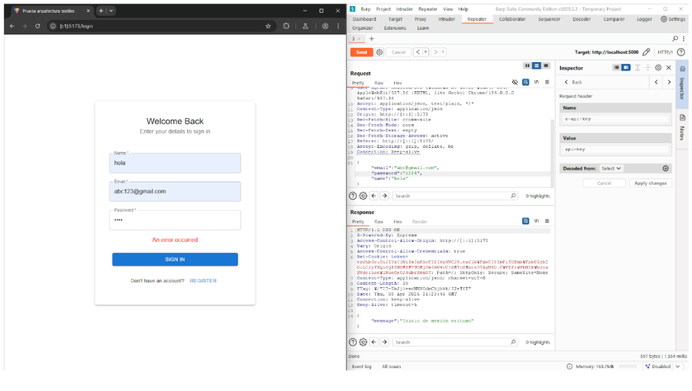

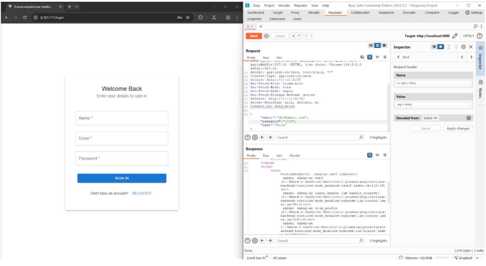

## Prueba de Usabilidad

### Objetivo

Esta prueba tiene como propósito validar la usabilidad y correcta funcionalidad del sistema en distintos navegadores web modernos. El objetivo es garantizar que los usuarios puedan interactuar con la aplicación de forma fluida y sin errores, independientemente del navegador utilizado.

La prueba consiste en ejecutar una serie de casos funcionales clave (como inicio de sesión, registro de usuario, carga y obtención de imágenes, integración con pasarela de pagos y cierre de sesión) en los navegadores Google Chrome, Microsoft Edge, Mozilla Firefox y Safari.

Aunque el desarrollo y validación oficial de la aplicación se enfoca únicamente en asegurar su correcto funcionamiento en Google Chrome y Microsoft Edge, también se realizan pruebas exploratorias en otros navegadores con el fin de detectar posibles inconsistencias y documentarlas.

Cada funcionalidad se verifica visual y funcionalmente, observando en tiempo real el comportamiento de la interfaz y la respuesta ante distintas interacciones del usuario. Las pruebas incluyen también observaciones sobre errores detectados o diferencias relevantes en la experiencia de uso.

| Caso de Prueba        | Navegador | Versión del Navegador | Resultado Esperado                                | Resultado Observado                               | ¿Funciona correctamente? | Notas/Errores encontrados                     |
| --------------------- | --------- | --------------------- | ------------------------------------------------- | ------------------------------------------------- | ------------------------ | --------------------------------------------- |
| Inicio de sesión      | Chrome    | 134.0.6998.179        | Redirección a la aplicación                       | Redirección a la aplicación                       | Sí                       | N/A                                           |
| Registrar usuario     | Chrome    | 134.0.6998.179        | Registro con éxito y redirección a Iniciar sesión | Registro con éxito y redirección a Iniciar sesión | Sí                       | N/A                                           |
| Subir imagen          | Chrome    | 134.0.6998.179        | Imagen subida con éxito                           | Imagen subida con éxito                           | Sí                       | N/A                                           |
| Obtener imagen        | Chrome    | 134.0.6998.179        | Recuperación de imagen subida                     | Recuperación de imagen subida                     | Sí                       | N/A                                           |
| Mercado Pago Checkout | Chrome    | 134.0.6998.179        | Redirección a Mercado Pago Checkout               | Redirección a Mercado Pago Checkout               | Sí                       | N/A                                           |
| Cerrar sesión         | Chrome    | 134.0.6998.179        | Redirección al inicio de sesión                   | Redirección al inicio de sesión                   | Sí                       | N/A                                           |
| Inicio de sesión      | Firefox   | 137.0                 | Redirección a la aplicación                       | Redirección a la aplicación                       | Sí                       | N/A                                           |
| Registrar usuario     | Firefox   | 137.0                 | Registro con éxito y redirección a Iniciar sesión | Registro con éxito y redirección a Iniciar sesión | Sí                       | N/A                                           |
| Subir imagen          | Firefox   | 137.0                 | Imagen subida con éxito                           | Imagen subida con éxito                           | Sí                       | N/A                                           |
| Obtener imagen        | Firefox   | 137.0                 | Recuperación de imagen subida                     | Recuperación de imagen subida                     | Sí                       | N/A                                           |
| Mercado Pago Checkout | Firefox   | 137.0                 | Redirección a Mercado Pago Checkout               | Redirección a Mercado Pago Checkout               | Sí                       | N/A                                           |
| Cerrar sesión         | Firefox   | 137.0                 | Redirección al inicio de sesión                   | Redirección al inicio de sesión                   | Sí                       | N/A                                           |
| Inicio de sesión      | Edge      | 134.0.3124.93         | Redirección a la aplicación                       | Redirección a la aplicación                       | Sí                       | N/A                                           |
| Registrar usuario     | Edge      | 134.0.3124.93         | Registro con éxito y redirección a Iniciar sesión | Registro con éxito y redirección a Iniciar sesión | Sí                       | N/A                                           |
| Subir imagen          | Edge      | 134.0.3124.93         | Imagen subida con éxito                           | Imagen subida con éxito                           | Sí                       | N/A                                           |
| Obtener imagen        | Edge      | 134.0.3124.93         | Recuperación de imagen subida                     | Recuperación de imagen subida                     | Sí                       | N/A                                           |
| Mercado Pago Checkout | Edge      | 134.0.3124.93         | Redirección a Mercado Pago Checkout               | Redirección a Mercado Pago Checkout               | Sí                       | N/A                                           |
| Cerrar sesión         | Edge      | 134.0.3124.93         | Redirección al inicio de sesión                   | Redirección al inicio de sesión                   | Sí                       | N/A                                           |
| Inicio de sesión      | Safari    | 18.4                  | Redirección a la aplicación                       | Inicio de sesión inválido                         | No                       | No se puede iniciar sesión, pero sí registrar |
| Registrar usuario     | Safari    | 18.4                  | Redirección a la aplicación                       | Inicio de sesión inválido                         | Sí                       | N/A                                           |
| Subir imagen          | Safari    | 18.4                  | Imagen subida con éxito                           | Inicio de sesión inválido                         | No                       | No se puede iniciar sesión                    |
| Obtener imagen        | Safari    | 18.4                  | Recuperación de imagen subida                     | Inicio de sesión inválido                         | No                       | No se puede iniciar sesión                    |
| Mercado Pago Checkout | Safari    | 18.4                  | Redirección a Mercado Pago Checkout               | Inicio de sesión inválido                         | No                       | No se puede iniciar sesión                    |
| Cerrar sesión         | Safari    | 18.4                  | Redirección al inicio de sesión                   | Inicio de sesión inválido                         | No                       | No se puede iniciar sesión                    |

---

| **Tipo de Versión** | **Descripción**                                            | **Fecha** | **Colaborador**                |
| ------------------- | ---------------------------------------------------------- | --------- | ------------------------------ |
| **1.0**             | Se creó la documentación de la prueba de arquitectura      | 4/3/2025  | Arturo Sanchez, Diego Alfaro   |
| **1.1**             | Se añadió la documentación de la prueba de rendimiento     | 3/4/2025  | Valeria Zúñiga Mendoza         |
| **1.2**             | Se añadió la documentación de la prueba de inyección NoSQL | 5/4/2025  | Paola Garrido y Carlos Fonseca |
| **1.3**             | Se añadió la documentación de Storybook                    | 5/4/2025  | Paola Garrido                  |
| **1.4**             | Se añadió la documentación de pruebas CSRF                 | 5/4/2025  | Angel Ramírez                  |
| **1.5**             | Se añadió la documentación de pruebas de Usabilidad        | 6/4/2025  | Nicolas Hood                   |
| **1.6**             | Se añadió la documentación de pruebas de Rendimiento       | 6/4/2025  | Hiram Mendoza                  |
