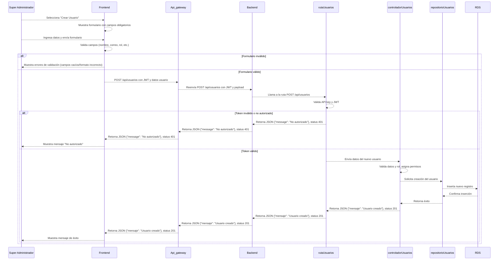

# RF1: Super Administrador Crea Usuario

**Última actualización:** 07 de abril de 2025

---

## Historia de Usuario

Como **Super Administrador**, quiero poder registrar nuevos usuarios en el sistema, asignándoles un rol y permisos específicos para gestionar su acceso de manera estructurada y eficiente.

### **Criterios de Aceptación:**

1. El Super Administrador debe poder acceder a la opción de **"Crear Usuario"** desde el panel de administración.
2. Se debe mostrar un formulario con los siguientes campos obligatorios:
   - Nombre completo
   - Correo electrónico
   - Número de telefono
   - Cliente al que pertenece
   - Rol del usuario (Ejemplo: Administrador, Usuario estándar, Moderador, etc.)
   - Permisos específicos según el rol seleccionado
   - Contraseña establecida y confirmada
3. Si los datos ingresados son válidos, el sistema debe registrar al nuevo usuario y mostrar un mensaje de confirmación.
4. Si algún campo obligatorio está vacío o con formato incorrecto, se debe mostrar un mensaje de error indicando qué corregir.
5. El usuario recién creado debe poder iniciar sesión con las credenciales proporcionadas.

---

## **Diagrama de Secuencia**

> _Descripción_: El diagrama de secuencia muestra cómo el **Super Administrador** interactúa con el sistema para registrar un nuevo usuario. Inicia con la selección de la opción "Crear Usuario", la validación de los datos ingresados, el almacenamiento en la base de datos y la notificación al nuevo usuario.

---

## **Mockup**

> _Descripción_: El mockup representa la interfaz del sistema donde el **Super Administrador** completa los datos del nuevo usuario, selecciona su rol y permisos, y confirma la creación del usuario en el sistema.

## **Pruebas Unitarias**

En caso de que alguna de las pruebas unitarias no sea aprobada, se deberá realizar una nueva iteración del proceso de pruebas.
Este proceso continuará de forma iterativa hasta que todas las pruebas sean aprobadas satisfactoriamente, garantizando así la estabilidad y el cumplimiento de los requisitos funcionales definidos en la historia de usuario.

**Iteración:** 1

| ID Prueba | Descripción                              | Precondiciones                                                             | Valores de entrada                                                                  | Resultado esperado                                                                 | Resultado observado | Aprobado (sí/no) |
| --------- | ---------------------------------------- | -------------------------------------------------------------------------- | ----------------------------------------------------------------------------------- | ---------------------------------------------------------------------------------- | ------------------- | ---------------- |
| CU001     | Todos los campos válidos                 | Acceso al sistema con rol de super admin                                   | Nombre, Apellido, Correo válido, Fecha válida, Teléfono válido, Rol válido, Cliente | Mensaje de éxito: Usuario creado exitosamente y redirección a la vista de usuarios | pending             | pending          |
| CU002     | Campo “Nombre” vacío                     | Acceso al sistema con rol de super admin                                   | Nombre vacío                                                                        | Error: “Nombre es obligatorio”                                                     | pending             | pending          |
| CU003     | Campo “Apellido” vacío                   | Acceso al sistema con rol de super admin                                   | Apellido vacío                                                                      | Error: “Apellido es obligatorio”                                                   | pending             | pending          |
| CU004     | Campo “Fecha de nacimiento” no ingresada | Acceso al sistema con rol de super admin                                   | Fecha de nacimiento vacía                                                           | Error: “Fecha de nacimiento es obligatoria”                                        | pending             | pending          |
| CU005     | Fecha de nacimiento futura               | Acceso al sistema con rol de super admin                                   | Fecha = 2050-01-01                                                                  | Error: “Fecha no puede ser futura”                                                 | pending             | pending          |
| CU006     | Correo con formato inválido              | Acceso al sistema con rol de super admin                                   | Correo = "usuario.com"                                                              | Error: “Correo electrónico no válido”                                              | pending             | pending          |
| CU007     | Correo ya registrado                     | Acceso al sistema con rol de super admin y usuario previo con mismo correo | Correo = "ya@existe.com"                                                            | Error: “Correo ya registrado”                                                      | pending             | pending          |
| CU008     | Teléfono con letras                      | Acceso al sistema con rol de super admin                                   | Teléfono = "55abc1234"                                                              | Error: “Número de teléfono inválido”                                               | pending             | pending          |
| CU009     | Cliente no seleccionado (dropdown vacío) | Acceso al sistema con rol de super admin                                   | Cliente = ""                                                                        | Error: “Debe seleccionar un cliente”                                               | pending             | pending          |
| CU010     | Cliente inválido (no está en catálogo)   | Acceso al sistema con rol de super admin                                   | Cliente = "Ferrari"                                                                 | Error: “Cliente no reconocido”                                                     | pending             | pending          |
| CU011     | Rol no seleccionado (dropdown vacío)     | Acceso al sistema con rol de super admin                                   | Rol = ""                                                                            | Error: “Debe seleccionar un rol”                                                   | pending             | pending          |
| CU012     | Rol inválido (no registrado en sistema)  | Acceso al sistema con rol de super admin                                   | Rol = "Maestro Jedi"                                                                | Error: “Rol no reconocido”                                                         | pending             | pending          |
| CU013     | Contraseña vacía                         | Acceso al sistema con rol de super admin                                   | Contraseña = ""                                                                     | Error: “Contraseña es obligatoria”                                                 | pending             | pending          |
| CU014     | Validación de contraseña no coincide     | Acceso al sistema con rol de super admin                                   | Contraseña = "abc123", Confirmación = "abc1234"                                     | Error: “Las contraseñas no coinciden”                                              | pending             | pending          |
