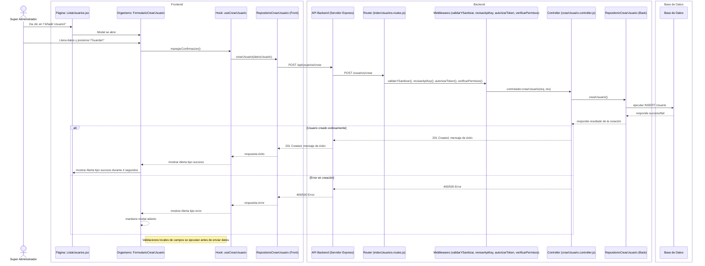
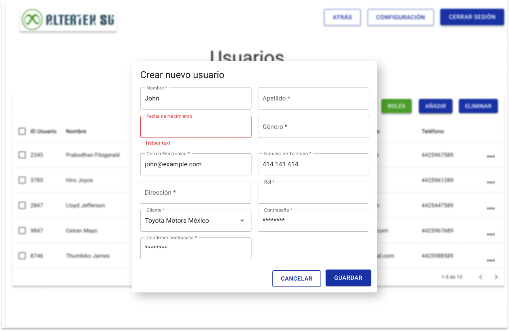

# RF1: Super Administrador Crea Usuario

---

## Historia de Usuario

Como **Super Administrador**, quiero poder registrar nuevos usuarios en el sistema, asignándoles un rol y permisos específicos para gestionar su acceso de manera estructurada y eficiente.

### **Criterios de Aceptación:**

1. El Super Administrador debe poder acceder a la opción de **"Crear Usuario"** desde el panel de administración.
2. Se debe mostrar un formulario con los siguientes campos obligatorios:
   <<<<<<<<< Temporary merge branch 1
   - Nombre
   - Apellido(s)
   - Fecha de Nacimiento
   - Género
   - Correo electrónico
   - Número de telefono
   - Dirección
   - Cliente al que pertenece
   - Rol del usuario (Ejemplo: Administrador, Usuario estándar, Moderador, etc.)
   - # Contraseña establecida y confirmada
   - Nombre(s)
   - Apellido(s)
   - Fecha de nacimiento
   - Género
   - Correo electrónico
   - Número de telefono
   - Dirección
   - Rol del usuario (Ejemplo: Administrador, Usuario estándar, Moderador, etc.)
   - Cliente al que pertenece
   - Contraseña establecida y confirmada
3. Si los datos ingresados son válidos, el sistema debe registrar al nuevo usuario y mostrar un mensaje de confirmación.
4. Si algún campo obligatorio está vacío o con formato incorrecto, se debe mostrar un mensaje de error en el campo a corregir.
5. Si el rol seleccionado es Super Administrador, entonces el campo cliente debe bloquearse y asignarse automaticamente a todos los clientes.
6. El usuario recién creado debe poder iniciar sesión con las credenciales proporcionadas.
7. Se debe validar que no exista un usuario con el correo electrónico ingresado.
8. Se debe validar que no exista un usuario con el número de teléfono ingresado.

---

## **Diagrama de Secuencia**

> _Descripción_: El diagrama de secuencia muestra cómo el **Super Administrador** interactúa con el sistema para registrar un nuevo usuario. Inicia con la selección de la opción "Crear Usuario", la validación de los datos ingresados, el almacenamiento en la base de datos y la notificación al nuevo usuario.

---

## **Mockup**

> _Descripción_: El mockup representa la interfaz del sistema donde el **Super Administrador** completa los datos del nuevo usuario, selecciona su rol y permisos, y confirma la creación del usuario en el sistema.

## **Pruebas**

_<u>[Enlace a pruebas RF2 Consultar Lista de Usuarios.](https://docs.google.com/spreadsheets/d/1NLGwGrGA5PVOEzLaqxa8Ts1D_Ng3QzzqNKWJYUzxD-M/edit?gid=336266899#gid=336266899)</u>_

---

| **Tipo de Versión** | **Descripción**              | **Fecha** | **Colaborador** |
| ------------------- | ---------------------------- | --------- | --------------- |
| **1.0**             | Creación del requisito       | 6/3/2025  | Angélica Rios   |
| **1.1**             | Cambio de estado de historia | 6/5/2025  | Nicolas Hood    |
| **1.3**             | Se actualizó documentación. | 22/05/2025 | Arturo Sánchez Rodríguez |

