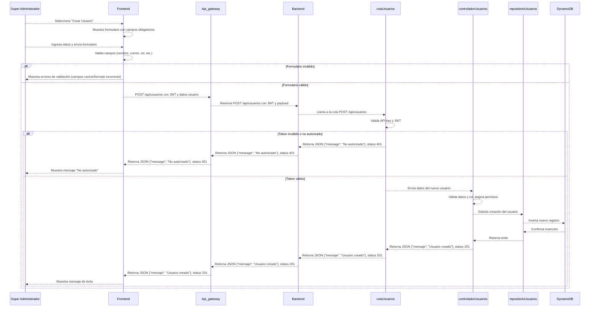

# RF1: Super Administrador Crea Usuario

**Última actualización:** 06 de marzo de 2025

---

## Historia de Usuario

Como **Super Administrador**, quiero poder registrar nuevos usuarios en el sistema, asignándoles un rol y permisos específicos para gestionar su acceso de manera estructurada y eficiente.

### **Criterios de Aceptación:**

1. El Super Administrador debe poder acceder a la opción de **"Crear Usuario"** desde el panel de administración.
2. Se debe mostrar un formulario con los siguientes campos obligatorios:
   - Nombre completo
   - Correo electrónico
   - Número de telefono
   - Cliente al que pertenece
   - Rol del usuario (Ejemplo: Administrador, Usuario estándar, Moderador, etc.)
   - Permisos específicos según el rol seleccionado
   - Contraseña establecida y confirmada
3. Si los datos ingresados son válidos, el sistema debe registrar al nuevo usuario y mostrar un mensaje de confirmación.
4. Si algún campo obligatorio está vacío o con formato incorrecto, se debe mostrar un mensaje de error indicando qué corregir.
5. El usuario recién creado debe poder iniciar sesión con las credenciales proporcionadas.

---

## **Diagrama de Secuencia**

> _Descripción_: El diagrama de secuencia muestra cómo el **Super Administrador** interactúa con el sistema para registrar un nuevo usuario. Inicia con la selección de la opción "Crear Usuario", la validación de los datos ingresados, el almacenamiento en la base de datos y la notificación al nuevo usuario.

---

## **Mockup**

> _Descripción_: El mockup representa la interfaz del sistema donde el **Super Administrador** completa los datos del nuevo usuario, selecciona su rol y permisos, y confirma la creación del usuario en el sistema.

## 
