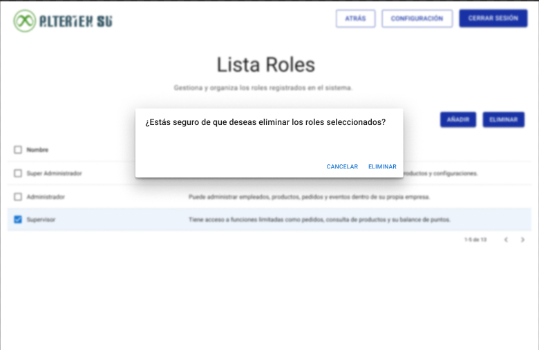

# RF10: Super Administrador Elimina Rol

---

## Historia de Usuario

Como administrador, quiero poder eliminar un rol que ya no sea necesario para mantener una estructura organizada en la gestión de accesos.

## **Criterios de Aceptación:**

1. El Super Administrador debe poder eliminar un rol desde la **Lista de Roles**.
2. Antes de eliminar, se debe mostrar una ventana de confirmación para evitar acciones accidentales.
3. Si el rol se elimina con éxito, la lista de roles debe actualizarse automáticamente.
4. Si ocurre un error, el sistema debe mostrar un mensaje indicando el problema.

---

## **Diagrama de Secuencia**

> _Descripción_: El diagrama de secuencia muestra los pasos que sigue el sistema cuando el Super Administrador intenta eliminar un rol, incluyendo la verificación de dependencias y la eliminación en la base de datos.

:::warning Importante
Debido a la dificultad baja del requisito, no se quiere diagrama de secuencia
:::

---

## **Mockup**

> _Descripción_: El mockup representa la interfaz donde el Super Administrador puede eliminar un rol, con una ventana de confirmación antes de ejecutar la acción.

## **Pruebas Unitarias**

_<u>[Enlace a pruebas RF10 Elimina Rol](https://docs.google.com/spreadsheets/d/1NLGwGrGA5PVOEzLaqxa8Ts1D_Ng3QzzqNKWJYUzxD-M/edit?gid=919657179#gid=919657179)</u>_

## **Código**

_<u>[Pull Request Front-End](https://github.com/CodeAnd-Co/Frontend-Text-Lines/pull/61)</u>_

_<u>[Pull Request Back-End](https://github.com/CodeAnd-Co/Backend-textiles/pull/54)</u>_

---

| **Tipo de Versión** | **Descripción**             | **Fecha**  | **Colaborador**          |
| ------------------- | --------------------------- | ---------- | ------------------------ |
| **1.0**             | Creación de RF10            |            |                          |
| **1.0**             | Agregar mockup              | 2/05/2025  | Diego Alfaro             |
| **1.1**             | Eliminar done               | 6/05/2025  | Diego Alfaro             |
| **1.2**             | Se actualizó documentación. | 22/05/2025 | Arturo Sánchez Rodríguez |
| **1.3**             | Agregar links de PR         | 26/05/2025 | Max Toscano              |
