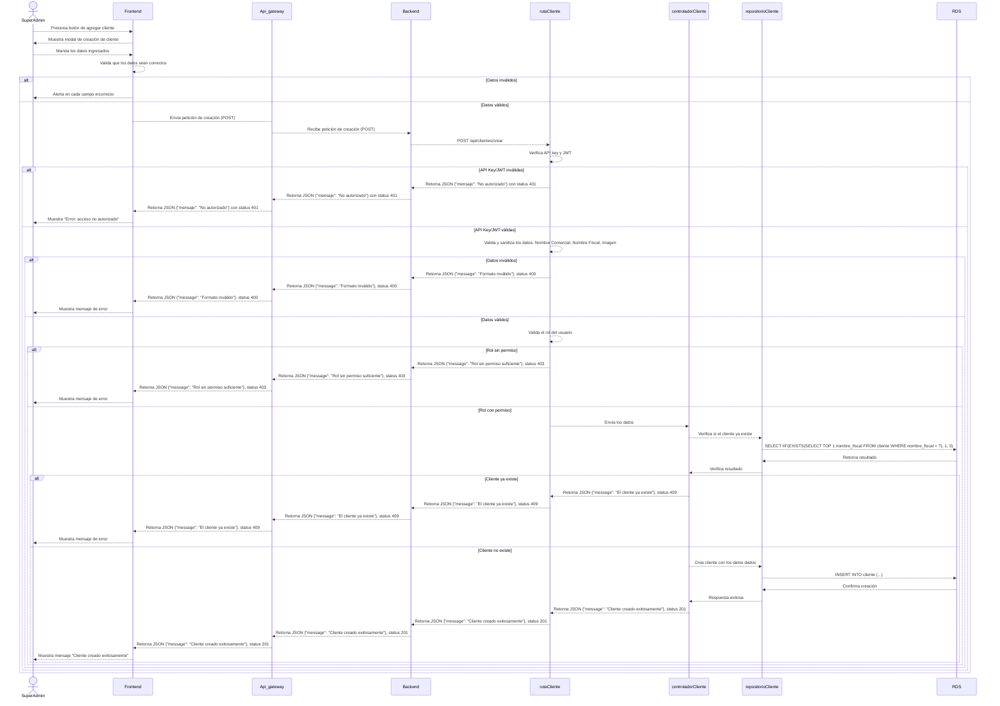
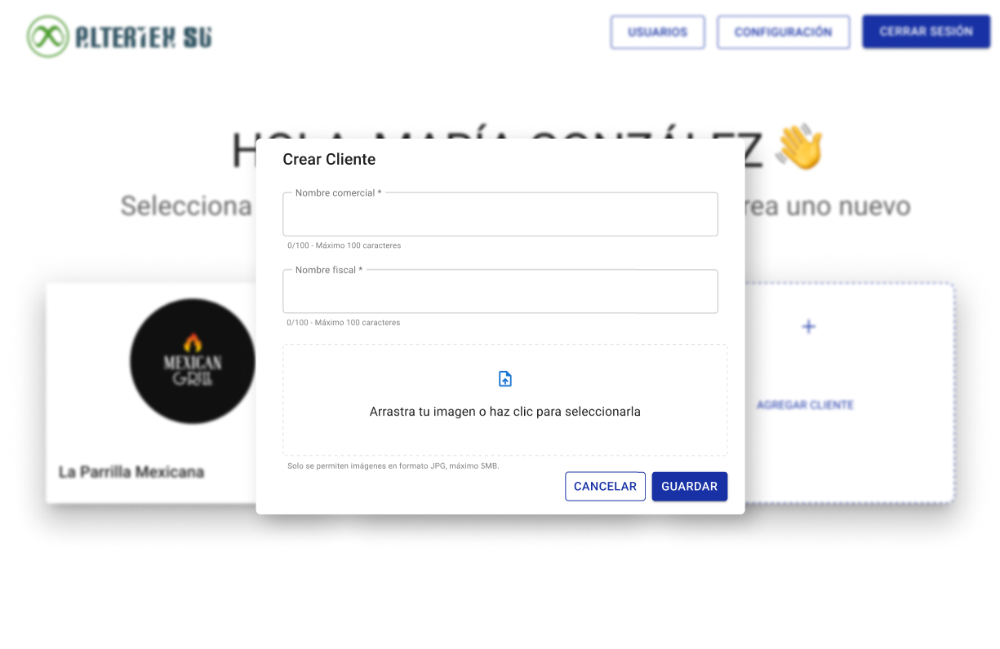

# RF11: Super Administrador Crea Cliente

---

## Historia de Usuario

Como administrador, quiero registrar un nuevo cliente en el sistema para gestionar la asignación de uniformes a sus empleados de manera organizada y eficiente.

## **Criterios de Aceptación:**

1. El Super Administrador debe poder acceder a la opción **"Crear Cliente"** dentro del panel de administración.
2. Se deben ingresar los siguientes datos:
   - Nombre comercial.
   - Nombre fiscal.
   - Imagen.
3. El sistema debe validar que el cliente no esté duplicado.
4. Si la creación es exitosa, se le cerrará la sesión al usuario, al momento de volver a ingresar le aparecerá el nuevo cliente en la lista de clientes.
5. Si hay un error, el sistema debe mostrar un mensaje indicando el problema.

---

## **Diagrama de Secuencia**

> _Descripción_: El diagrama de secuencia representa el flujo mediante el cual el Super Administrador registra un nuevo cliente, validando los datos y confirmando la creación.

---

---

## **Mockup**

> _Descripción_: El mockup muestra la interfaz donde el Super Administrador puede ingresar los datos del cliente en un formulario antes de confirmarlo.

> 

## Historial de cambios

| **Tipo de Versión** | **Descripción**                                                        | **Fecha** | **Colaborador**      |
| ------------------- | ---------------------------------------------------------------------- | --------- | -------------------- |
| **1.0**             | Creación del requisito                                                 | 6/3/2025  | Angélica Rios        |
| **1.1**             | Diagrama de secuencia y mockup, cambio en los criterios de aceptación. | 6/5/2025  | Diego Fuentes Juvera |
| **1.2**             | Corregir de secuencia, cambio en los criterios de aceptación.          | 6/5/2025  | Diego Fuentes Juvera |
