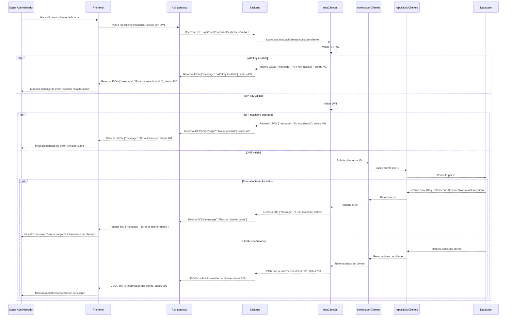
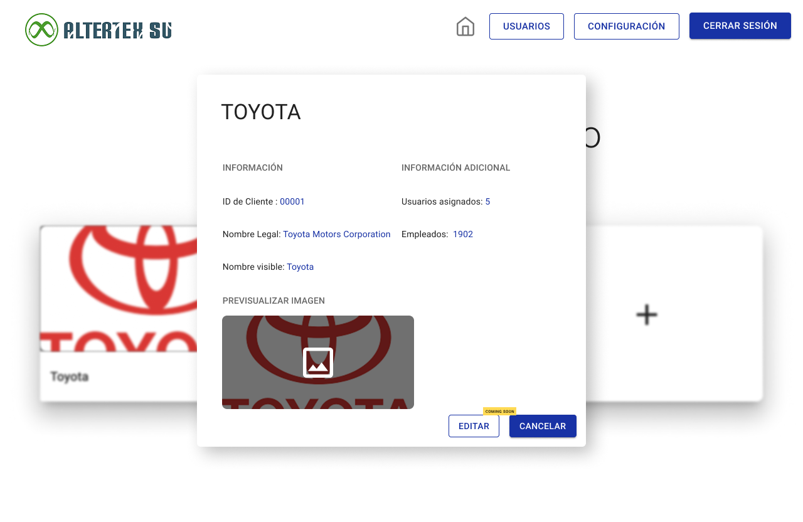

# RF13: Super Administrador Lee Cliente

---

## Historia de Usuario

Como administrador, quiero visualizar la información detallada de un cliente específico, para verificar que los datos están correctamente asignados.

## **Criterios de Aceptación:**

1. El Super Administrador debe poder visualizar la información detallada de un cliente desde un modal.
2. Los datos mostrados deben incluir:
   - Título con el nombre del cliente
   - ID de Cliente
   - Nombre Legal
   - Nombre Visible
   - Cantidad de usuarios asignados
   - Cantidad de empleados
   - Imagen de previsualización del cliente
3. El modal debe ser de solo lectura, sin permitir la edición directa de los datos.
4. Debe existir una opción para cerrar o cancelar la vista (ej. botón "CANCELAR").

---

## **Diagrama de Secuencia**

> _Descripción_: El diagrama de secuencia ilustra el flujo de interacción entre el Super Administrador y el sistema cuando se solicita la información detallada de un cliente. Incluye la solicitud desde la interfaz, el procesamiento por parte del backend, la consulta a la base de datos, la respuesta con los datos del cliente y su posterior visualización en la interfaz.

---

## **Mockup**

> _Descripción_: El mockup muestra la interfaz donde el Super Administrador puede visualizar la información detallada de un cliente.

> 

## **Pruebas Unitarias**

_<u>[Enlace a pruebas RF13 Leer Cliente ](https://docs.google.com/spreadsheets/d/1NLGwGrGA5PVOEzLaqxa8Ts1D_Ng3QzzqNKWJYUzxD-M/edit?usp=sharing)</u>_

### Historial de cambios

| **Tipo de Versión** | **Descripción**                                 | **Fecha** | **Colaborador**               |
| ------------------- | ----------------------------------------------- | --------- | ----------------------------- |
| **1.0**             | Creación del documento.                          | 06/3/2025 | Angélica Rios Cuentas         |
| **1.1**             | Actualización de la documentación del requisito. | 08/4/2025 | Paola María Garrido Montes    |