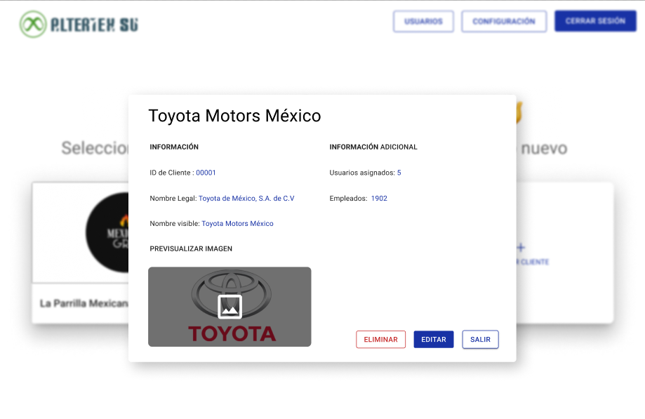

# RF13: Super Administrador Lee Cliente

**Última actualización:** 06 de marzo de 2025

---

## Historia de Usuario

Como administrador, quiero visualizar la información detallada de un cliente específico para asegurar que los datos están asignados correctamente.

## **Criterios de Aceptación:**

1. El Super Administrador debe poder visualizar la información detallada de un cliente.
2. Los datos mostrados deben incluir:
   - Id del cliente
   - Nombre legal
   - Nombre Visible
   - Usuarios asignados
   - Empleados
   - Imagen
3. El panel debe tener las opciones “Editar” y “Eliminar”.
4. En caso de que ocurra un error al consultar la información del cliente, se debe mostrar una alerta con un mensaje que especifique el tipo de error ocurrido.

---

## **Diagrama de Secuencia**

> _Descripción_: El diagrama de secuencia representa el flujo de interacción del Super Administrador con el sistema para visualizar los detalles de un cliente.

:::warning Importante
Debido a la dificultad baja del requisito, no se requiere diagrama de secuencia
:::

---

## **Mockup**

> _Descripción_: El mockup muestra la interfaz donde el Super Administrador puede visualizar la información detallada de un cliente sin opciones de edición.

> 

## **Pruebas Unitarias**

_<u>[Enlace a pruebas RF13 Leer Cliente.](https://docs.google.com/spreadsheets/d/1NLGwGrGA5PVOEzLaqxa8Ts1D_Ng3QzzqNKWJYUzxD-M/edit?gid=13461774#gid=13461774)</u>_

## **Código**

_<u>[Pull Request Front-End](https://github.com/CodeAnd-Co/Frontend-Text-Lines/pull/67)</u>_

_<u>[Pull Request Back-End](https://github.com/CodeAnd-Co/Backend-textiles/pull/56)</u>_

---

| **Tipo de Versión** | **Descripción**                                  | **Fecha**  | **Colaborador**            |
| ------------------- | ------------------------------------------------ | ---------- | -------------------------- |
| **1.0**             | Creación de documentación                        | 04/04/2025 | Angélica Ríos              |
| **1.1**             | Modificar diagramas de secuencia                 | 12/05/2025 | Angélica Ríos              |
| **1.2**             | Se actualizó documentación.                      | 22/05/2025 | Arturo Sánchez Rodríguez   |
| **1.3**             | Agregar links de PR                              | 26/05/2025 | Max Toscano                |
| **1.4**             | Actualización de la documentación del requisito. | 03/6/2025  | Paola María Garrido Montes |
