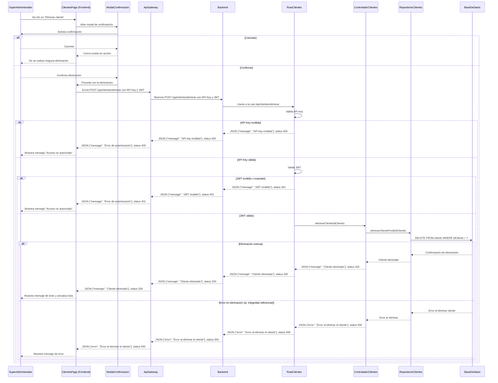
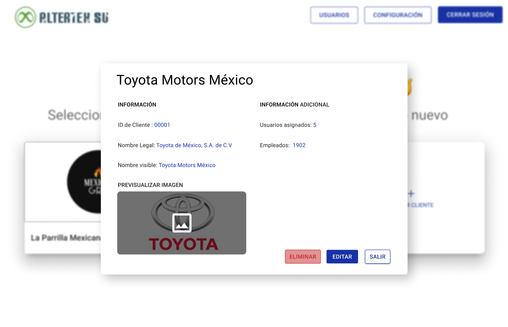
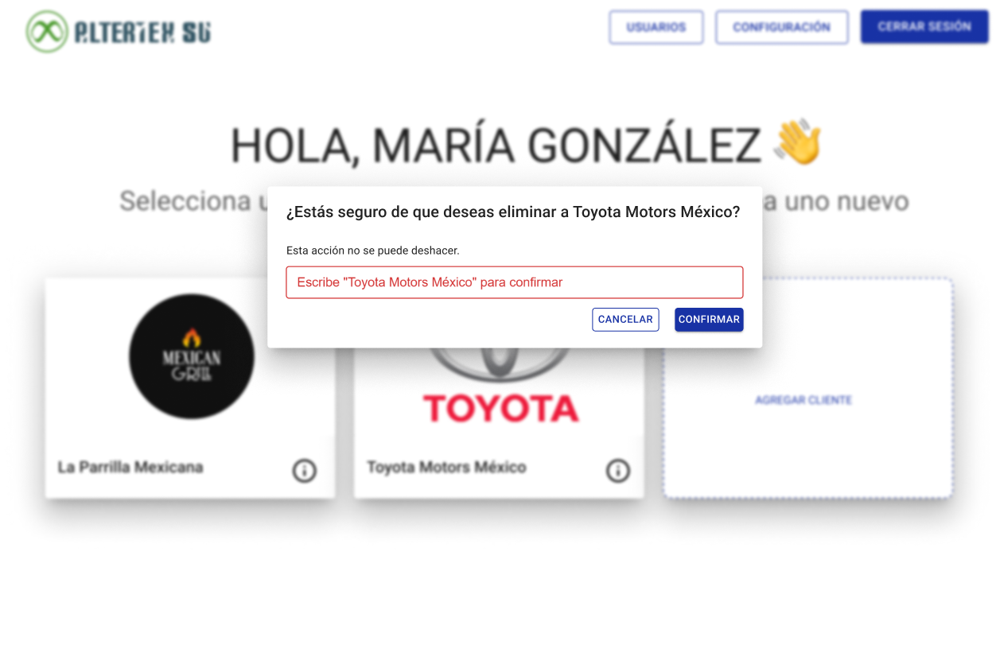

# RF15: Super Administrador Elimina Cliente

---

## Historia de Usuario

Como Super Administrador, quiero poder eliminar el registro de un cliente que ya no requiere nuestros servicios, para mantener una base de datos actualizada y evitar asignaciones erróneas de uniformes.

## **Criterios de Aceptación:**

1. El Super Administrador puede eliminar a un cliente registrado desde la interfaz de lectura de cliente.
2. Para confirmar la eliminación de un cliente se deberá escribir su nombre completo para evitar acciones accidentales.
3. Tras eliminar exitosamente al cliente, este desaparece inmediatamente de la lista de clientes y se muestra un mensaje de éxito.
4. Si ocurre un error durante la eliminación, el sistema muestra un mensaje informativo con el motivo del fallo.

---

## **Diagrama de Secuencia**

> _Descripción_: El diagrama de secuencia muestra la interacción entre el Super Administrador y el sistema al eliminar un cliente. Incluye la solicitud desde la interfaz, la confirmación de eliminación mediante un modal, el procesamiento por parte del backend, la consulta a la base de datos y el retorno de una respuesta indicando el éxito o error de la operación.

---

## **Mockup**

> _Descripción_: El mockup representa la interfaz donde el Super Administrador puede eliminar un cliente con un mensaje de confirmación previo.

>  > 

## **Pruebas Unitarias**

_<u>[Enlace a pruebas RF15 Elimina Cliente](https://docs.google.com/spreadsheets/d/1NLGwGrGA5PVOEzLaqxa8Ts1D_Ng3QzzqNKWJYUzxD-M/edit?gid=1502239888#gid=1502239888)</u>_

## **Código**

_<u>[Pull Request Front-End](https://github.com/CodeAnd-Co/Frontend-Text-Lines/pull/41)</u>_

_<u>[Pull Request Back-End](https://github.com/CodeAnd-Co/Backend-textiles/pull/73)</u>_

---

### Historial de cambios

| **Tipo de Versión** | **Descripción**                                  | **Fecha** | **Colaborador**            |
| ------------------- | ------------------------------------------------ | --------- | -------------------------- |
| **1.0**             | Creación del documento.                          | 06/3/2025 | Angélica Rios Cuentas      |
| **1.1**             | Actualización de la documentación del requisito. | 29/4/2025 | Paola María Garrido Montes |

| **1.2** | Se actualizó documentación. | 22/05/2025 | Arturo Sánchez Rodríguez |
| **1.3** | Agregar links de PR | 26/05/2025 | Max Toscano |
| **1.4** | Actualización del diagrama de secuencia. | 03/6/2025 | Paola María Garrido Montes |
