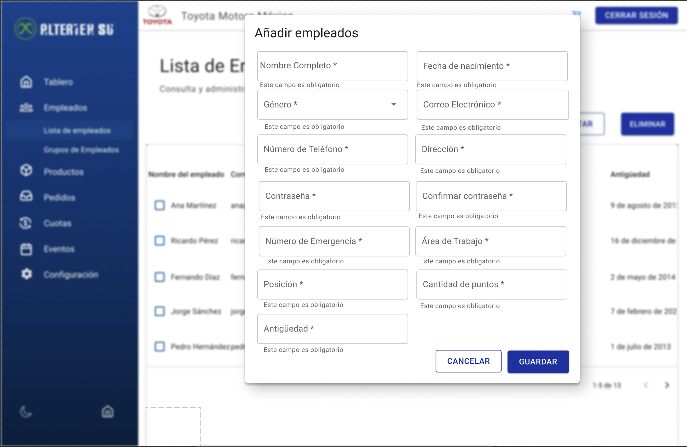

# RF16: Super Administrador Crea Empleado

---

## Historia de Usuario

Como administrador, quiero poder registrar un nuevo empleado y asignarlo a un cliente específico para gestionar sus permisos dentro del sistema.

## **Criterios de Aceptación:**

1. El Super Administrador debe poder registrar nuevos empleados en el sistema.
2. Se debe permitir ingresar:
   - Nombre completo
   - Fecha de nacimiento
   - Género
   - Correo electrónico
   - Número de teléfono
   - Dirección
   - Contraseña
   - Número de emergencia
   - Área de trabajo
   - Posición
   - Cantidad de puntos
   - Antigüedad
3. El sistema debe asegurar que todos los campos estén completos y correctamente formateados de acuerdo a las especificaciones.
4. El sistema debe validar que el correo electrónico y el número de teléfono no estén duplicados.
5. El sistema debe detectar y detener posible inyección SQL en los campos de entrada.
6. Si el registro es exitoso, el nuevo empleado debe aparecer en la lista de empleados.

---

## **Diagrama de Secuencia**

> _Descripción_: El diagrama de secuencia muestra el proceso mediante el cual el Super Administrador crea un nuevo empleado y cómo el sistema valida y guarda la información.

:::warning Importante
Debido a la dificultad estimada del requisito, no se requiere diagrama de secuencia.
:::

---

## **Mockup**

> _Descripción_: El mockup representa la interfaz donde el Super Administrador puede ingresar los datos de un nuevo empleado y registrarlo en el sistema.

> 

## **Pruebas Unitarias**

_<u>[Enlace a pruebas RF16 Crea Empleado](https://docs.google.com/spreadsheets/d/1NLGwGrGA5PVOEzLaqxa8Ts1D_Ng3QzzqNKWJYUzxD-M/edit?gid=555074181#gid=555074181)</u>_

## **Código**

_<u>[Pull Request Front-End](https://github.com/CodeAnd-Co/Frontend-Text-Lines/pull/170)</u>_

_<u>[Pull Request Back-End](https://github.com/CodeAnd-Co/Backend-textiles/pull/127)</u>_

---

### Historial de cambios

| **Tipo de Versión** | **Descripción**                                  | **Fecha**  | **Colaborador**               |
| ------------------- | ------------------------------------------------ | ---------- | ----------------------------- |
| **1.0**             | Creación del documento.                          | 06/03/2025 | Angélica Rios Cuentas         |
| **1.1**             | Actualización de la documentación del requisito. | 06/06/2025 | Carlos Iván Fonseca Mondragón |
