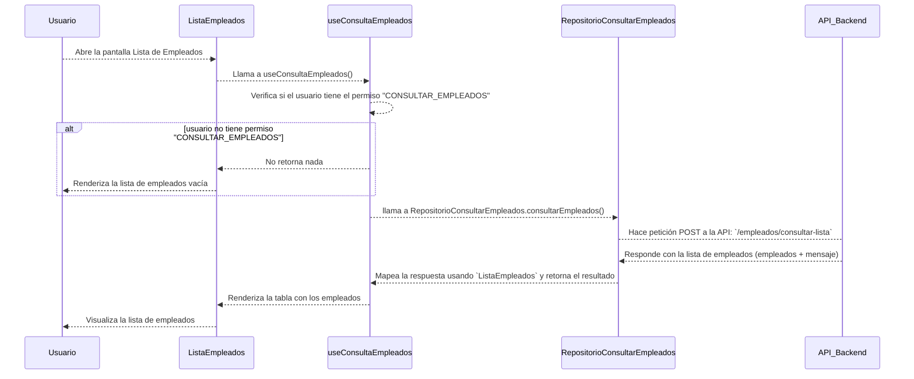
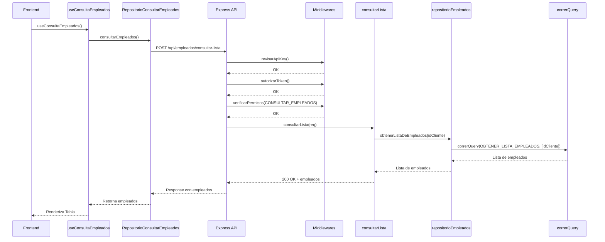
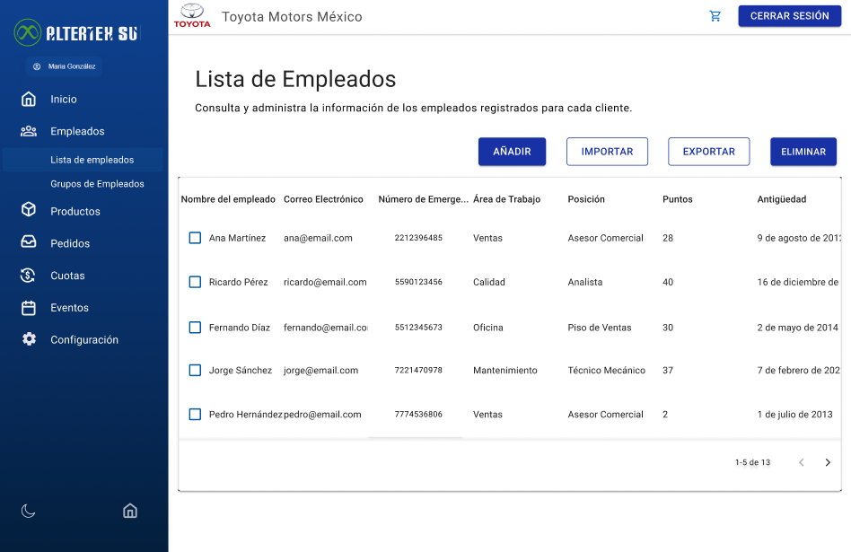

# RF17: Super Administrador Consulta Lista de Empleados

---

## Historia de Usuario

Como administrador, quiero poder ver un listado de empleados con filtros y opciones de búsqueda para gestionar su información de manera eficiente.

## **Criterios de Aceptación:**

1. El Super Administrador debe poder visualizar una lista de todos los empleados registrados.
2. La lista debe mostrar información relevante como:
   - Nombre del empleado
   - Correo electrónico
   - Número de emergencia
   - Área de trabajo
   - Posición
   - Puntos
   - Antiguedad
3. Debe incluir una opción de búsqueda y filtrado.

## **Diagrama de Secuencia**

> _Descripción_: El diagrama de secuencia del frontend muestra el proceso mediante el cual el Super Administrador consulta la lista de empleados

> _Descripción_: El diagrama de secuencia del backend muestra el proceso mediante el cual el Super Administrador consulta la lista de empleados.

---

## **Mockup**

> _Descripción_: El mockup representa la interfaz donde el Super Administrador puede ver la lista de empleados.

## **Pruebas**

_<u>[Enlace a pruebas RF17 Consultar Lista de Empleados.](https://docs.google.com/spreadsheets/d/1NLGwGrGA5PVOEzLaqxa8Ts1D_Ng3QzzqNKWJYUzxD-M/edit?gid=233812011#gid=233812011)</u>_

## **Código**

_<u>[Pull Request Front-End](https://github.com/CodeAnd-Co/Frontend-Text-Lines/pull/23)</u>_

_<u>[Pull Request Back-End](https://github.com/CodeAnd-Co/Backend-textiles/pull/29)</u>_

---

## Historial de cambios

| **Tipo de Versión** | **Descripción**             | **Fecha**  | **Colaborador**          |
| ------------------- | --------------------------- | ---------- | ------------------------ |
| **1.0**             | Creación de documentación   | 25/04/2025 | Angel Ramirez            |
| **1.1**             | Se actualizó documentación. | 22/05/2025 | Arturo Sánchez Rodríguez |
| **1.2**             | Agregar links de PR         | 26/05/2025 | Max Toscano              |
