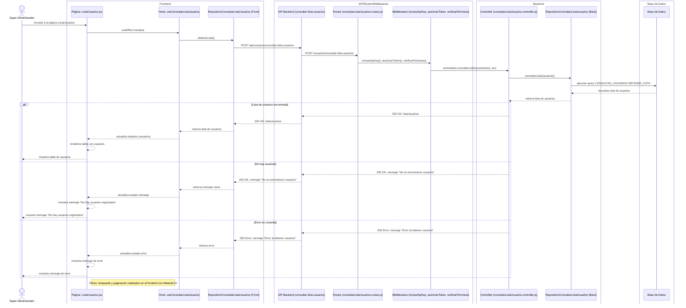

# RF2: Super Administrador Consulta Lista de Usuarios

**Última actualización:** 10 de abril de 2025

---

## Historia de Usuario

Como **Super Administrador**, quiero acceder a un listado de usuarios con opciones de búsqueda y filtros para gestionar su información y accesos de manera eficiente.

## **Criterios de Aceptación:**

1. El Super Administrador debe poder acceder a la opción **"Usuarios"** desde el panel de administración.
2. Se debe mostrar una tabla con la siguiente información de cada usuario:
   - ID
   - Nombre completo
   - Rol
   - Cliente
   - Estatus
   - Correo
   - Teléfono
3. Se deben poder hacer búsquedas y filtros para ubicar usuarios.
4. Debe permitir paginación si hay muchos usuarios registrados.
5. Si no hay usuarios en la base de datos, se debe mostrar un mensaje indicando que no hay registros disponibles.

---

## **Diagrama de Secuencia**

> _Descripción_: El diagrama de secuencia muestra la interacción del Super Administrador con el sistema para consultar la lista de usuarios. Incluye los pasos de solicitud, procesamiento y respuesta de los datos obtenidos de la base de datos.

---

## **Mockup**

> _Descripción_: El mockup representa la interfaz de usuario donde el Super Administrador puede ver la lista de usuarios en formato de tabla, con opciones para filtrar, buscar y paginar los resultados.

> 

## **Pruebas**

_<u>[Enlace a pruebas RF2 Consultar Lista de Usuarios.](https://docs.google.com/spreadsheets/d/1NLGwGrGA5PVOEzLaqxa8Ts1D_Ng3QzzqNKWJYUzxD-M/edit?gid=1685718554#gid=1685718554)</u>_

### Historial de cambios

| **Tipo de Versión** | **Descripción**                                  | **Fecha** | **Colaborador** |
| ------------------- | ------------------------------------------------ | --------- | --------------- |
| **1.0**             | Actualización de la documentación del requisito. | 10/4/2025 | Valeria Zúñiga  |
