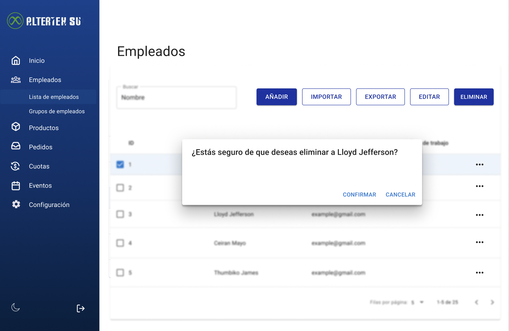

# RF20: Super Administrador Elimina Empleado

**Última actualización:** 06 de marzo de 2025

---

## Historia de Usuario

Como administrador, quiero poder dar de baja a un empleado para revocar sus accesos y asegurar que ya no tenga permisos dentro del sistema.

## **Criterios de Aceptación:**

1. El Super Administrador debe poder eliminar un empleado registrado.
2. Antes de la eliminación, el sistema debe solicitar confirmación.
3. Si la eliminación es exitosa, el empleado debe desaparecer de la lista de empleados.
4. Si hay un error, el sistema debe mostrar un mensaje indicando el problema.

---

## **Diagrama de Secuencia**

---

## **Mockup**

> _Descripción_: El mockup representa la interfaz donde el Super Administrador puede eliminar un empleado con un mensaje de confirmación previo.

> 

## **Pruebas**

_<u>[Enlace a pruebas RF20 Eliminar Empleado.](https://docs.google.com/spreadsheets/d/1NLGwGrGA5PVOEzLaqxa8Ts1D_Ng3QzzqNKWJYUzxD-M/edit?pli=1&gid=1904919670#gid=1904919670)</u>_