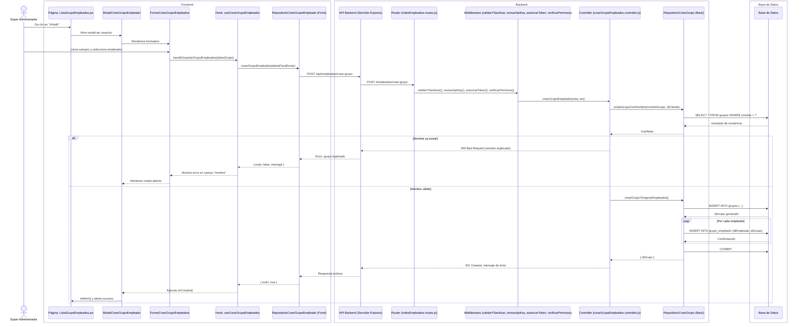
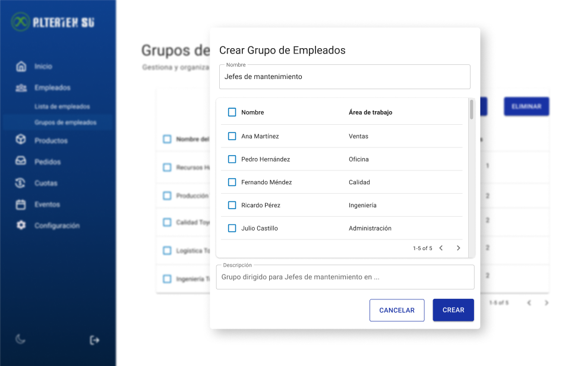

# RF21: Super Administrador Crea Grupo de Empleados

---

## Historia de Usuario

Como administrador, quiero poder crear un grupo de empleados para gestionar configuraciones de manera colectiva, optimizando la administración del sistema.

## **Criterios de Aceptación:**

1. El Super Administrador debe poder crear un nuevo grupo de empleados.
2. Se deben ingresar los siguientes datos:
   - Nombre del grupo
   - Lista de empleados a asignar
   - Descripción
3. Si la creación es exitosa, el nuevo grupo debe ser visible en la lista de grupos.
4. Si hay un error, el sistema debe mostrar un mensaje indicando el problema.

---

## **Diagrama de Secuencia**

> _Descripción_: El diagrama de secuencia muestra el proceso mediante el cual el Super Administrador crea un grupo de empleados y cómo el sistema valida y guarda los datos.

---

## **Mockup**

> _Descripción_: El mockup representa la interfaz donde el Super Administrador ingresa los datos necesarios para crear un nuevo grupo de empleados.

> 

_<u>[Enlace a pruebas RF21 Crear grupo de empleados.](https://docs.google.com/spreadsheets/d/1NLGwGrGA5PVOEzLaqxa8Ts1D_Ng3QzzqNKWJYUzxD-M/edit?pli=1&gid=1069061414#gid=1069061414)</u>_

| **Tipo de Versión** | **Descripción**                  | **Fecha**  | **Colaborador** |
| ------------------- | -------------------------------- | ---------- | --------------- |
| **1.0**             | Creación de documentación        | 06/04/2025 | Hiram Mendoza  |
| **1.1**             | Agregar pruebas,mockups y diagrama de secuencia | 06/05/2025 | Hiram Mendoza   |
| **1.2**             | Actualización de diagrama | 06/05/2025 | Hiram Mendoza   |
| **1.3**             | Se actualizó documentación. | 22/05/2025 | Arturo Sánchez Rodríguez |
