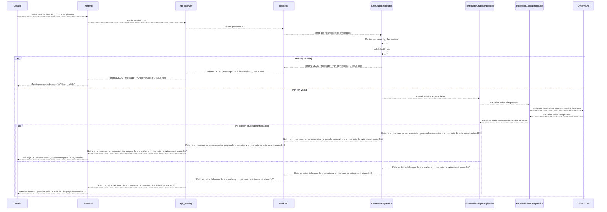
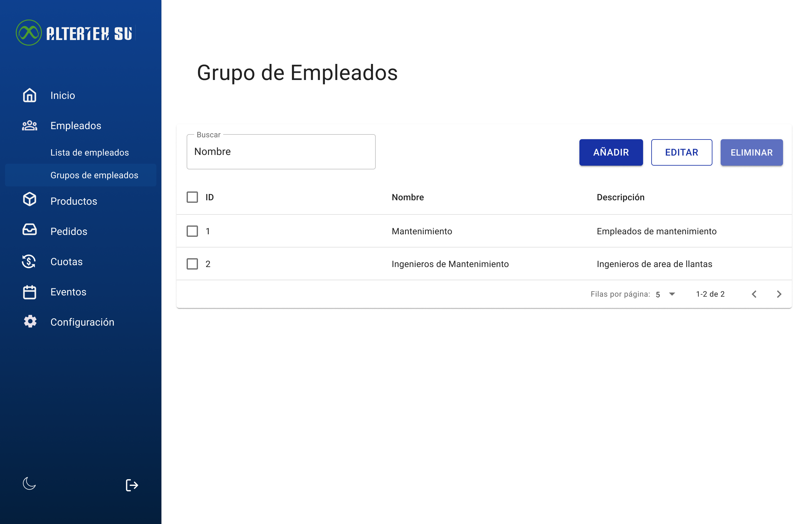

# RF22: Super Administrador Consulta Lista de Grupos de Empleados

**Última actualización:** 06 de abril de 2025

---

## Historia de Usuario

Como administrador, quiero poder ver un listado de grupos de empleados con filtros y opciones de búsqueda para gestionar su información de manera eficiente.

## **Criterios de Aceptación:**

1. El Super Administrador debe poder consultar la lista completa de grupos de empleados.
2. La lista debe mostrar:
   - Nombre del grupo
   - Descripción del grupo
   - Sets de productos asociados
   - Número de empleados asignados
3. La consulta debe ser rápida y reflejar cualquier cambio en tiempo real.
4. Si no existen grupos, el sistema debe mostrar un mensaje indicando que no hay grupos registrados.

---

## **Diagrama de Secuencia**

> _Descripción_: El diagrama de secuencia muestra el proceso mediante el cual el Super Administrador consulta la lista de grupos de empleados.

---

## **Mockup**

> _Descripción_: El mockup representa la interfaz donde el Super Administrador puede ver la lista de grupos de empleados.

