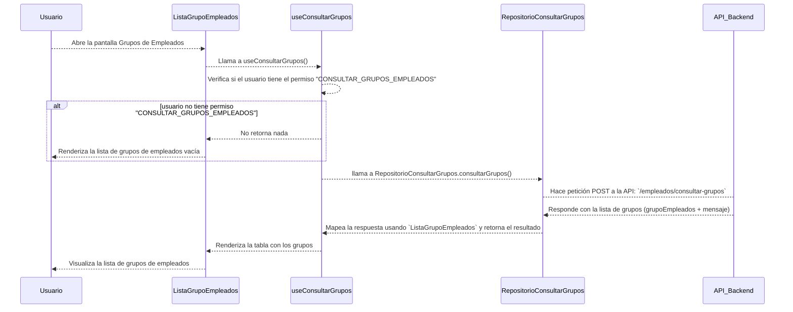
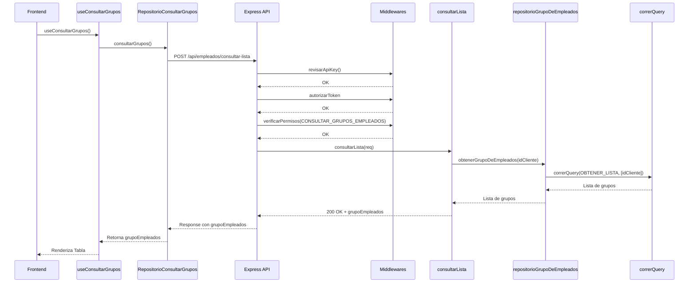

# RF22: Super Administrador Consulta Lista de Grupos de Empleados

**Última actualización:** 25 de abril de 2025

---

## Historia de Usuario

Como administrador, quiero poder ver un listado de grupos de empleados con filtros y opciones de búsqueda para gestionar su información de manera eficiente.

## **Criterios de Aceptación:**

1. El Super Administrador debe poder consultar la lista completa de grupos de empleados.
2. La lista debe mostrar:
   - Nombre del grupo
   - Descripción
   - Número de empleados asignados
3. La consulta debe ser rápida y reflejar cualquier cambio en tiempo real.
4. Si no existen grupos, el sistema debe mostrar un mensaje indicando que no hay grupos registrados.

---

## **Diagrama de Secuencia**

> _Descripción_: El diagrama de secuencia del frontend muestra el proceso mediante el cual el Super Administrador consulta la lista de grupos de empleados.

> _Descripción_: El diagrama de secuencia del backend muestra el proceso mediante el cual el Super Administrador consulta la lista de grupos de empleados.

---

## **Mockup**

> _Descripción_: El mockup representa la interfaz donde el Super Administrador puede ver la lista de grupos de empleados.

## **Pruebas**

_<u>[Enlace a pruebas RF22 Consultar Grupos de Empleados.](https://docs.google.com/spreadsheets/d/1NLGwGrGA5PVOEzLaqxa8Ts1D_Ng3QzzqNKWJYUzxD-M/edit?gid=491705582#gid=491705582)</u>_

## **Código**

_<u>[Pull Request Front-End](https://github.com/CodeAnd-Co/Frontend-Text-Lines/pull/14)</u>_

_<u>[Pull Request Back-End](https://github.com/CodeAnd-Co/Backend-textiles/pull/15)</u>_

---

## Historial de cambios

| **Tipo de Versión** | **Descripción**                  | **Fecha**  | **Colaborador**          |
| ------------------- | -------------------------------- | ---------- | ------------------------ |
| **1.0**             | Creación de documentación        | 06/04/2025 | Angel Ramirez            |
| **1.1**             | Modificar diagramas de secuencia | 25/04/2025 | Angel Ramirez            |
| **1.2**             | Se actualizó documentación.      | 22/05/2025 | Arturo Sánchez Rodríguez |
| **1.3**             | Agregar links de PR              | 26/05/2025 | Max Toscano              |
