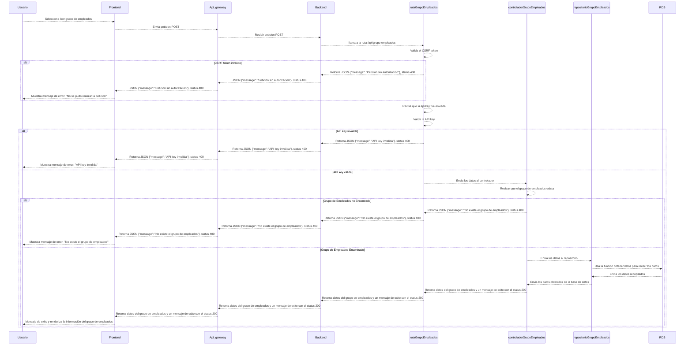
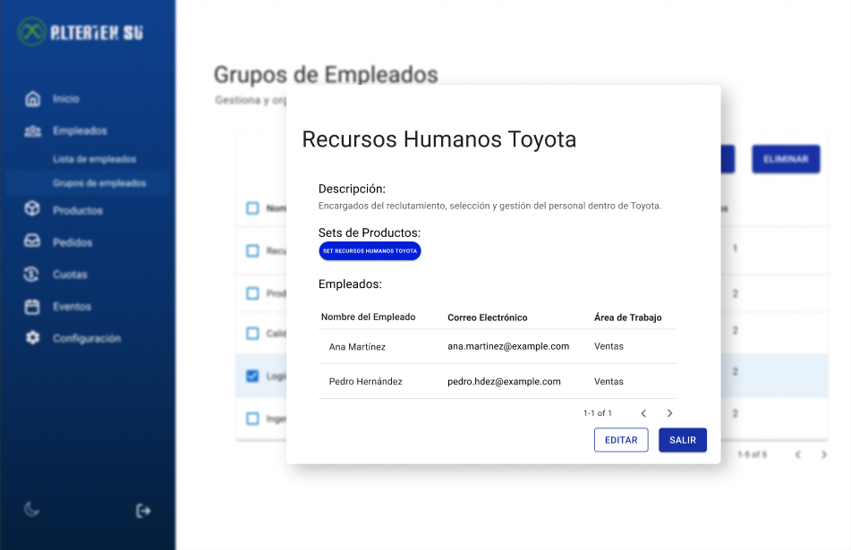

# RF23: Super Administrador Lee Grupo de Empleados

**Última actualización:** 06 de abril de 2025

---

## Historia de Usuario

Como administrador, quiero poder visualizar la información de un grupo de empleados para consultar sus miembros y configuraciones asignadas.

## **Criterios de Aceptación:**

1. El Super Administrador debe poder ver la información detallada de un grupo de empleados.
2. La información debe incluir:
   - Nombre del grupo
   - Descripción del grupo
   - Lista de empleados asignados
   - Set de productos asignado
3. Si el grupo no existe o no se puede encontrar, el sistema debe mostrar un mensaje de error.
4. Si aún no tiene un set de productos asignado, se debe de mostrar un campo de información que indique su ausencia.
5. Si no hay empleados asignados al grupo, la lista de empleados debe de aparecer vacía.

---

## **Diagrama de Secuencia**

> _Descripción_: El diagrama de secuencia muestra el proceso mediante el cual el Super Administrador consulta la información de un grupo de empleados en específico.

---

## **Mockup**

> _Descripción_: El mockup muestra la interfaz donde el Super Administrador puede ver la información detallada de un grupo de empleados como su nombre, descripción, cantidad de empleados y set de productos asignados.

## **Código**

_<u>[Pull Request Front-End](https://github.com/CodeAnd-Co/Frontend-Text-Lines/pull/73)</u>_

_<u>[Pull Request Back-End](https://github.com/CodeAnd-Co/Backend-textiles/pull/61)</u>_

---

## Historial de cambios

| **Tipo de Versión** | **Descripción**             | **Fecha**  | **Colaborador**          |
| ------------------- | --------------------------- | ---------- | ------------------------ |
| **1.1**             | Se actualizó documentación. | 22/05/2025 | Arturo Sánchez Rodríguez |
| **1.2**             | Agregar links de PR         | 26/05/2025 | Max Toscano              |
