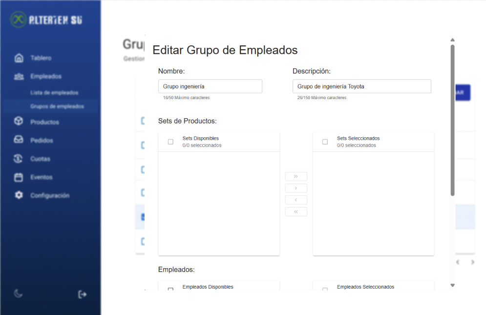
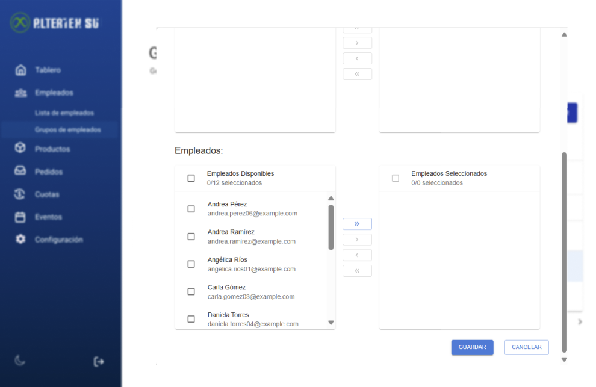

# RF24: Super Administrador Actualiza Grupo de Empleados

---

## Historia de Usuario

Como administrador, quiero poder modificar la información y configuración de un grupo de empleados para mantener su estructura y configuraciones actualizadas.

## **Criterios de Aceptación:**

1. El Super Administrador debe poder modificar la información de un grupo de empleados.
2. Se deben permitir cambios en:
   - Nombre del grupo
   - Descripción del grupo
   - Lista de empleados asignados
   - Sets de productos asignados
3. Si la actualización es exitosa, los cambios deben reflejarse de inmediato en la lista de grupos.
4. Si hay un error, el sistema debe mostrar un mensaje indicando el problema.
5. Debe permitir actualizar grupos con 0 empleados asignados y 0 sets asignados.
6. No se debe permitir actualizar un grupo de empleados con los campos de nombre o descripción vacios.
7. No se debe permitir un nombre con más de 50 caracteres.
8. No se debe permitir una descripción con más de 150 caracteres.
9. No se debe permitir una inyección de sql en los campos de texto.

---

## **Diagrama de Secuencia**

> _Descripción_: El diagrama de secuencia muestra el proceso mediante el cual el Super Administrador modifica los datos de un grupo de empleados y cómo el sistema valida y guarda los cambios.

---

## **Mockup**

> _Descripción_: El mockup representa la interfaz donde el Super Administrador puede modificar los datos de un grupo de empleados antes de guardarlos.

## **Pruebas**

_<u>[Enlace a pruebas RF24 Actualizar Grupo de empleados](https://docs.google.com/spreadsheets/d/1NLGwGrGA5PVOEzLaqxa8Ts1D_Ng3QzzqNKWJYUzxD-M/edit?gid=1129908527#gid=1129908527)</u>_

## **Código**

_<u>[Pull Request Front-End](https://github.com/CodeAnd-Co/Frontend-Text-Lines/pull/159)</u>_

_<u>[Pull Request Back-End](https://github.com/CodeAnd-Co/Backend-textiles/pull/117)</u>_

---
