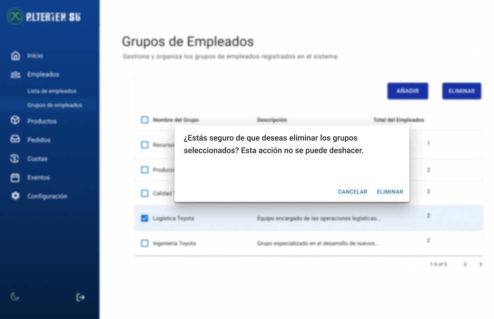

# RF25: Super Administrador Elimina Grupo de Empleados

---

## Historia de Usuario

Como administrador, quiero poder eliminar un grupo de empleados para reorganizar la gestión y evitar la acumulación de grupos innecesarios.

## **Criterios de Aceptación:**

1. El Super Administrador debe poder eliminar un grupo de empleados.
2. El sistema debe pedir una confirmación antes de eliminar el grupo.
3. Una vez eliminado muestra un mensaje de éxito y el grupo ya no debe aparecer en la lista de grupos.
4. Si el grupo no puede eliminarse, el sistema debe mostrar un mensaje de error.

---

## **Diagrama de Secuencia**

> _Descripción_: El diagrama de secuencia muestra el proceso mediante el cual el Super Administrador elimina un grupo de empleados y cómo el sistema confirma la eliminación.

:::warning Importante
Debido a la dificultad baja del requisito, no se requiere diagrama de secuencia
:::

---

## **Mockup**

> _Descripción_: El mockup muestra la interfaz donde el Super Administrador puede confirmar la eliminación de un grupo de empleados.

## **Pruebas**

_<u>[Enlace a pruebas RF25 Eliminar grupo de empleados.](https://docs.google.com/spreadsheets/d/1NLGwGrGA5PVOEzLaqxa8Ts1D_Ng3QzzqNKWJYUzxD-M/edit?gid=1152630563#gid=1152630563)</u>_

## **Código**

_<u>[Pull Request Front-End](https://github.com/CodeAnd-Co/Frontend-Text-Lines/pull/54)</u>_

_<u>[Pull Request Back-End](https://github.com/CodeAnd-Co/Backend-textiles/pull/49)</u>_

---

| **Tipo de Versión** | **Descripción**                      | **Fecha**  | **Colaborador**          |
| ------------------- | ------------------------------------ | ---------- | ------------------------ |
| **1.0**             | Creación del requisito               | 6/3/2025   | Angélica Rios            |
| **1.1**             | Mockup, cambio de estado de historia | 6/5/2025   | Nicolas Hood             |
| **1.2**             | Se actualizó documentación.          | 22/05/2025 | Arturo Sánchez Rodríguez |
| **1.3**             | Agregar links de PR                  | 26/05/2025 | Max Toscano              |
