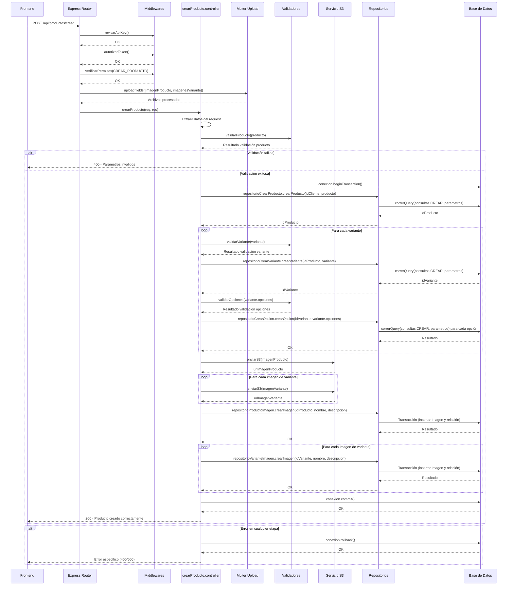
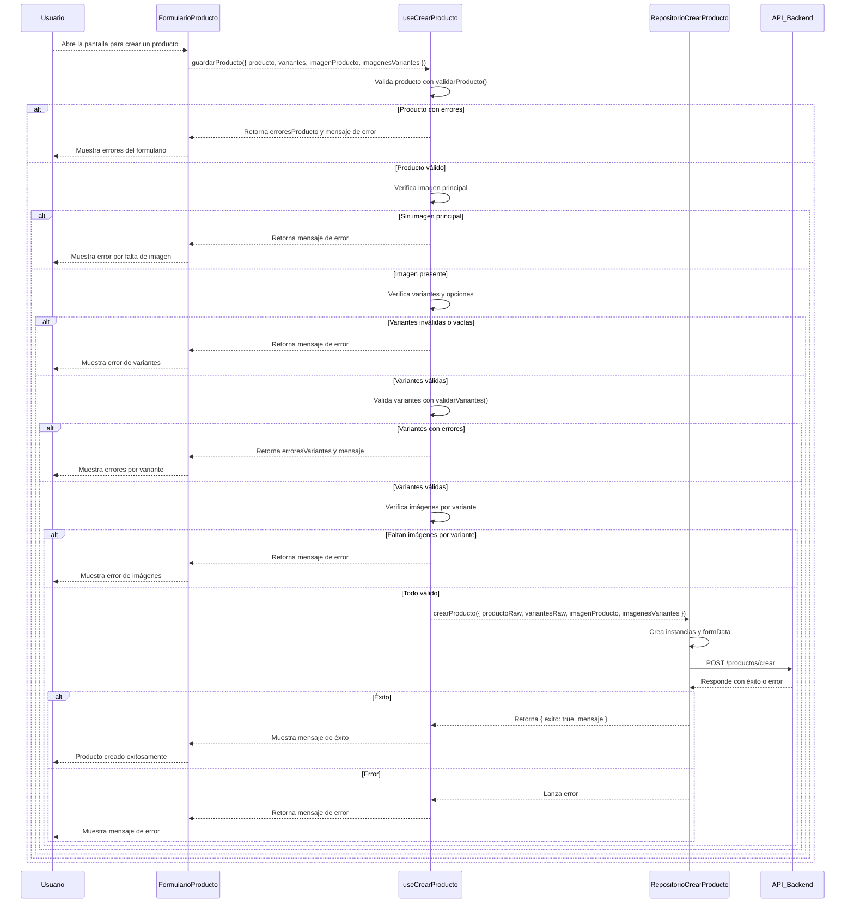
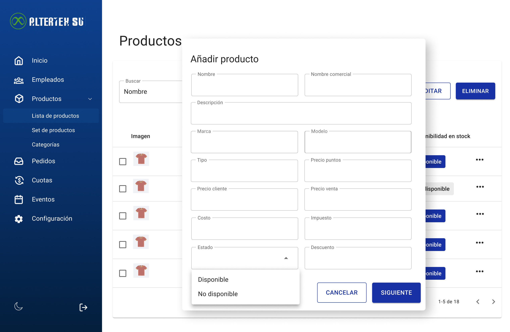
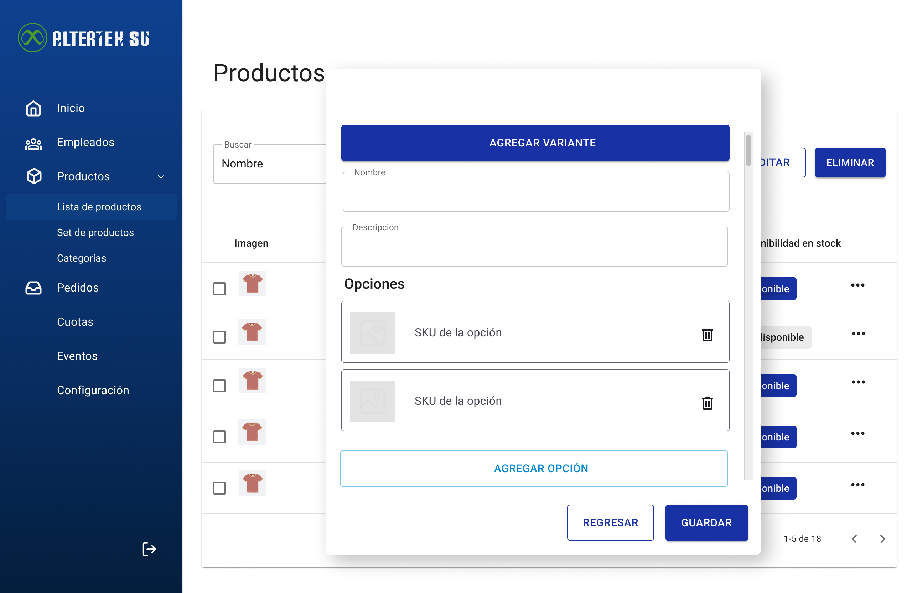
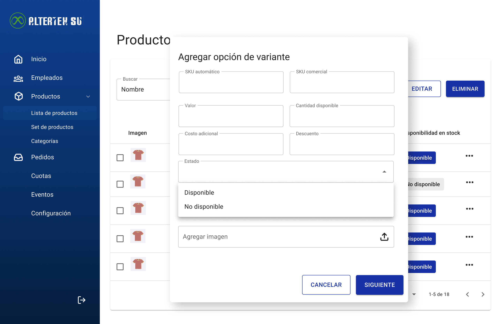

---

# RF26: Super Administrador Crea Producto

---

## Historia de Usuario

Como administrador, quiero registrar un nuevo producto en el sistema para que esté disponible para su asignación a los empleados.

## **Criterios de Aceptación:**

1. El Super Administrador debe poder crear un nuevo producto.
2. Los datos a ingresar incluyen:
   - Proveedor 
   - Nombre común del producto
   - Nombre comercial del producto
   - Descripción
   - Marca
   - Modelo
   - Tipo de producto
   - Precio en puntos
   - Precio para el cliente
   - Precio de venta
   - Costo
   - Impuesto
   - Descuento
   - Estado (activo/inactivo)
   - Indicador de envío
   - Imagen del producto
3. Debe ser posible añadir variantes al producto con sus respectivas opciones.
   - Cada variante debe tener nombre y descripción
   - Cada opción debe tener valor, cantidad, SKU automático, SKU comercial, costo adicional, descuento y estado
4. Debe permitir subir imágenes para el producto y cada variante.
5. Si la creación es exitosa, el producto debe ser visible en la lista de productos.
6. Si hay un error en cualquier etapa, el sistema debe mostrar un mensaje indicando el problema y no realizar cambios parciales (rollback).

---

## **Diagramas de secuencia**

> _Descripción_: El diagrama de secuencia del backend muestra el proceso mediante el cual el sistema procesa la solicitud de creación de un producto, incluyendo la validación de datos, el almacenamiento en la base de datos y la gestión de archivos.

> _Descripción_: El diagrama de secuencia del frontend muestra el flujo de interacción del usuario con la interfaz para crear un producto y cómo se comunica con el backend para completar la operación.

## **Mockup**

> _Descripción_: El mockup muestra la interfaz donde el Super Administrador ingresa los datos necesarios para crear un nuevo producto.

## **Pruebas**

_<u>[Enlace a pruebas RF26 Crear Producto.](https://docs.google.com/spreadsheets/d/1NLGwGrGA5PVOEzLaqxa8Ts1D_Ng3QzzqNKWJYUzxD-M/edit?gid=1228526650#gid=1228526650)</u>_

## Historial de cambios

| **Tipo de Versión** | **Descripción**                                                 | **Fecha**  | **Colaborador** |
| ------------------- | --------------------------------------------------------------- | ---------- | --------------- |
| **1.0**             | Creación de documentaciónActualización de diagramas y criterios | 13/05/2025 | Angel Ramírez   |
