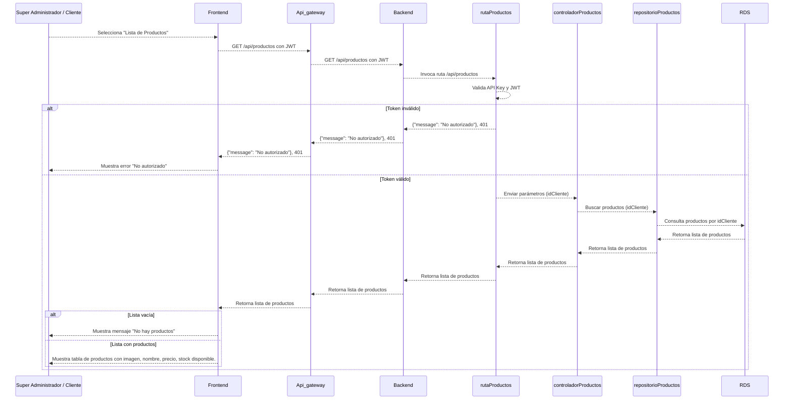
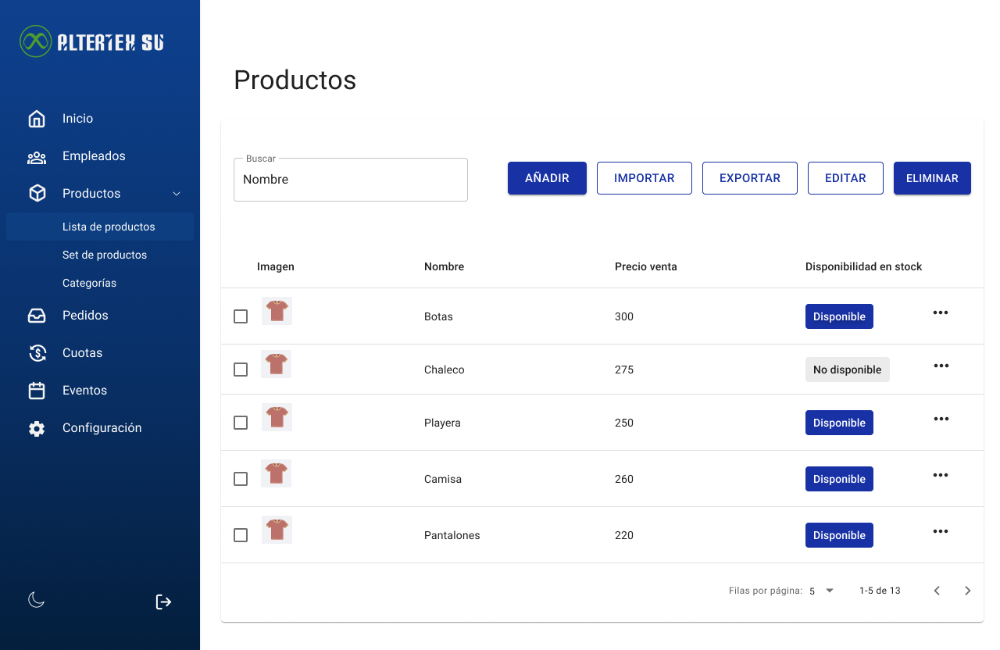

# RF27: Super Administrador, Cliente Consulta Lista de Productos

**Última actualización:** 07 de abril de 2025

---

## Historia de Usuario

Como administrador, quiero acceder a un listado completo de productos con opciones de filtro y búsqueda para gestionar eficientemente el catálogo y facilitar la asignación de productos a los empleados.

## **Criterios de Aceptación:**

1. El Super Administrador y el Cliente deben poder consultar la lista de productos disponibles.
2. La lista debe mostrar:
   - Imagen
   - Nombre del producto
   - Precio venta
   - Disponibilidad en stock
3. El sistema debe ser capaz de filtrar los productos por categorías, si es necesario.

---

## **Diagrama de Secuencia**

> _Descripción_: El diagrama de secuencia muestra cómo el Super Administrador y el Cliente consultan la lista de productos y cómo el sistema valida y muestra la información.

---

## **Mockup**

> _Descripción_: El mockup muestra la interfaz donde el Super Administrador o Cliente pueden ver la lista de productos disponibles.

# 

## **Pruebas Unitarias**

En caso de que alguna de las pruebas unitarias no sea aprobada, se deberá realizar una nueva iteración del proceso de pruebas.
Este proceso continuará de forma iterativa hasta que todas las pruebas sean aprobadas satisfactoriamente, garantizando así la estabilidad y el cumplimiento de los requisitos funcionales definidos.

**Iteración:** 1

| ID Prueba | Descripción                                               | Precondiciones                                           | Valores de entrada                                                  | Resultado esperado                                                                       | Resultado observado                                                   | Aprobado (sí/no) |
| --------- | --------------------------------------------------------- | -------------------------------------------------------- | ------------------------------------------------------------------- | ---------------------------------------------------------------------------------------- | --------------------------------------------------------------------- | ---------------- |
| CU001     | Abrir y cerrar la barra lateral                           | Acceso al sistema de un cliente                          | Clic en el icono superior derecho de la barra                       | La barra se debera abrir y cerrar sin problemas                                          | Se puede hacer click a la imagen y se sigue abriendo la barra lateral | no               |
| CU002     | Modo claro / oscuro                                       | Acceso al sistema de un cliente, abrir la barra lateral  | Clic en el icono de luna/sol que se encuentra en la parte de abajo. | Los colores del sistema deben cambiar cada vez que se de click al icono correspondiente. | El tema del sistema cambia correctamente                              | sí               |
| CU003     | Comportamiento ante clic en un elemento                   | Acceso al sistema con rol de super admin                 | Clic en el ítem "Inicio"                                            | Se muestra la pagina de Inicio renderizada                                               | Renderiza la pagina de inicio                                         | sí               |
| CU004     | Comportamiento ante clic en un elemento                   | Acceso al sistema con rol de super admin                 | Clic en el ítem "Lista de Empleados"                                | Se muestra la pagina de Empleados renderizada                                            | Renderiza la pagina de empleados                                      | sí               |
| CU005     | Comportamiento ante clic en un elemento                   | Acceso al sistema con rol de super admin                 | Clic en el ítem "Grupos de Empleados"                               | Se muestra la pagina de Grupos de empleados renderizada                                  | Renderiza la pagina de grupo de empleados                             | sí               |
| CU006     | Comportamiento ante clic en un elemento                   | Acceso al sistema con rol de super admin                 | Clic en el ítem "Lista de Productos"                                | Se muestra la pagina de Productos renderizada                                            | Renderiza la pagina de productos                                      | sí               |
| CU007     | Comportamiento ante clic en un elemento                   | Acceso al sistema con rol de super admin                 | Clic en el ítem "Sets de Productos"                                 | Se muestra la pagina de Sets de Productos renderizada                                    | Renderiza la pagina de set de productos                               | sí               |
| CU008     | Comportamiento ante clic en un elemento                   | Acceso al sistema con rol de super admin                 | Clic en el ítem "Categorías"                                        | Se muestra la pagina de Categorías renderizada                                           | Renderiza la pagina de categorias                                     | sí               |
| CU009     | Comportamiento ante clic en un elemento                   | Acceso al sistema con rol de super admin                 | Clic en el ítem "Pedidos"                                           | Se muestra la pagina de Pedidos renderizada                                              | Renderiza la pagina de pedidos                                        | sí               |
| CU010     | Comportamiento ante clic en un elemento                   | Acceso al sistema con rol de super admin                 | Clic en el ítem "Cuotas"                                            | Se muestra la pagina de Cuotas renderizada                                               | Renderiza la pagina de cuotas                                         | sí               |
| CU011     | Comportamiento ante clic en un elemento                   | Acceso al sistema con rol de super admin                 | Clic en el ítem "Eventos"                                           | Se muestra la pagina de Eventos renderizada                                              | Renderiza la pagina de eventos                                        | sí               |
| CU012     | Comportamiento ante clic en un elemento                   | Acceso al sistema con rol de super admin                 | Clic en el ítem "Configuración"                                     | Se muestra la pagina de Configuración renderizada                                        | Renderiza la pagina de configuracion                                  | sí               |
| CU013     | Comportamiento ante clic en un elemento                   | Acceso al sistema con rol de super admin                 | Clic en el ítem desplegable "Empleados"                             | Se despliegan los items del desplegable                                                  | Despliega los items del desplegableempleados                          | sí               |
| CU014     | Comportamiento ante clic en un elemento                   | Acceso al sistema con rol de super admin                 | Clic en el ítem desplegable "Productos"                             | Se despliegan los items del desplegable                                                  | Despliega los items del desplegablede productos                       | sí               |
| CU015     | Comportamiento ante pasar el cursor en un elemento        | Acceso al sistema de un cliente, abrir la barra lateral  | Cursor sobre los items de la barra lateral                          | Muestra una descripción corta de la sección                                              | No muestra una descripción corta de la sección                        | no               |
| CU016     | Comportamiento ante clic en un elemento                   | Acceso al sistema de un cliente, abrir la barra lateral  | Clic en el logo de la barra lateral                                 | Redirige a la página de inicio y la renderiza                                            | No redirige a la página de inicio y no lo renderiza                   | no               |
| CU017     | Comportamiento ante clic en un elemento                   | Acceso al sistema de un cliente, abrir la barra lateral  | Clic en los items desplegables de la barra lateral                  | La animación de abrir y cerrar el desplegable debe de ser la misma                       | La animación de de cerrar no es la misma cuando abre                  | no               |
| CU018     | Comportamiento ante clic en un elemento                   | Acceso al sistema de un cliente, abrir la barra lateral  | Clic en un item de la barra lateral                                 | El ícono del item de la barra lateral se rellena de acuerdo al color del tema            | No se rellena el ícono del item de la barra lateral                   | no               |
| CU019     | Comportamiento de los elementos con barra lateral cerrada | Acceso al sistema de un cliente, cerrar la barra lateral | Clic en el icono superior derecho para cerrar la barra              | Los botones de cerrar sesión y modo obscuro se despliegan verticalmente                  | No de s                                                               | no               |
