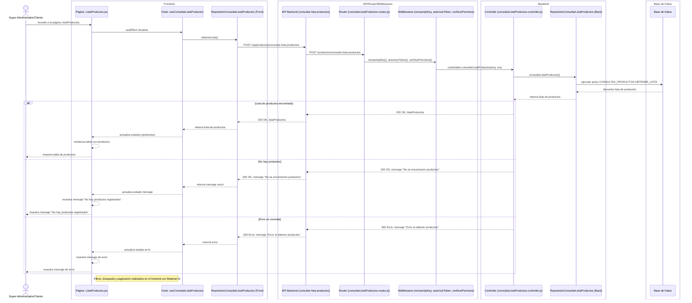
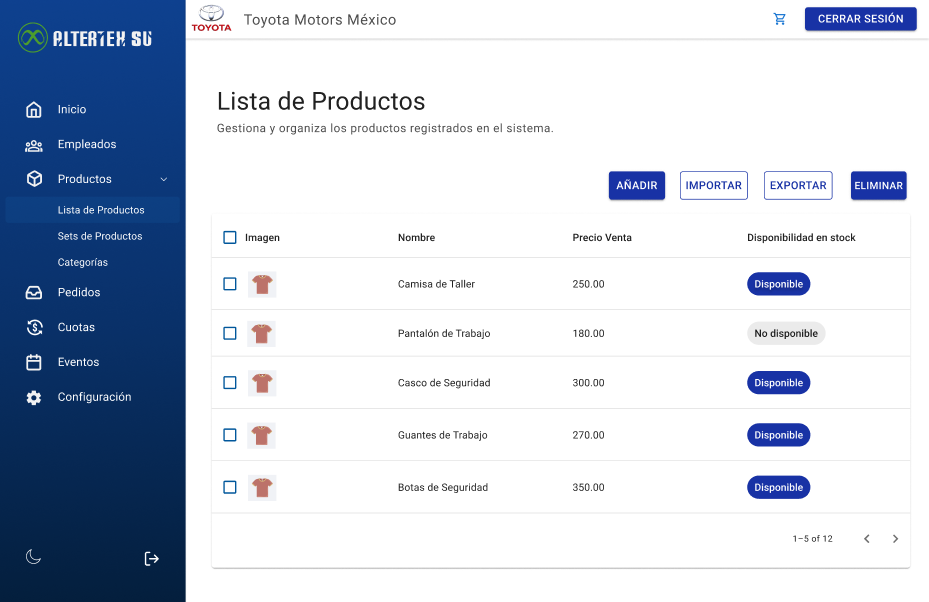

# RF27: Super Administrador, Cliente Consulta Lista de Productos

---

## Historia de Usuario

Como administrador, quiero acceder a un listado completo de productos con opciones de filtro y búsqueda para gestionar eficientemente el catálogo y facilitar la asignación de productos a los empleados.

## **Criterios de Aceptación:**

1. El Super Administrador y el Cliente deben poder consultar la lista de productos disponibles.
2. La lista debe mostrar:
   - Imagen
   - Nombre del producto
   - Precio venta
   - Disponibilidad en stock
3. El sistema debe ser capaz de filtrar los productos, si es necesario.

---

## **Diagrama de Secuencia**

> _Descripción_: El diagrama de secuencia muestra cómo el Super Administrador y el Cliente consultan la lista de productos y cómo el sistema valida y muestra la información.

---

## **Mockup**

> _Descripción_: El mockup muestra la interfaz donde el Super Administrador o Cliente pueden ver la lista de productos disponibles.

> 

## **Pruebas**

_<u>[Enlace a pruebas RF27 Consultar Lista de Productos.](https://docs.google.com/spreadsheets/d/1NLGwGrGA5PVOEzLaqxa8Ts1D_Ng3QzzqNKWJYUzxD-M/edit?gid=1907283860#gid=1907283860)</u>_

## **Código**

_<u>[Pull Request Front-End](https://github.com/CodeAnd-Co/Frontend-Text-Lines/pull/21)</u>_

_<u>[Pull Request Back-End](https://github.com/CodeAnd-Co/Backend-textiles/pull/17)</u>_

---

| **Tipo de Versión** | **Descripción**                  | **Fecha**  | **Colaborador**          |
| ------------------- | -------------------------------- | ---------- | ------------------------ |
| **1.0**             | Creación de documentación        | 04/04/2025 | Angélica Ríos            |
| **1.1**             | Modificar diagramas de secuencia | 02/05/2025 | Angélica Ríos            |
| **1.2**             | Se actualizó documentación.      | 22/05/2025 | Arturo Sánchez Rodríguez |
| **1.3**             | Agregar links de PR              | 26/05/2025 | Max Toscano              |
