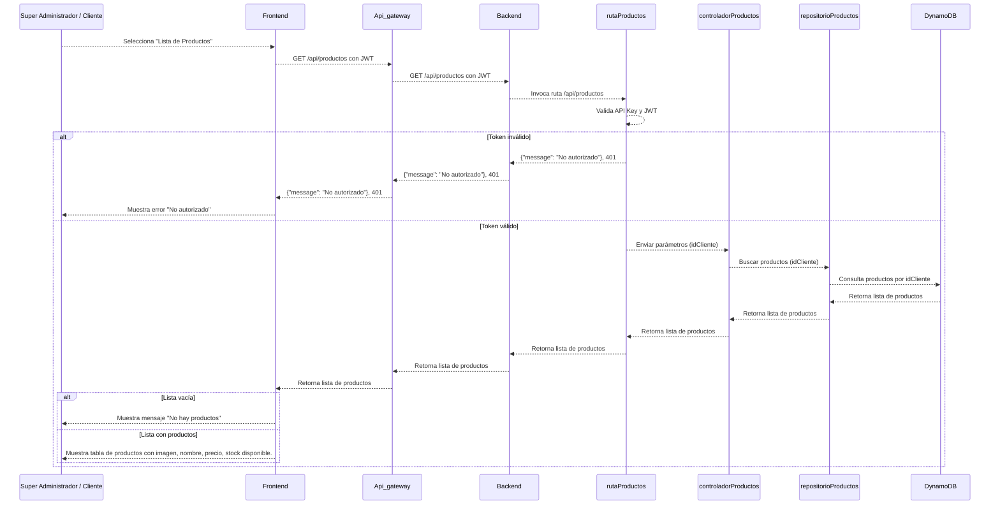

# RF27: Super Administrador, Cliente Consulta Lista de Productos

**Última actualización:** 07 de abril de 2025

---

## Historia de Usuario

Como administrador, quiero acceder a un listado completo de productos con opciones de filtro y búsqueda para gestionar eficientemente el catálogo y facilitar la asignación de productos a los empleados.

## **Criterios de Aceptación:**

1. El Super Administrador y el Cliente deben poder consultar la lista de productos disponibles.
2. La lista debe mostrar:
   - Imagen
   - Nombre del producto
   - Precio venta
   - Disponibilidad en stock
3. El sistema debe ser capaz de filtrar los productos por categorías, si es necesario.

---

## **Diagrama de Secuencia**

> _Descripción_: El diagrama de secuencia muestra cómo el Super Administrador y el Cliente consultan la lista de productos y cómo el sistema valida y muestra la información.

---

## **Mockup**

> _Descripción_: El mockup muestra la interfaz donde el Super Administrador o Cliente pueden ver la lista de productos disponibles.

# 
