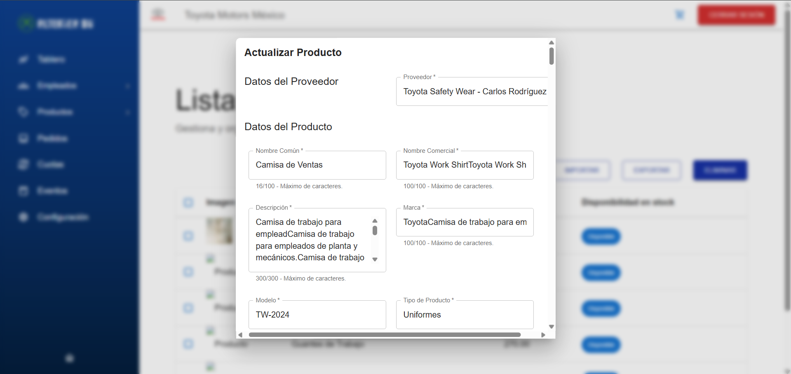
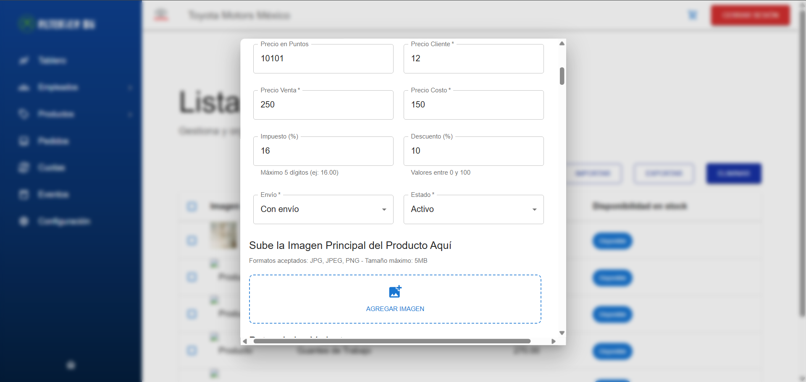
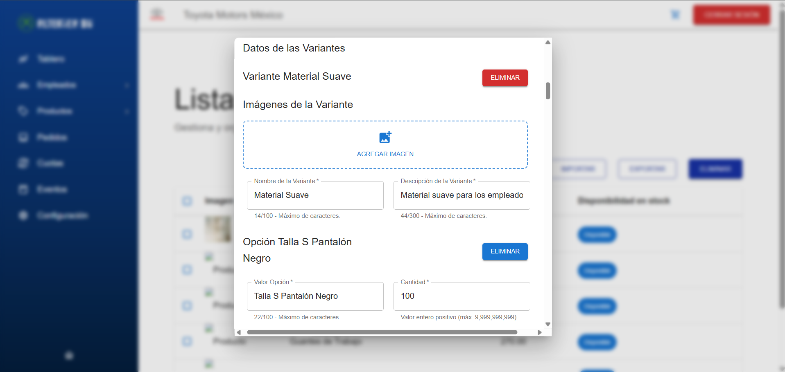
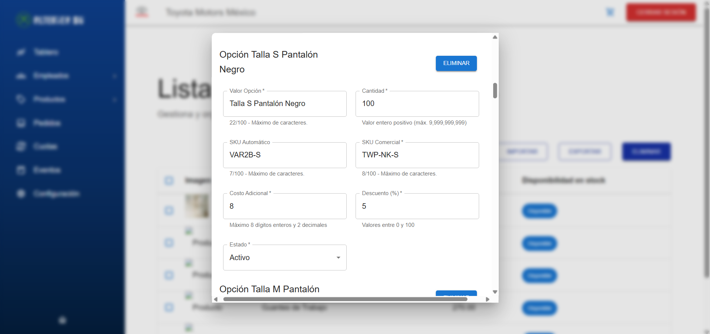
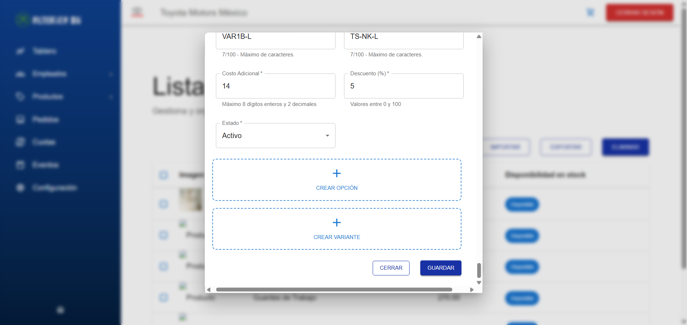

# RF29: Super Administrador Actualiza Producto

---

## Historia de Usuario

Como administrador, quiero modificar la información de un producto existente para mantener los datos actualizados y reflejar cualquier cambio en sus características o disponibilidad.

## **Criterios de Aceptación:**

1. El Super Administrador debe poder modificar la información de un producto.
2. Los cambios deben incluir:
   - Todos los campos del produto.
     -Todos los campos de variantes
     -Todos los campos de Opciones
3. Si no se quieren actualizar las imágenes, aún así deberá subir de nuevo todas las imágenes del producto de nuevo
4. El sistema debe reflejar los cambios cuando se seleccione de nuevo el producto que se actualizó.
5. Si la actualización es exitosa, el producto debe mostrarse con la información actualizada.
6. Si ocurre un error, el sistema debe mostrar un mensaje de error.

---

## **Diagrama de Secuencia**

> _Descripción_: Según lo establecido en nuestras definiciones de "Done" y "Ready", esta historia de usuario no requiere de un diagrama de secuencia.

---

## **Mockup**

> _Descripción_: El mockup muestra la interfaz donde el Super Administrador puede actualizar los datos de un producto.

## Pruebas

Las pruebas se pueden encontrar [aquí](https://docs.google.com/spreadsheets/d/1NLGwGrGA5PVOEzLaqxa8Ts1D_Ng3QzzqNKWJYUzxD-M/edit?gid=745999312#gid=745999312)

## **Código**

_<u>[Pull Request Front-End](https://github.com/CodeAnd-Co/Frontend-Text-Lines/pull/183)</u>_
_<u>[Pull Request Back-End]()</u>_
