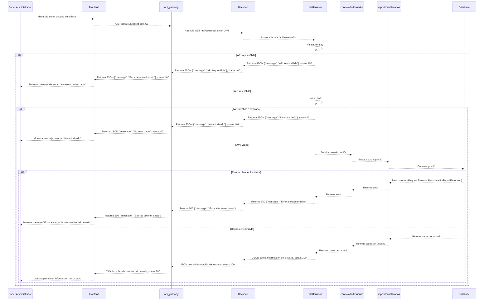
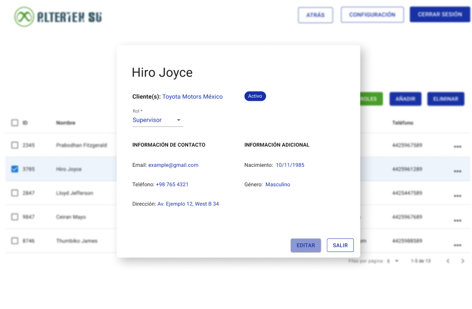

# RF3: Super Administrador Lee Usuario

---

## Historia de Usuario

Como **Super Administrador**, quiero consultar la información detallada de un usuario, para verificar que su rol, estado y datos de contacto sean correctos y estén actualizados.

## **Criterios de Aceptación:**

1. El Super Administrador debe poder hacer clic en un usuario dentro de la **Lista de Usuarios** para ver su información.
2. Al hacer clic, se debe abrir un panel que muestre los siguientes datos:
   - Nombre completo
   - Cliente
   - Rol asignado (desplegable si está en modo edición)
   - Estado del usuario (Activo/Inactivo)
   - Correo electrónico
   - Teléfono
   - Dirección
   - Fecha de nacimiento
   - Género
3. El panel debe tener las opciones “Editar” y “Salir”.

---

## **Diagrama de Secuencia**

> _Descripción_: El diagrama de secuencia ilustra el flujo de interacción entre el Super Administrador y el sistema cuando se solicita la información detallada de un usuario. Incluye la solicitud desde la interfaz, el procesamiento por parte del backend, la consulta a la base de datos, la respuesta con los datos del usuario y su posterior visualización en la interfaz.

---

## **Mockup**

> _Descripción_: El mockup representa la interfaz que permite al Super Administrador consultar la información detallada de un usuario. Al seleccionar un usuario en la tabla, se muestra un panel con sus datos completos, incluyendo nombre, cliente, rol, estado, correo electrónico, teléfono, dirección, fecha de nacimiento y género.

> 

## **Pruebas Unitarias**

_<u>[Enlace a pruebas RF03 Lee Usuario](https://docs.google.com/spreadsheets/d/1NLGwGrGA5PVOEzLaqxa8Ts1D_Ng3QzzqNKWJYUzxD-M/edit?usp=sharing)</u>_

### Historial de cambios

| **Tipo de Versión** | **Descripción**                                  | **Fecha** | **Colaborador**            |
| ------------------- | ------------------------------------------------ | --------- | -------------------------- |
| **1.0**             | Actualización de la documentación del requisito. | 07/4/2025 | Paola María Garrido Montes |
