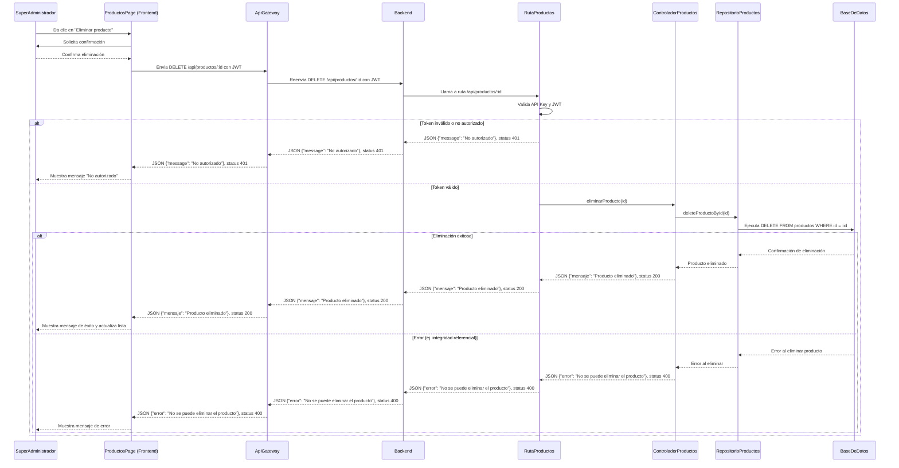

# RF30: Super Administrador Elimina Producto

---

## Historia de Usuario

Como administrador, quiero eliminar un producto del sistema cuando ya no esté disponible o sea obsoleto, para mantener el catálogo de productos relevante y actualizado.

## **Criterios de Aceptación:**

1. El Super Administrador debe poder eliminar un producto.
2. El sistema debe solicitar una confirmación antes de eliminar el producto.
3. Una vez eliminado, el producto debe desaparecer de la lista de productos.
4. Si el producto no puede eliminarse, el sistema debe mostrar un mensaje de error.

---

## **Diagrama de Secuencia**

> _Descripción_: El diagrama de secuencia muestra el proceso mediante el cual el Super Administrador elimina un producto y cómo el sistema confirma la eliminación.

# Diagrama de Secuencia - RF30: Super Administrador Elimina Producto

---

## **Mockup**

> _Descripción_: El mockup muestra la interfaz donde el Super Administrador puede confirmar la eliminación de un producto.

> 

## **Pruebas**

_<u>[Enlace a pruebas RF30 Eliminar Producto.](https://docs.google.com/spreadsheets/d/1NLGwGrGA5PVOEzLaqxa8Ts1D_Ng3QzzqNKWJYUzxD-M/edit?pli=1&gid=1236536645#gid=1236536645)</u>_

| **Tipo de Versión** | **Descripción**                  | **Fecha**  | **Colaborador** |
| ------------------- | -------------------------------- | ---------- | --------------- |
| **1.0**             | Creación de documentación        | 06/04/2025 | Hiram Mendoza  |
| **1.1**             | Agregar pruebas | 06/05/2025 | Hiram Mendoza   |
