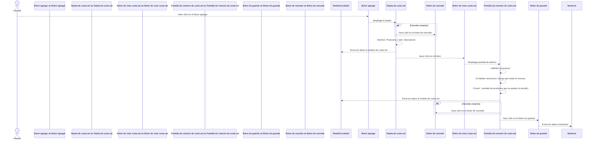
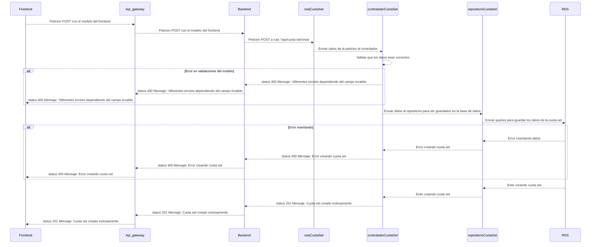

# RF31: Super Administrador Crea Set de Cuotas

---

## Historia de Usuario

Como administrador, quiero registrar un nuevo set de cuotas para asignarlo a los empleados, de modo que puedan utilizarla para adquirir uniformes según las políticas establecidas.

## **Criterios de Aceptación:**

1. El Super Administrador debe poder crear un nuevo set de cuotas.
2. Los datos a ingresar incluyen:
   - Nombre del set de cuotas
   - Descripción
   - Monto de cada cuota
3. Si la creación es exitosa, el nuevo set de cuotas debe ser visible en la lista de sets de cuotas.
4. Si hay un error, el sistema debe mostrar un mensaje indicando el problema.

---

## **Diagrama de Secuencia**

> _Descripción_: El diagrama de secuencia muestra el proceso mediante el cual el Super Administrador crea un set de cuotas y cómo el sistema valida y guarda los datos.

### Diagrama de frontend

### Diagrama de backend

---

## **Mockup**

> _Descripción_: El mockup muestra la interfaz donde el Super Administrador ingresa los datos necesarios para crear un nuevo set de cuotas.

| **Tipo de Versión** | **Descripción**       | **Fecha**  | **Colaborador**    |
| ------------------- | --------------------- | ---------- | ------------------ |
| **2.0**             | Actualización de RF31 | 22/04/2025 | Diego Alfaro Pinto |
| **2.1**             | Eliminar done         | 6/05/2025  | Diego Alfaro Pinto |
