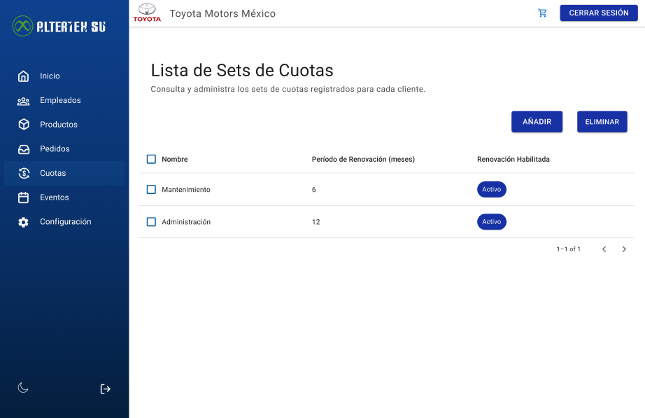

# RF32: Super Administrador, Cliente Consulta Lista de Set de Cuotas

---

## Historia de Usuario

Como administrador, deseo visualizar una lista de todos los sets de cuotas registradas, con sus detalles y estado actual, para gestionar eficientemente las asignaciones a los empleados.

## **Criterios de Aceptación:**

1. El Super Administrador y el Cliente deben poder consultar la lista de sets de cuotas disponibles.
2. La lista debe mostrar:
   - Nombre del set de cuotas
   - Periodo de Renovación
   - Renovación habilitada
3. El sistema debe permitir la búsqueda y filtrado por nombre o fecha.
4. Si no existen sets de cuotas, el sistema debe mostrar un mensaje indicando que no hay sets disponibles.

---

## **Diagrama de Secuencia**

> _Descripción_: El diagrama de secuencia muestra cómo el Super Administrador y el Cliente consultan la lista de sets de cuotas y cómo el sistema valida y muestra la información.

:::warning Importante
Debido a la dificultad baja del requisito, no se quiere diagrama de secuencia
:::

---

## **Mockup**

> _Descripción_: El mockup muestra la interfaz donde el Super Administrador o Cliente pueden ver la lista de sets de cuotas disponibles.

> 

## **Pruebas**

_<u>[Enlace a pruebas RF32 Consulta Lista de Set de Cuotas.](https://docs.google.com/spreadsheets/d/1NLGwGrGA5PVOEzLaqxa8Ts1D_Ng3QzzqNKWJYUzxD-M/edit?pli=1&gid=261101749#gid=261101749)</u>_

| **Tipo de Versión** | **Descripción**                  | **Fecha**  | **Colaborador** |
| ------------------- | -------------------------------- | ---------- | --------------- |
| **1.0**             | Creación de documentación        | 06/04/2025 | Hiram Mendoza  |
| **1.1**             | Agregar pruebas | 06/05/2025 | Hiram Mendoza   |
| **1.2**             | Actualización de diagrama | 06/05/2025 | Hiram Mendoza   |
| **1.3**             | Se actualizó documentación. | 22/05/2025 | Arturo Sánchez Rodríguez |
