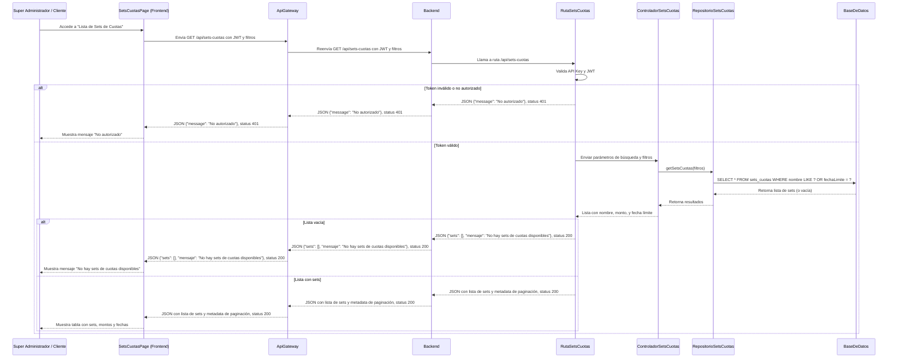
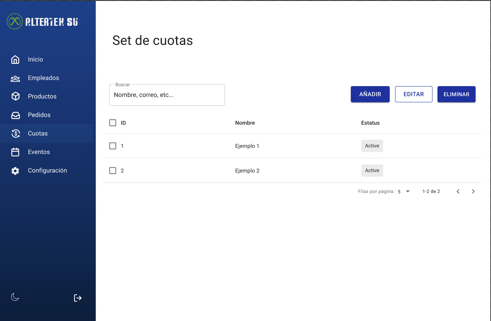

# RF32: Super Administrador, Cliente Consulta Lista de Set de Cuotas

**Última actualización:** 23 de abril de 2025

---

## Historia de Usuario

Como administrador, deseo visualizar una lista de todos los sets de cuotas registradas, con sus detalles y estado actual, para gestionar eficientemente las asignaciones a los empleados.

## **Criterios de Aceptación:**

1. El Super Administrador y el Cliente deben poder consultar la lista de sets de cuotas disponibles.
2. La lista debe mostrar:
   - Nombre del set de cuotas
   - Monto de cada cuota
   - Fecha límite de pago
3. El sistema debe permitir la búsqueda y filtrado por nombre o fecha.
4. Si no existen sets de cuotas, el sistema debe mostrar un mensaje indicando que no hay sets disponibles.

---

## **Diagrama de Secuencia**

> _Descripción_: El diagrama de secuencia muestra cómo el Super Administrador y el Cliente consultan la lista de sets de cuotas y cómo el sistema valida y muestra la información.

---

## **Mockup**

> _Descripción_: El mockup muestra la interfaz donde el Super Administrador o Cliente pueden ver la lista de sets de cuotas disponibles.

> 
