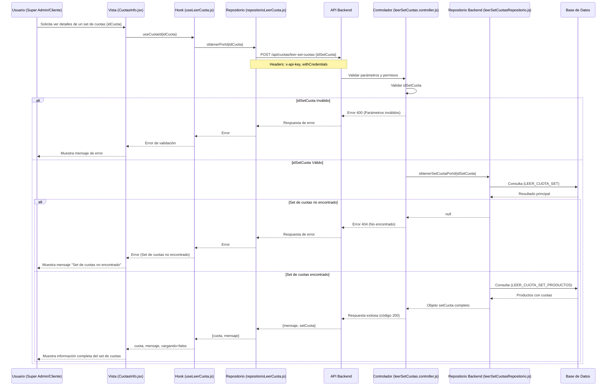
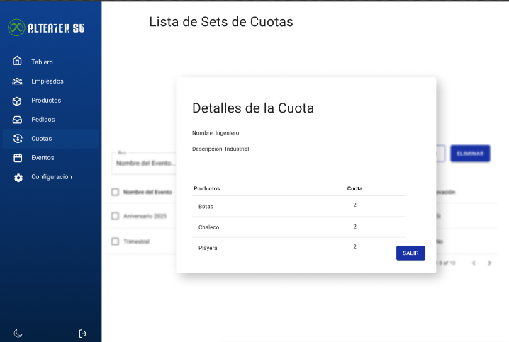

# RF33: Super Administrador, Cliente Lee Set de Cuotas

---

## Historia de Usuario

Como administrador, deseo consultar los detalles de un set de cuotas existente para verificar su asignación de productos y sus cuotas

## **Criterios de Aceptación:**

1. El Super Administrador y el Cliente deben poder ver los detalles de un set de cuotas específico.
2. La información debe incluir:
   - Nombre del set de cuotas
   - Descripción
   - Monto de cada cuota
   - Producto asociado a la cuota
3. Si el set de cuotas no existe o no se encuentra, el sistema debe mostrar un mensaje de error.

---

## **Diagrama de Secuencia**

> _Descripción_: El diagrama de secuencia muestra el proceso mediante el cual el Super Administrador y el Cliente leen los detalles de un set de cuotas.

---

## **Mockup**

> _Descripción_: El mockup representa la interfaz donde el Super Administrador o Cliente puede ver los detalles de un set de cuotas.

## **Pruebas**

_<u>[Enlace a pruebas RF33 Leer Set de Cuotas.](https://docs.google.com/spreadsheets/d/1NLGwGrGA5PVOEzLaqxa8Ts1D_Ng3QzzqNKWJYUzxD-M/edit?gid=1687741541#gid=1687741541)</u>_

## **Código**

_<u>[Pull Request Front-End](https://github.com/CodeAnd-Co/Frontend-Text-Lines/pull/160)</u>_

_<u>[Pull Request Back-End](https://github.com/CodeAnd-Co/Backend-textiles/pull/118)</u>_

---

| **Tipo de Versión** | **Descripción**                | **Fecha** | **Colaborador**                        |
| ------------------- | ------------------------------ | --------- | -------------------------------------- |
| **1.0**             | Creación del documento         | 3/6/2025  | Rodrigo Antonio Benítez                |
| **1.1**             | Diagrama de secuencia y mockup | 6/6/2025  | Rodrigo Antonio Benítez De La Portilla |
| **1.2**             | Pruebas Unitarias              | 6/6/2025  | Rodrigo Antonio Benítez De La Portilla |
| **1.3**             | Agregar links de PR            | 6/6/2025  | Rodrigo Antonio Benítez                |
