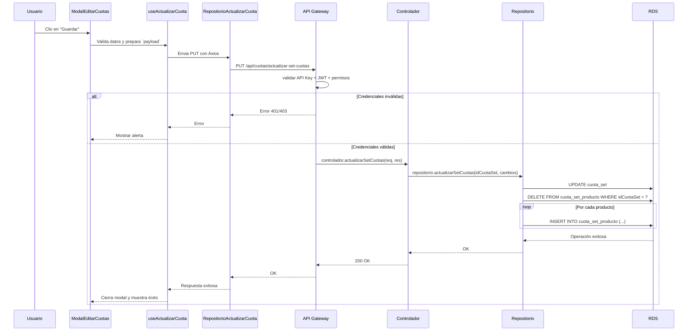

# RF34: Super Administrador Actualiza Set de Cuotas

---

## Historia de Usuario

Como administrador, necesito modificar los parámetros de un set de cuotas existente, como el monto o los empleados asignados, para ajustarla a nuevas necesidades o políticas.

## **Criterios de Aceptación:**

1. El Super Administrador debe poder actualizar los datos de un set de cuotas.
2. Los cambios deben incluir:
   - Nombre del set de cuotas
   - Descripción
   - Periodo de Renovación
   - Habilitación de renovación automática
   - Lista de productos asociados, con sus respectivos límites (`limite`) y límites actuales (`limiteActual`) con un maximo de 9 digitos cada uno.
   - Posibilidad de eliminar y agregar productos del set 
3. El sistema debe reflejar los cambios de inmediato en la lista de sets de cuotas.
4. Si la actualización es exitosa, el set de cuotas debe mostrarse con la información actualizada.
5. Si ocurre un error, el sistema debe mostrar un mensaje de error.
6. No se debe permitir asignar un producto más de una vez al mismo set.
7. Debe mostrar un mensaje de éxito al actualizar la cuota.
8. En caso de un error debe de salir una mensaje con alerta. 
9. El botón “Cancelar” debe cerrar el modal sin realizar cambios.

---

## **Diagrama de Secuencia**

> _Descripción_: El diagrama de secuencia muestra el proceso mediante el cual el Super Administrador actualiza los detalles de un set de cuotas y cómo el sistema guarda los cambios.

---

## **Mockup**

> _Descripción_: El mockup muestra la interfaz donde el Super Administrador puede actualizar los datos de un set de cuotas.

## Pruebas

_<u>[Enlace a pruebas RF34 Actualizar Set de Cuotas.](https://docs.google.com/spreadsheets/d/1NLGwGrGA5PVOEzLaqxa8Ts1D_Ng3QzzqNKWJYUzxD-M/edit?gid=615553945#gid=615553945)</u>_

## **Código**

_<u>[Pull Request Front-End](https://github.com/CodeAnd-Co/Frontend-Text-Lines/pull/173)</u>_

_<u>[Pull Request Back-End](https://github.com/CodeAnd-Co/Backend-textiles/pull/131)</u>_

### Historial de cambios

| **Tipo de Versión** | **Descripción**                                  | **Fecha** | **Colaborador**          |
| ------------------- | ------------------------------------------------ | --------- | ------------------------ |
| **1.0**             | Implementación de Diagrama de secuencia y mockup | 09/5/2025 | Arturo Sánchez Rodríguez |
| **1.1**             | Actualización de documentación | 06/6/2025 | Arturo Sánchez Rodríguez |
