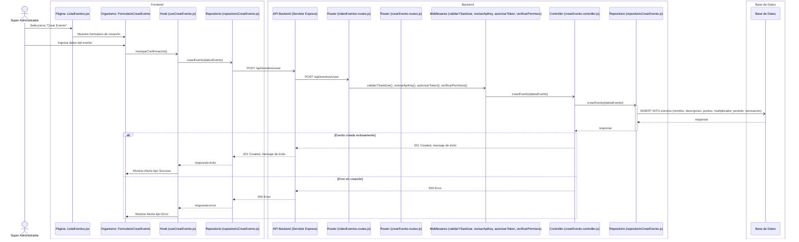

# RF36: Super Administrador Crea Evento

**Última actualización:** 06 de marzo de 2025

---

## Historia de Usuario

Como administrador, quiero crear un evento para la renovación o asignación de puntos para automatizar la gestión de beneficios y asegurar que se ejecuten en las fechas establecidas.

## **Criterios de Aceptación:**

1. El Super Administrador debe poder crear un nuevo evento.
2. Los campos obligatorios para crear un evento incluyen:
   - Nombre del evento
   - Descripción
   - Puntos
   - Multiplicador

3. El sistema debe validar que los campos sean correctos antes de crear el evento.
4. Si el evento se crea exitosamente, debe reflejarse de inmediato en la lista de eventos.
5. Si ocurre un error, el sistema debe mostrar un mensaje de error.

---

## **Diagrama de Secuencia**

> _Descripción_: El diagrama de secuencia muestra el proceso mediante el cual el Super Administrador crea un evento y cómo el sistema valida los datos y guarda la nueva información.

---

## **Mockup**

> _Descripción_: El mockup muestra la interfaz donde el Super Administrador puede ingresar los datos para crear un evento.

## **Pruebas Unitarias**

_<u>[Enlace a pruebas RF36 Crea Evento](https://docs.google.com/spreadsheets/d/1NLGwGrGA5PVOEzLaqxa8Ts1D_Ng3QzzqNKWJYUzxD-M/edit?gid=1190716284#gid=1190716284)</u>_

## **Código**

_<u>[Pull Request Front-End](https://github.com/CodeAnd-Co/Frontend-Text-Lines/pull/135)</u>_

_<u>[Pull Request Back-End](https://github.com/CodeAnd-Co/Backend-textiles/pull/103)</u>_

---

# Historial de cambios

| **Tipo de Versión** | **Descripción**                                    | **Fecha**  | **Colaborador**              |
| ------------------- | -------------------------------------------------- | ---------- | ---------------------------- |
| **1.0**             | Actualización de criterios y diagrama de secuencia | 23/05/2025 | Diego Antonio García Padilla |
| **1.1**             | Agregar links de PR                                | 26/05/2025 | Max Toscano                  |
