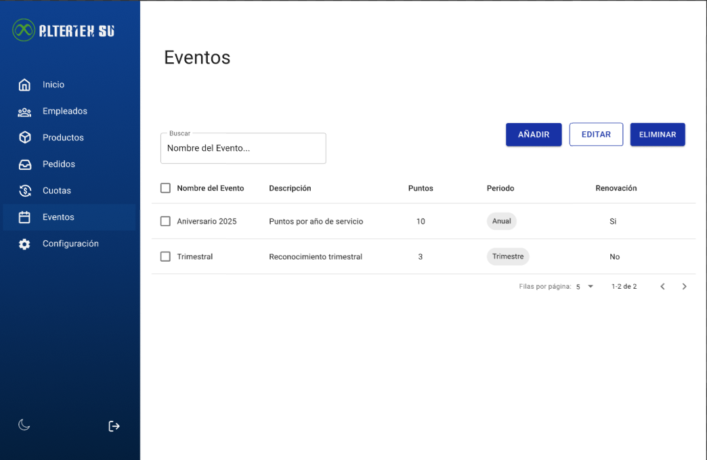

# RF37: Super Administrador, Cliente Consulta Lista de Eventos

---

## Historia de Usuario

Como administrador/como cliente, quiero ver los eventos programados para la renovación de puntos para darles seguimiento y asegurar que se ejecuten correctamente.

## **Criterios de Aceptación:**

1. El Super Administrador y el Cliente deben poder ver la lista de eventos disponibles.
2. La lista debe incluir los siguientes datos:
   - Nombre del evento
   - Descripción
   - Puntos
   - Periodo
   - Renovación
3. La lista debe permitir buscar y filtrar eventos según los criterios mencionados.
4. Si no hay eventos disponibles, el sistema debe mostrar un mensaje indicando que no hay eventos.

---

## **Diagrama de Secuencia**

> _Descripción_: El diagrama de secuencia muestra el proceso mediante el cual el Super Administrador y el Cliente consultan la lista de eventos.

No aplica, de acuerdo con el análisis realizado conforme a nuestro procedimiento 'ready-done'. Tras revisar los criterios establecidos, concluimos que este caso no corresponde a las especificaciones requeridas para su aplicación.

## **Mockup**

> _Descripción_: El mockup muestra la interfaz donde el Super Administrador o Cliente pueden consultar y visualizar la lista de eventos.
> 

## **Pruebas Unitarias**

_<u>[Enlace a pruebas RF37 Consulta Lista Eventos](https://docs.google.com/spreadsheets/d/1NLGwGrGA5PVOEzLaqxa8Ts1D_Ng3QzzqNKWJYUzxD-M/edit?gid=1260209510#gid=1260209510)</u>_

# Historial de cambios

| **Tipo de Versión** | **Descripción**                | **Fecha** | **Colaborador**                        |
| ------------------- | ------------------------------ | --------- | -------------------------------------- |
| **1.0**             | Creacion de el documento       | 3/6/2025  | Ángel Mauricio Ramírez                 |
| **1.1**             | Diagrama de secuencia y mockup | 4/9/2025  | Rodrigo Antonio Benítez De La Portilla |
| **1.2**             | Pruebas Unitarias              | 5/8/2025  | Rodrigo Antonio Benítez De La Portilla |
