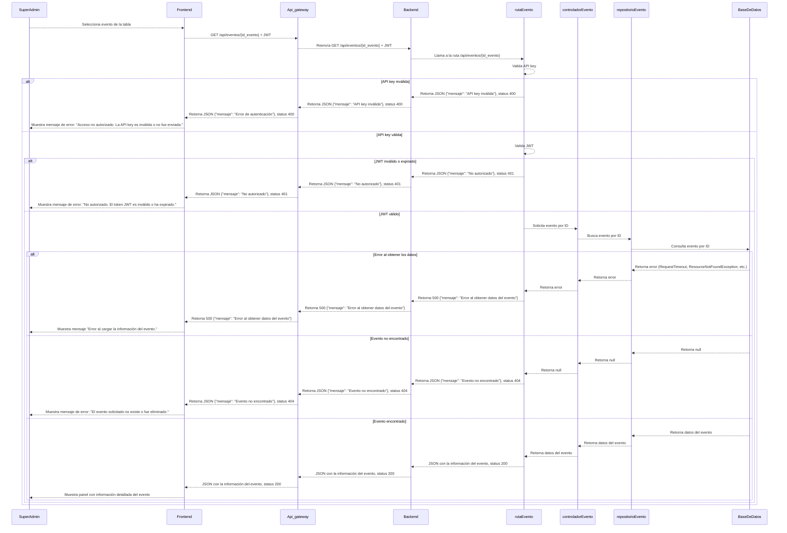
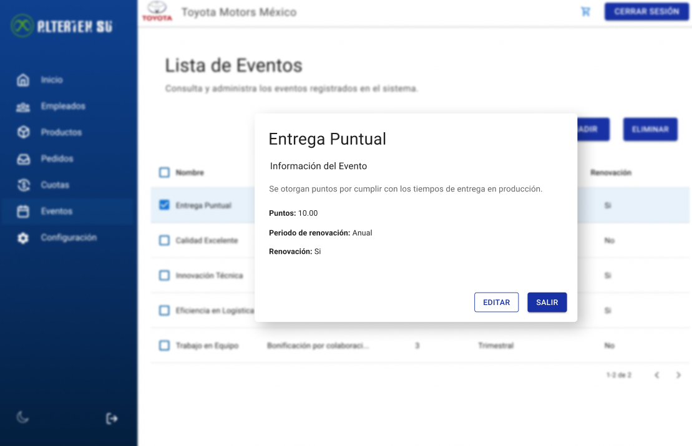

# RF38: Super Administrador, Cliente Lee Evento

**Última actualización:** 06 de mayo de 2025

---

## Historia de Usuario

Como administrador, quiero visualizar la información detallada de un evento, incluyendo su tipo, reglas, fecha y estado, para asegurar una correcta gestión de la renovación o asignación de puntos.

## **Criterios de Aceptación:**

1. El Super Administrador y el Cliente deben poder ver los detalles de un evento específico.
2. Los datos mostrados deben incluir:
   - Nombre del evento
   - Información del evento
   - Puntos
   - Periodo de Renovación
   - Renovación
   - Lista de participantes (si corresponde)
3. Si el evento no existe, el sistema debe mostrar un mensaje indicando que no se puede encontrar.

---

## **Diagrama de Secuencia**

> _Descripción_: El diagrama de secuencia muestra el proceso mediante el cual el Super Administrador y el Cliente leen los detalles de un evento específico.

---

## **Mockup**

> _Descripción_: El mockup muestra la interfaz donde el **Super Administrador** puede consultar un evento.

## **Pruebas Unitarias**

_<u>[Enlace a pruebas RF38 Consulta Usuario](https://docs.google.com/spreadsheets/d/1NLGwGrGA5PVOEzLaqxa8Ts1D_Ng3QzzqNKWJYUzxD-M/edit?gid=1081692928#gid=1081692928)</u>_

> _Descripción_: El mockup muestra la interfaz donde el Super Administrador o Cliente pueden ver los detalles completos de un evento.

## **Código**

_<u>[Pull Request Front-End](https://github.com/CodeAnd-Co/Frontend-Text-Lines/pull/64)</u>_

_<u>[Pull Request Back-End](https://github.com/CodeAnd-Co/Backend-textiles/pull/53)</u>_

---

### Historial de cambios

| **Tipo de Versión** | **Descripción**                                 | **Fecha**  | **Colaborador**               |
| ------------------- | ----------------------------------------------- | ---------- | ----------------------------- |
| **1.0**             | Creación del documento                          | 06/3/2025  | Angélica Rios Cuentas         |
| **1.1**             | Actualización de la documentación del requisito | 06/5/2025  | Carlos Iván Fonseca Mondragón |
| **1.2**             | Se actualizó documentación.                     | 22/05/2025 | Arturo Sánchez Rodríguez      |
| **1.3**             | Agregar links de PR                             | 26/05/2025 | Max Toscano                   |
