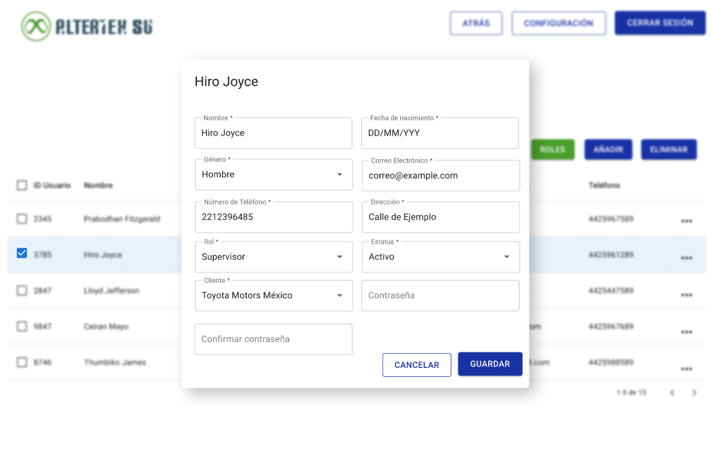

# RF4: Super Administrador Actualiza Usuario

**Última actualización:** 06 de junio de 2025

---

## Historia de Usuario

Como administrador, quiero poder modificar la información de un usuario, incluyendo su rol y permisos, para mantener el sistema actualizado y alineado con las necesidades de la organización.

## **Criterios de Aceptación:**

1. El Super Administrador debe poder acceder a la opción **"Editar Usuario"** dentro del panel de información de un usuario.
2. Se deben permitir modificaciones en los siguientes campos:

   - Nombre completo
   - Fecha de nacimiento
   - Género
   - Correo electrónico
   - Número de teléfono
   - Dirección
   - Rol del usuario
   - Estado (Activo/Inactivo)
   - Cliente asignado
   - Contraseña

3. Si los datos son válidos, el sistema debe guardar los cambios y mostrar un mensaje de confirmación.
4. Si hay errores en la entrada de datos, se debe mostrar un mensaje de error indicando qué corregir.

---

## **Diagrama de Secuencia**

> _Descripción_: El diagrama de secuencia representa el proceso mediante el cual el Super Administrador edita la información de un usuario. Se muestra la interacción con la base de datos para la actualización de datos y la confirmación del cambio.

---

## **Mockup**

> _Descripción_: El mockup representa la interfaz del sistema donde el **Super Administrador** completa los datos del nuevo usuario, selecciona su rol y permisos, y confirma la creación del usuario en el sistema.

## **Pruebas Unitarias**

_<u>[Enlace a pruebas RF4 Actualizar Usuarios.](https://docs.google.com/spreadsheets/d/1NLGwGrGA5PVOEzLaqxa8Ts1D_Ng3QzzqNKWJYUzxD-M/edit?gid=2134306506#gid=2134306506)</u>_

## **Código**

_<u>[Pull Request Front-End](https://github.com/CodeAnd-Co/Frontend-Text-Lines/pull/174/)</u>_

_<u>[Pull Request Back-End](https://github.com/CodeAnd-Co/Backend-textiles/pull/132)</u>_
