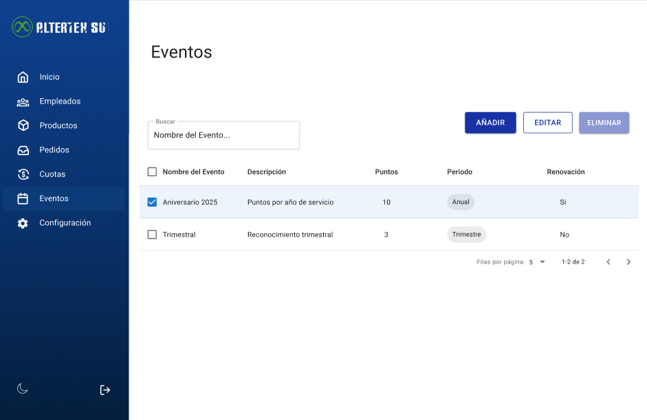
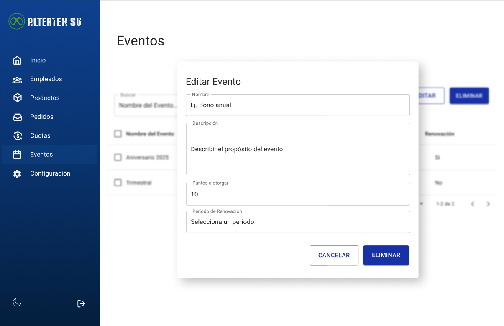
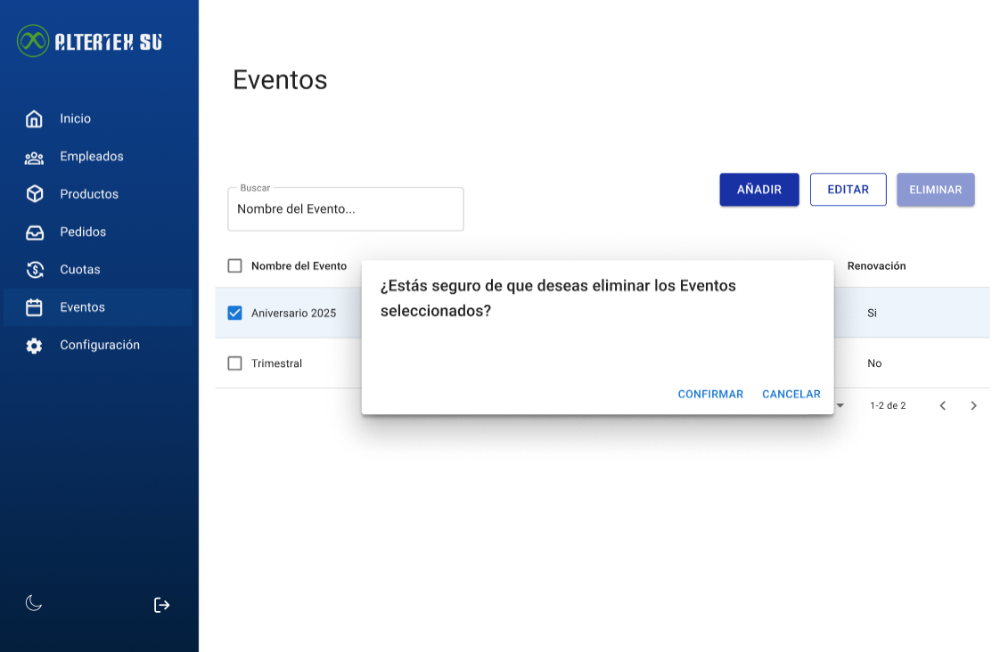

# RF40: Super Administrador, Cliente Elimina Evento

**Última actualización:** 06 de marzo de 2025

---

## Historia de Usuario

Como administrador, quiero eliminar un evento de renovación de puntos para mantener mi sistema actualizado.

## **Criterios de Aceptación:**

1. El Super Administrador y el Cliente deben poder eliminar un evento existente.
2. El sistema debe confirmar que el evento ha sido eliminado correctamente.
3. Si el evento no existe o el usuario no tiene permisos para eliminarlo, el sistema debe mostrar un mensaje de error.
4. La eliminación debe reflejarse de inmediato en la lista de eventos.

---

## **Diagrama de Secuencia**

> _Descripción_: El diagrama de secuencia muestra el proceso mediante el cual el Super Administrador o el Cliente eliminan un evento y cómo el sistema confirma la eliminación.

No aplica, de acuerdo con el análisis realizado conforme a nuestro procedimiento 'ready-done'. Tras revisar los criterios establecidos, concluimos que este caso no corresponde a las especificaciones requeridas para su aplicación.

---

## **Mockup**

> _Descripción_: El mockup muestra la interfaz donde el Super Administrador o Cliente pueden eliminar un evento.
>  >  > 

## **Pruebas Unitarias**

# Historial de cambios

| **Tipo de Versión** | **Descripción**                         | **Fecha** | **Colaborador**                        |
| ------------------- | --------------------------------------- | --------- | -------------------------------------- |
| **1.0**             | Creacion de el documento                | 3/6/2025  | Rodrigo Antonio Benítez De La Portilla |
| **1.1**             | Diagrama de secuencia, mockup y pruebas | 4/21/2025 | Rodrigo Antonio Benítez De La Portilla |
