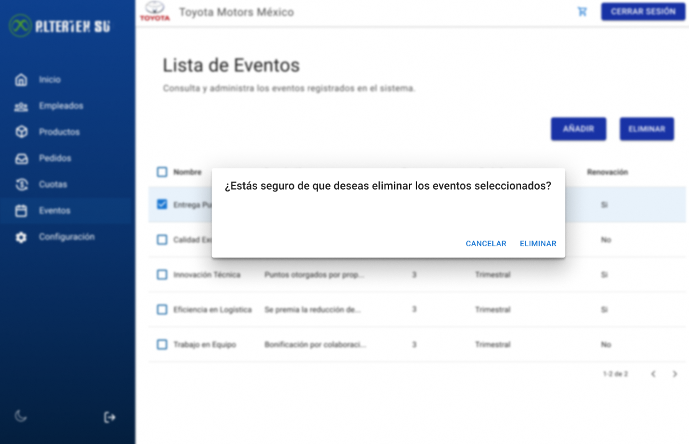

# RF40: Super Administrador, Cliente Elimina Evento

---

## Historia de Usuario

Como administrador, quiero eliminar un evento o eventos para mantener mi sistema actualizado.

## **Criterios de Aceptación:**

1. El Super Administrador y el Cliente deben poder eliminar un evento o eventos existente/s.
2. El sistema debe confirmar que el evento ha sido eliminado correctamente.
3. La eliminación debe reflejarse de inmediato en la lista de eventos.

---

## **Diagrama de Secuencia**

> _Descripción_: El diagrama de secuencia muestra el proceso mediante el cual el Super Administrador o el Cliente eliminan un evento y cómo el sistema confirma la eliminación.

No aplica, de acuerdo con el análisis realizado conforme a nuestro procedimiento 'ready-done'. Tras revisar los criterios establecidos, concluimos que este caso no corresponde a las especificaciones requeridas para su aplicación.

---

## **Mockup**

> _Descripción_: El mockup muestra la interfaz donde el Super Administrador o Cliente pueden eliminar un evento.

>  > 

## **Pruebas Unitarias**

_<u>[Enlace a pruebas RF40 Eliminar Evento](https://docs.google.com/spreadsheets/d/1NLGwGrGA5PVOEzLaqxa8Ts1D_Ng3QzzqNKWJYUzxD-M/edit?gid=836466678#gid=836466678)</u>_

## **Código**

_<u>[Pull Request Front-End](https://github.com/CodeAnd-Co/Frontend-Text-Lines/pull/68)</u>_

_<u>[Pull Request Back-End](https://github.com/CodeAnd-Co/Backend-textiles/pull/57)</u>_

---

# Historial de cambios

| **Tipo de Versión** | **Descripción**                         | **Fecha**  | **Colaborador**                        |
| ------------------- | --------------------------------------- | ---------- | -------------------------------------- |
| **1.0**             | Creacion de el documento                | 3/6/2025   | Rodrigo Antonio Benítez De La Portilla |
| **1.1**             | Diagrama de secuencia, mockup y pruebas | 5/8/2025   | Rodrigo Antonio Benítez De La Portilla |
| **1.2**             | Agregar links de PR                     | 26/05/2025 | Max Toscano                            |
