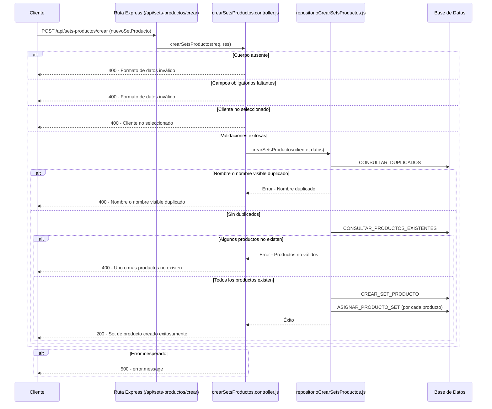

# RF41: Super Administrador, Cliente Crea Set de Productos

**Última actualización:** 06 de marzo de 2025

---

## Historia de Usuario

Como administrador, quiero crear un set de productos para asignar descuentos, estado del set y asignar uniformes completos a los empleados de manera eficiente.

## **Criterios de Aceptación:**

1. El Super Administrador y el Cliente deben poder crear un nuevo set de productos.
2. Los campos obligatorios para crear un set de productos incluyen:
   - Nombre del set
   - Nombre visible del set
   - Descripción
   - Lista de productos asignados
3. El sistema debe validar que los campos sean correctos y que no exista un set de productos con el mismo nombre antes de crear el set de productos.
4. Si el set de productos se crea exitosamente, debe reflejarse de inmediato en la lista de sets de productos.
5. Si ocurre un error, el sistema debe mostrar un mensaje de error.

---

## **Diagrama de Secuencia**

> _Descripción_: El diagrama de secuencia muestra el proceso mediante el cual el Super Administrador o Cliente crea un set de productos y cómo el sistema valida los datos y guarda la nueva información.

---

## **Mockup**

> _Descripción_: El mockup muestra la interfaz donde el Super Administrador o Cliente puede ingresar los datos para crear un set de productos.

## **Pruebas Unitarias**

_<u>[Enlace a pruebas RF41 Crea Set de Productos](https://docs.google.com/spreadsheets/d/1NLGwGrGA5PVOEzLaqxa8Ts1D_Ng3QzzqNKWJYUzxD-M/edit?gid=862208318#gid=862208318)</u>_

## **Código**

_<u>[Pull Request Front-End](https://github.com/CodeAnd-Co/Frontend-Text-Lines/pull/157)</u>_

_<u>[Pull Request Back-End](https://github.com/CodeAnd-Co/Backend-textiles/pull/115)</u>_

---

## Historial de versiones

| **Tipo de Versión** | **Descripción**                         | **Fecha** | **Colaborador**    |
| ------------------- | --------------------------------------- | --------- | ------------------ |
| **1.0**             | Creacion de el documento                | 4/04/2025 | Angélica Ríos      |
| **1.1**             | Diagrama de secuencia, mockup y pruebas | 5/27/2025 | Diego Alfaro Pinto |
| **1.2**             | Links de PR y pruebas                   | 06/5/2025 | Angélica Ríos      |
