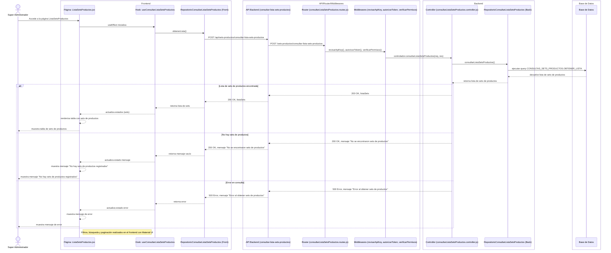
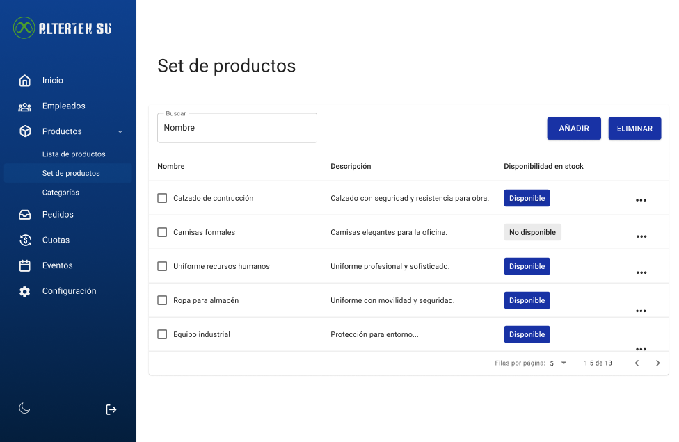

# RF42: Super Administrador, Cliente Consulta Lista de Sets de Productos

**Última actualización:** 06 de marzo de 2025

---

## Historia de Usuario

Como administrador, quiero acceder a un listado de todos los sets de productos con opciones de búsqueda.

## **Criterios de Aceptación:**

1. El Super Administrador y el Cliente deben poder ver la lista de sets de productos disponibles.
2. La lista debe incluir los siguientes datos:
   - Nombre del set de productos
   - Descripción
   - Disponibilidad
3. La lista debe permitir buscar y filtrar sets de productos según los criterios mencionados.
4. Si no hay sets de productos disponibles, el sistema debe mostrar un mensaje indicando que no hay sets disponibles.

---

## **Diagrama de Secuencia**

> _Descripción_: El diagrama de secuencia muestra el proceso mediante el cual el Super Administrador o Cliente consultan la lista de sets de productos.

---

## **Mockup**

> _Descripción_: El mockup muestra la interfaz donde el Super Administrador o Cliente pueden consultar y visualizar la lista de sets de productos.
> 
