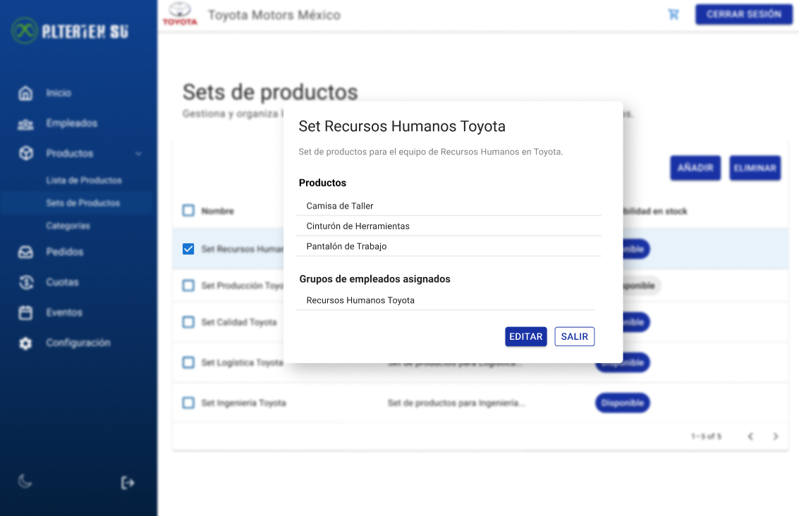

# RF43: Super Administrador, Cliente Lee Set de Productos

**Última actualización:** 11 de mayo de 2025

---

## Historia de Usuario

Como administrador, quiero visualizar la información detallada de un set de productos, incluyendo los productos que lo componen y sus grupos de empleados asignados, para verificar su contenido antes de asignarlo a los empleados.

## **Criterios de Aceptación:**

1. El Super Administrador y el Cliente deben poder ver los detalles de un set de productos específico.
2. Los datos mostrados deben incluir:
   - Nombre del set
   - Descripción
   - Lista de productos incluidos
   - Grupos de empleados asignados

---

## **Diagrama de Secuencia**

> _Descripción_: El diagrama de secuencia muestra el proceso mediante el cual el Super Administrador o Cliente leen los detalles de un set de productos específico.

No aplica.

---

## **Mockup**

> _Descripción_: El mockup muestra la interfaz donde el Super Administrador o Cliente pueden ver los detalles completos de un set de productos.
> 

## **Pruebas**

_<u>[Enlace a pruebas RF43 Leer sets de productos.](https://docs.google.com/spreadsheets/d/1NLGwGrGA5PVOEzLaqxa8Ts1D_Ng3QzzqNKWJYUzxD-M/edit?gid=1656886373#gid=1656886373)</u>_

## **Código**

_<u>[Pull Request Front-End](https://github.com/CodeAnd-Co/Frontend-Text-Lines/pull/71)</u>_

---

### Historial de cambios

| **Tipo de Versión** | **Descripción**                                  | **Fecha**  | **Colaborador** |
| ------------------- | ------------------------------------------------ | ---------- | --------------- |
| **1.0**             | Actualización de la documentación del requisito. | 11/05/2025 | Valeria Zúñiga  |
| **1.1**             | Agregar links de PR                              | 26/05/2025 | Max Toscano     |
