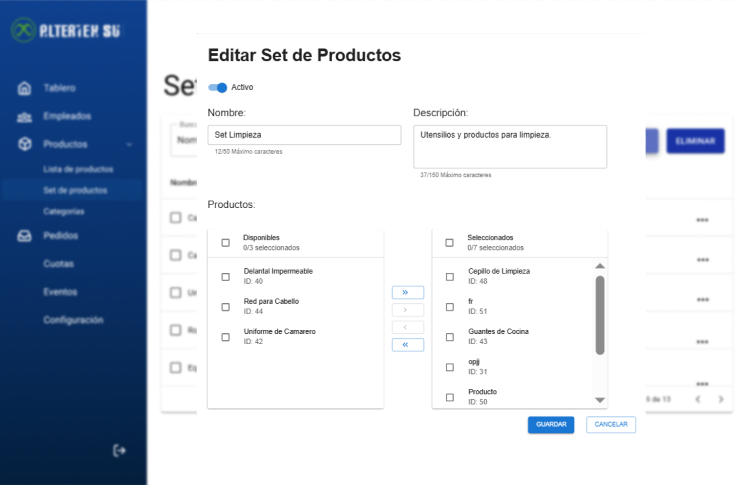

# RF44: Super Administrador Actualiza Set de Productos

**Última actualización:** 06 de junio de 2025

---

## Historia de Usuario

Como administrador, quiero modificar la información de un set de productos existente, como agregar o eliminar productos, para mantener la asignación de uniformes actualizada y adecuada a las necesidades de los empleados.

## **Criterios de Aceptación:**

1. El Super Administrador debe poder actualizar los datos de un set de productos.
2. Los cambios deben incluir:
   - Nombre del set de productos
   - Descripción
   - Productos incluidos en el set
3. El sistema debe reflejar los cambios de inmediato en la tabla de sets de productos.
4. Si la actualización es exitosa, al consultar individualmente el set de productos, debe mostrarse toda la información actualizada.
5. El sistema debe mostrar un mensaje de error en los siguientes casos:
   - No hay productos seleccionados
   - Se intenta inyectar SQL
   - Otro set tiene el mismo nombre o nombre visible
   - No se han ingresado los campos obligatorios
6. Se deben validar el número de caracteres permitido en todas las entradas de texto
   - Nombre: 50 caracteres
   - Nombre visible: 50 caracteres
   - Descripción: 150 caracteres

---

## **Diagrama de Secuencia**

> _Descripción_: El diagrama de secuencia muestra el proceso mediante el cual el Super Administrador actualiza los detalles de un set de productos y cómo el sistema guarda los cambios.

No aplica

---

## **Mockup**

> _Descripción_: El mockup muestra la interfaz donde el Super Administrador puede actualizar los datos de un set de productos.

## **Pruebas**

_<u>[Enlace a pruebas RF44 Actualiza Set de Productos](https://docs.google.com/spreadsheets/d/1NLGwGrGA5PVOEzLaqxa8Ts1D_Ng3QzzqNKWJYUzxD-M/edit?gid=1884652073#gid=1884652073)</u>_

## **Código**

_<u>[Pull Request Front-End](https://github.com/CodeAnd-Co/Frontend-Text-Lines/pull/171)</u>_

_<u>[Pull Request Back-End](https://github.com/CodeAnd-Co/Backend-textiles/pull/129)</u>_

---

### Historial de cambios

| **Tipo de Versión** | **Descripción**                                  | **Fecha**  | **Colaborador**          |
| ------------------- | ------------------------------------------------ | ---------- | ------------------------ |
| **1.0**             | Actualización de la documentación del requisito. | 06/06/2025  | Valeria Zúñiga           |
