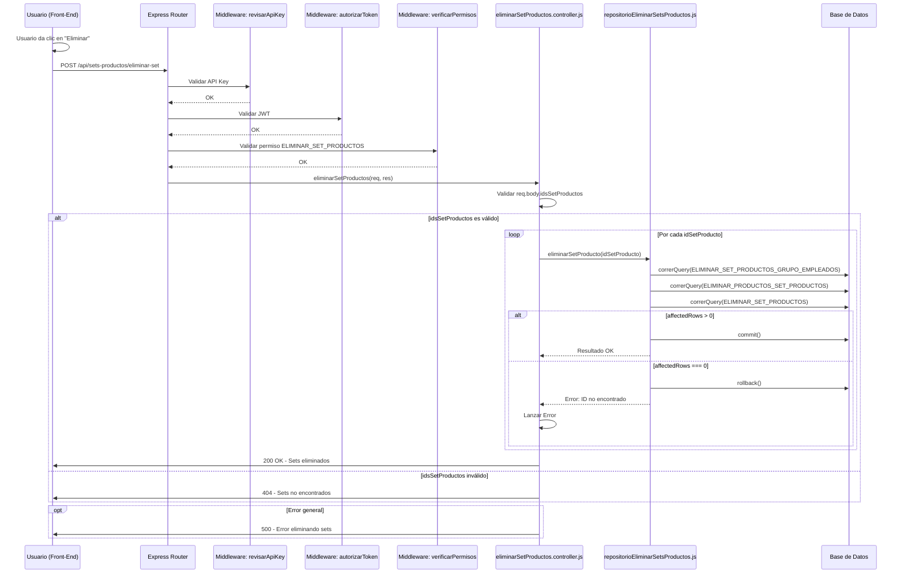
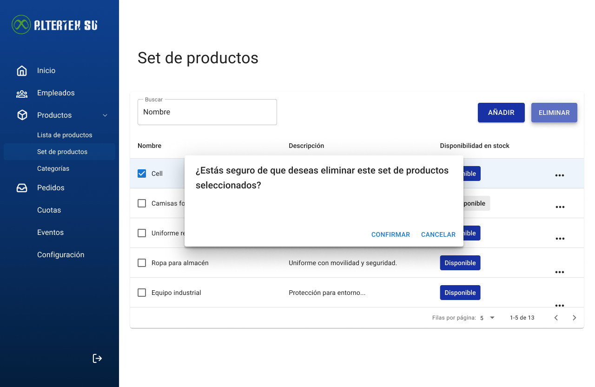

# RF45: Super Administrador Elimina Set de Productos

**Última actualización:** 06 de marzo de 2025

---

## Historia de Usuario

Como administrador, quiero eliminar un set de productos que ya no sea necesario, para mantener el sistema organizado y evitar asignaciones incorrectas de uniformes.

## **Criterios de Aceptación:**

1. El Super Administrador debe poder eliminar un set de productos existente.
2. El sistema debe confirmar que el set de productos ha sido eliminado correctamente.
3. Si el set de productos no existe, el sistema debe mostrar un mensaje indicando que no se puede eliminar.
4. La eliminación debe reflejarse de inmediato en la lista de sets de productos.

---

## **Diagrama de Secuencia**

> _Descripción_: El diagrama de secuencia muestra el proceso mediante el cual el Super Administrador elimina un set de productos y cómo el sistema confirma la eliminación.

---

## **Mockup**

> _Descripción_: El mockup muestra la interfaz donde el Super Administrador puede eliminar un set de productos.

> 

## **Pruebas**

_<u>[Enlace a pruebas RF45 Elimina Set de Productos.](https://docs.google.com/spreadsheets/d/1NLGwGrGA5PVOEzLaqxa8Ts1D_Ng3QzzqNKWJYUzxD-M/edit?gid=1328710722#gid=1328710722)</u>_

| **Tipo de Versión** | **Descripción**                  | **Fecha**  | **Colaborador** |
| ------------------- | -------------------------------- | ---------- | --------------- |
| **1.0**             | Creación de documentación        | 27/04/2025 | Angélica Ríos   |
| **1.1**             | Modificar diagramas de secuencia | 02/05/2025 | Angélica Ríos   |
