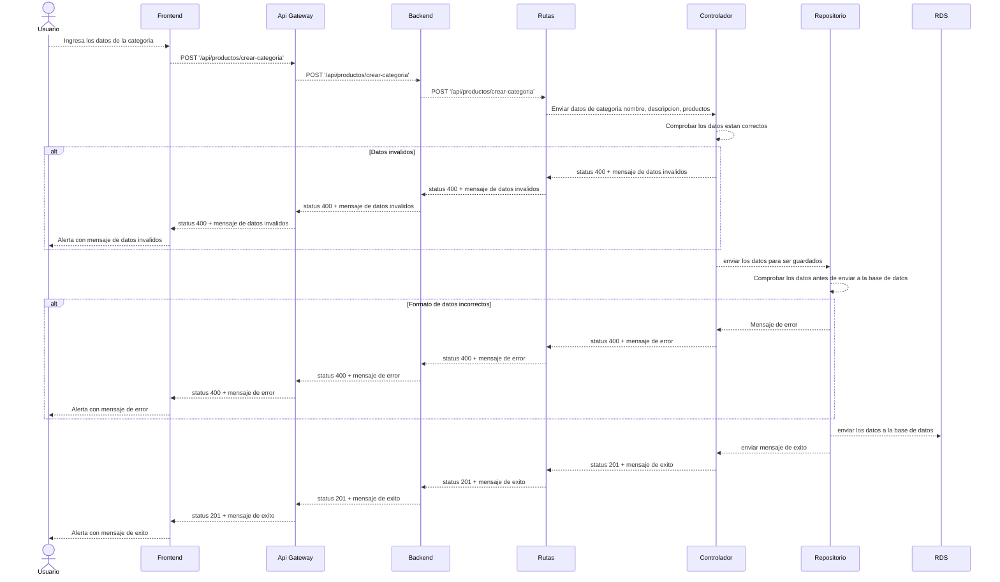

# RF46: Super Administrador Crea Categoria de Productos

**Última actualización:** 06 de marzo de 2025

---

## Historia de Usuario

Como administrador, quiero crear una categoría de productos con un nombre único y una descripción opcional, para organizar los productos de manera estructurada y facilitar su gestión dentro del sistema.

## **Criterios de Aceptación:**

1. El Super Administrador debe poder crear una nueva categoría de productos.
2. Los campos obligatorios para crear una categoría incluyen:
   - Nombre de la categoría
3. El sistema debe validar que los campos sean correctos antes de crear la categoría.
4. Si la categoría se crea exitosamente, debe reflejarse de inmediato en la lista de categorías.
5. Si ocurre un error, el sistema debe mostrar un mensaje de error.

---

## **Diagrama de Secuencia**

> _Descripción_: El diagrama de secuencia muestra el proceso mediante el cual el Super Administrador crea una categoría de productos y cómo el sistema valida los datos y guarda la nueva información.

---

## **Mockup**

> _Descripción_: El mockup muestra la interfaz donde el Super Administrador puede ingresar los datos para crear una categoría de productos.

