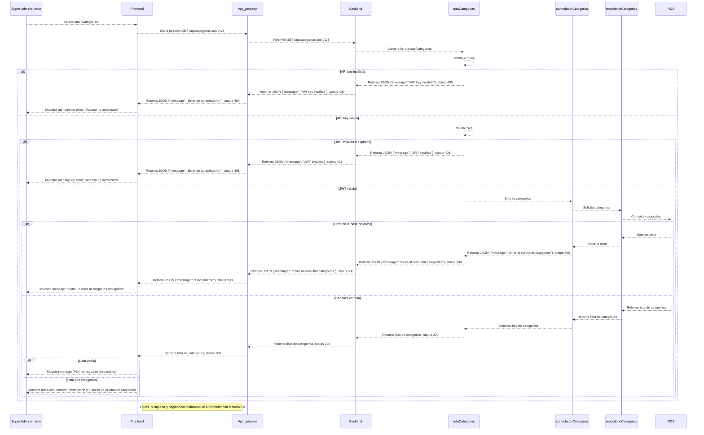
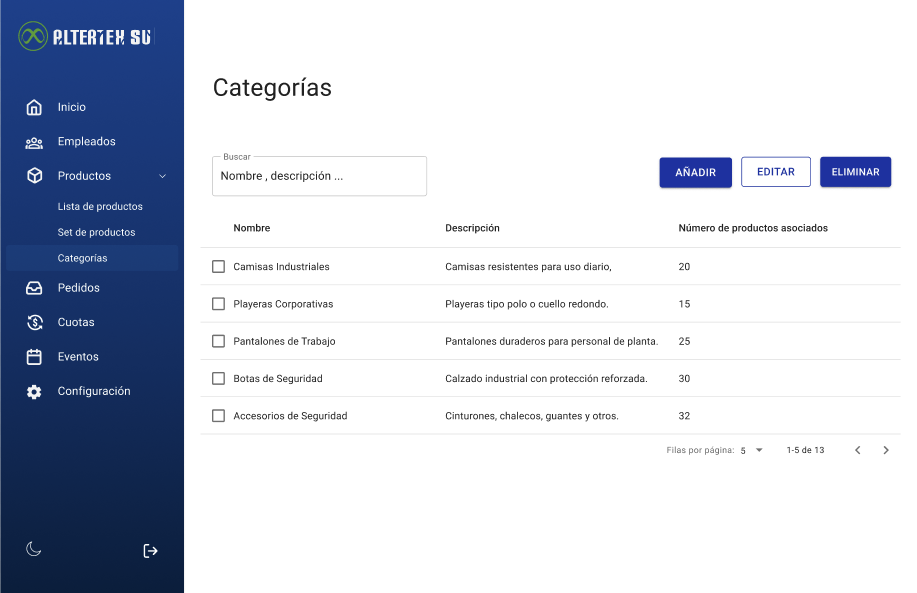

# RF47: Super Administrador Consulta Lista de Categorias de Productos

---

## Historia de Usuario

Como administrador, quiero ver una lista de todas las categorías de productos con sus nombres y descripciones, para conocer y administrar eficientemente las categorías disponibles.

## **Criterios de Aceptación:**

1. El Super Administrador debe poder consultar la lista completa de categorías de productos.
2. La lista debe incluir:
   - Nombre de la categoría
   - Descripción
   - Número de productos asociados
3. El sistema debe permitir la búsqueda y filtrado por nombre o descripción de la categoría.
4. Debe implementarse paginación.
5. Si no hay categorías registradas en la base de datos, se debe mostrar un mensaje indicando que no hay registros disponibles.

---

## **Diagrama de Secuencia**

> _Descripción_: El diagrama de secuencia muestra la interacción entre el Super Administrador y el sistema cuando se solicita la lista de categorías de productos. Incluye la solicitud desde la interfaz, el procesamiento por parte del backend, la consulta a la base de datos y el retorno de la información con el nombre, la descripción y el número de productos asociados por categoría.

---

---

## **Mockup**

> _Descripción_: El mockup muestra la interfaz donde el Super Administrador puede ver la lista de categorías de productos disponibles.

> 

---

| Autor | Descripción del cambio | Versión |
|---------|-------------------------|---------|
| Paola Garrido | Actualizar descripción, agregar mockup y diagrama de secuencia. | 1.0 |