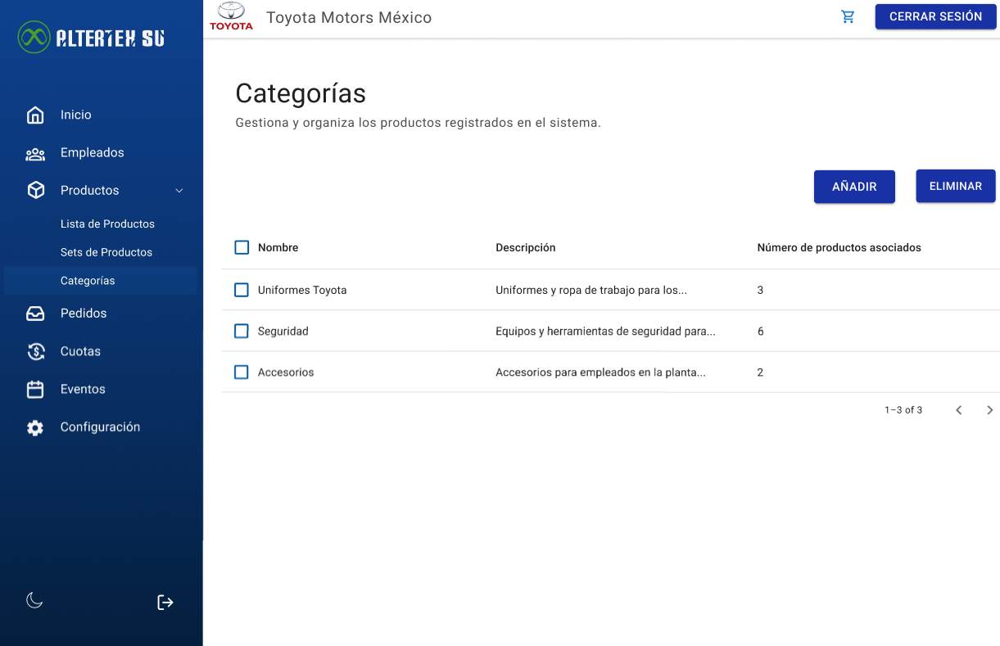

# RF47: Super Administrador Consulta Lista de Categorias de Productos

---

## Historia de Usuario

Como administrador, quiero ver una lista de todas las categorías de productos con sus nombres y descripciones, para conocer y administrar eficientemente las categorías disponibles.

## **Criterios de Aceptación:**

1. El Super Administrador debe poder consultar la lista completa de categorías de productos.
2. La lista debe incluir:
   - Nombre de la categoría
   - Descripción
   - Número de productos asociados
3. El sistema debe permitir la búsqueda y filtrado por los criterios establecidos.
4. Si no hay categorías registradas en la base de datos, se debe mostrar un mensaje indicando que no hay filas.

---

## **Diagrama de Secuencia**

> _Descripción_: El diagrama de secuencia muestra la interacción entre el Super Administrador y el sistema cuando se solicita la lista de categorías de productos. Incluye la solicitud desde la interfaz, el procesamiento por parte del backend, la consulta a la base de datos y el retorno de la información con el nombre, la descripción y el número de productos asociados por categoría.

---

---

## **Mockup**

> _Descripción_: El mockup muestra la interfaz donde el Super Administrador puede ver la lista de categorías de productos disponibles.

> 

---

## **Pruebas Unitarias**

_<u>[Enlace a pruebas RF47 Consulta Categorías](https://docs.google.com/spreadsheets/d/1NLGwGrGA5PVOEzLaqxa8Ts1D_Ng3QzzqNKWJYUzxD-M/edit?usp=sharing)</u>_

## **Código**

_<u>[Pull Request Front-End](https://github.com/CodeAnd-Co/Frontend-Text-Lines/pull/25)</u>_

_<u>[Pull Request Back-End](https://github.com/CodeAnd-Co/Backend-textiles/pull/21)</u>_

---

### Historial de cambios

| **Tipo de Versión** | **Descripción**                                  | **Fecha**  | **Colaborador**            |
| ------------------- | ------------------------------------------------ | ---------- | -------------------------- |
| **1.0**             | Actualización de la documentación del requisito. | 07/4/2025  | Paola María Garrido Montes |
| **1.1**             | Agregar links de PR                              | 26/05/2025 | Max Toscano                |
