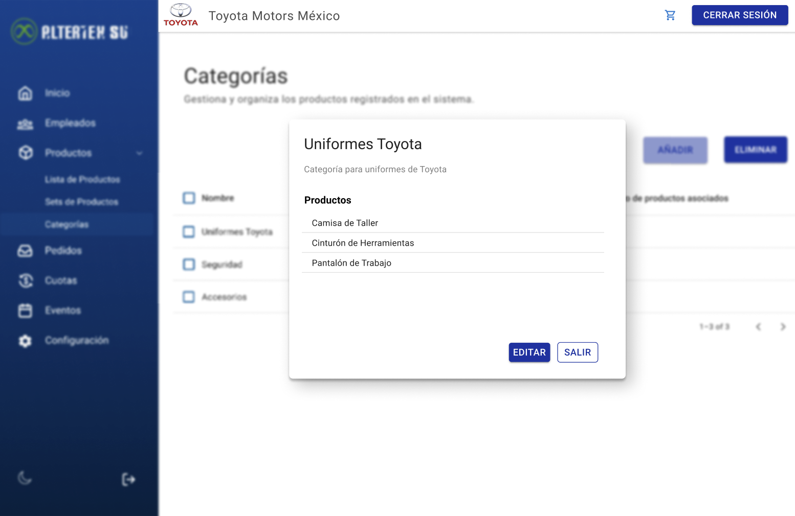

# RF48: Super Administrador, Cliente Lee Categoria de Productos

**Última actualización:** 06 de marzo de 2025

---

## Historia de Usuario

Como administrador, quiero ver los detalles de una categoría de productos, incluyendo su descripción y los productos asociados, para conocer su contenido y tomar decisiones informadas sobre su gestión.

## **Criterios de Aceptación:**

1. El Super Administrador y el Cliente deben poder ver los detalles de una categoría de productos específica.
2. Los datos mostrados deben incluir:
   - Nombre de la categoría
   - Descripción
   - Lista de productos asociados
3. Si la categoría no existe, el sistema debe mostrar un mensaje indicando que no se puede encontrar.

---

## **Diagrama de Secuencia**

> _Descripción_: El diagrama de secuencia muestra el proceso mediante el cual el Super Administrador o Cliente leen los detalles de una categoría de productos.

:::warning Importante
Debido a la dificultad baja del requisito, no se quiere diagrama de secuencia
:::

---

## **Mockup**

> _Descripción_: El mockup muestra la interfaz donde el Super Administrador o Cliente pueden ver los detalles completos de una categoría de productos.

> 

### Historial de cambios

| **Tipo de Versión** | **Descripción**                                  | **Fecha** | **Colaborador**            |
| ------------------- | ------------------------------------------------ | --------- | -------------------------- |
| **1.0**             | Actualización de la documentación del requisito. | 27/5/2025 | Hiram  Mendoza Lópes |