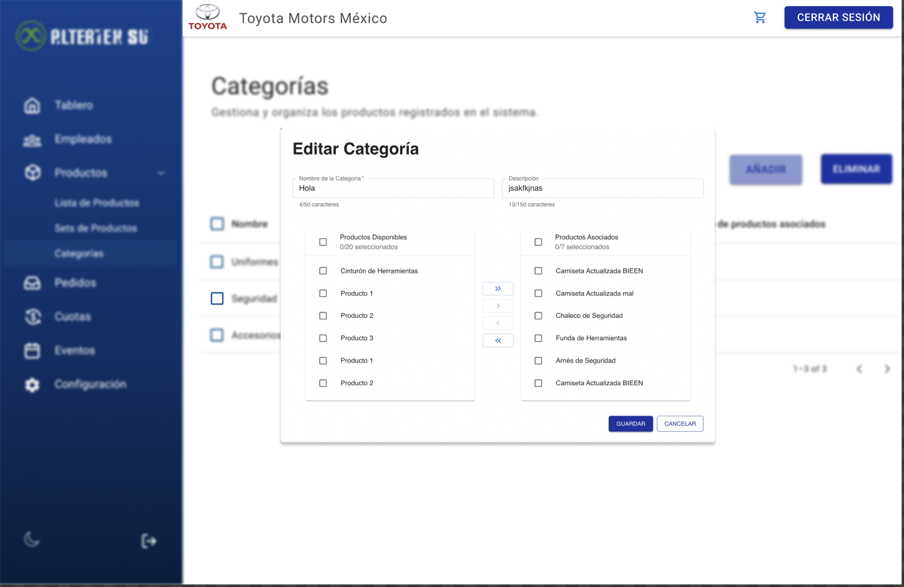

# RF49: Super Administrador Actualiza Categoria de Productos

**Última actualización:** 06 de junio de 2025

---

## Historia de Usuario

Como administrador, quiero modificar el nombre, la descripción y los productos de una categoría de productos, para mantener la información actualizada y reflejar correctamente los cambios en la organización de los productos.

## **Criterios de Aceptación:**

1. El Super Administrador debe poder actualizar los detalles de una categoría de productos.
2. Los campos editables deben incluir:
   - Nombre de la categoría
   - Descripción
   - Productos
3. El sistema debe validar que los campos sean correctos antes de actualizar la categoría.
4. Si la categoría se actualiza correctamente, debe reflejarse de inmediato en la lista de categorías.
5. Si ocurre un error, el sistema debe mostrar un mensaje de error.

---

## **Diagrama de Secuencia**

> _Descripción_: El diagrama de secuencia muestra el proceso mediante el cual el Super Administrador actualiza los detalles de una categoría de productos y cómo el sistema valida y guarda los cambios.

:::warning Importante
Debido a la dificultad baja del requisito, no se quiere diagrama de secuencia
:::

---

## **Mockup**

> 

---

## **Pruebas Unitarias**

_<u>[Enlace a pruebas RF49 Actualizar Categorías](https://docs.google.com/spreadsheets/d/1NLGwGrGA5PVOEzLaqxa8Ts1D_Ng3QzzqNKWJYUzxD-M/edit?usp=sharing)</u>_